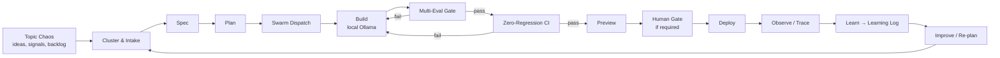

# AGENTS.md — AgentX2.ai Agent Operating Contract

> **Breadcrumb:** [Home](README.md) › **AGENTS.md**
> **Status:** `Active` · **Owner:** `production-ops-brain` · **Last verified:** `2026-06-12`

This file is the **single contract every AI agent and swarm obeys** when operating in this
repository. It follows the open [`AGENTS.md`](https://agents.md/) convention so any compliant
coding agent reads it automatically. AgentX2.ai is **self-building**: local Ollama models, working
as parallel agentic swarms, take this repo from *topic chaos → spec → plan → build → multi-eval →
zero-regression CI/CD → production → observability → learning → improvement*. Humans set
direction and approve gated actions; agents do the work.

For the full mechanism, read the keystone doc: [AI Build System](docs/01-architecture/AI_BUILD_SYSTEM.md).

---

## 0. Non-negotiables (read first)

1. **Time anchor.** The first action of every run records the current date/time in **UTC**
   (ISO-8601). All timestamps, "since" comparisons, and freshness checks use it. Never assume the
   date from training; read the clock.
2. **Ground everything.** Cite authoritative sources with access dates. Mark anything you cannot
   verify `[UNVERIFIED]` and log it as an open question. Never invent metrics, prices, or facts.
3. **Local-first AI.** Default reasoning, coding, embedding, judging, and safety run on **local
   Ollama models** (see [Model Strategy](docs/01-architecture/MODEL_STRATEGY.md)). Cloud models are
   opt-in, never required to build or run the repo.
4. **Zero regression.** Nothing merges that regresses tests, evals, accessibility, performance,
   security, or links. See [Regression Policy](docs/04-quality/REGRESSION_POLICY.md).
5. **Observe everything.** Every agent action emits OpenTelemetry **GenAI** spans/metrics and a
   timestamped record. See [Tracing](docs/05-observability/TRACING.md).
6. **Record learning.** Every meaningful run appends a timestamped, fact-grounded entry to the
   [Learning Log](docs/08-knowledge/LEARNING_LOG.md).
7. **Respect human gates.** Irreversible / high-risk actions stop for approval per
   [Human-in-the-Loop](docs/06-governance/HUMAN_IN_THE_LOOP.md).

---

## 1. The self-build loop



Every transition is timestamped and trace-linked. The loop never "stops at build": build is
followed by eval, regression, observation, and a recorded learning. Full definition:
[AI Build System](docs/01-architecture/AI_BUILD_SYSTEM.md).

---

## 2. Agent run protocol (every agent, every time)

1. **Anchor time** (UTC) and open a trace (`trace_id`, `run_id`).
2. **Load context** from the relevant docs (this file, the doc index, the task's domain docs) and
   from [memory](docs/01-architecture/MEMORY_ARCHITECTURE.md). Re-verify any fact past its decay horizon.
3. **Plan** before acting; for anything non-trivial, write the plan down.
4. **Act** using only allow-listed tools at your [autonomy tier](docs/06-governance/HUMAN_IN_THE_LOOP.md).
5. **Validate** against the spec and the [Quality Gates](docs/04-quality/QUALITY_GATES.md).
6. **Remediate** failures yourself; never disable a gate to pass.
7. **Emit** spans/metrics; **record** a learning entry; **hand off** with a structured result.

### Standard result envelope (JSON)

```json
{
  "task_id": "string",
  "status": "ok | needs_human | failed",
  "result": {},
  "evidence": ["trace_id", "eval_run_id", "commit_sha"],
  "cost": { "tokens": 0, "tool_calls": 0, "wall_ms": 0 },
  "timestamp": "2026-06-12T00:00:00Z",
  "trace_id": "string"
}
```

---

## 3. Parallel swarms

Work is executed by specialized swarms running in parallel lanes with explicit dependencies and
handoffs (agent-to-agent). The orchestrator (`production-ops-brain`) dispatches, monitors, retries,
and escalates. Topology, concurrency limits, and handoff contracts:
[Agentic Swarm](docs/01-architecture/AGENTIC_SWARM.md) and
[Orchestration](docs/01-architecture/ORCHESTRATION.md).

| Lane | Swarm | Owns |
|------|-------|------|
| Architecture | architecture-swarm | system + build-system + memory docs |
| Website | website-swarm | site IA, design system, pages, a11y, perf |
| Agents | agent-architecture-swarm | agent specs, consultation engine |
| Quality | quality-swarm | tests, evals, regression, CI/CD |
| Observability | observability-swarm | tracing, metrics, dashboards |
| Governance | governance-swarm | AI governance, security, compliance |
| Knowledge | knowledge-swarm | learning log, knowledge graph, ADRs |
| Content/SEO | content-swarm | SEO factory, content production |

---

## 4. Local model defaults

Pinned, local-first defaults (full matrix + fallbacks in
[Model Strategy](docs/01-architecture/MODEL_STRATEGY.md), grounded in the
[Ollama library](https://ollama.com/library)):

| Role | Primary (local) | Fallback (local) |
|------|-----------------|------------------|
| Orchestration / reasoning | `glm-4.7-flash` | `qwen3.6` |
| Code generation | `qwen3-coder:30b` | `qwen2.5-coder:7b` |
| Embeddings / memory | `qwen3-embedding:8b` | `embeddinggemma:300m` |
| Eval judge | `qwen3.6` | `glm-4.7-flash` |
| Safety / guardian | `granite4.1-guardian` | `llama-guard3` |
| Vision (design QA) | `gemma4` | `qwen2.5vl` |

---

## 5. Quality & safety gates (must pass to merge)

HTML validity · accessibility (WCAG 2.2 AA) · performance (Core Web Vitals budgets) · mobile ·
security headers + dependency/secret scans · SEO · analytics wiring · documentation freshness ·
observability coverage · governance/HITL · **multi-eval ≥ thresholds** · **zero regression**.
Definitions: [Quality Gates](docs/04-quality/QUALITY_GATES.md).

---

## 6. Commit & PR conventions

- **[Conventional Commits 1.0.0](https://www.conventionalcommits.org/en/v1.0.0/):**
  `feat|fix|docs|refactor|test|chore|ci|perf(scope): summary`.
- Every PR links its **spec, plan, eval run, and trace**; CI enforces the gates above.
- Direct-to-`main` only when policy allows and all gates are green; otherwise feature branch + PR.
- Never force-push `main`; never `--no-verify`; never discard unfamiliar in-progress work.

---

## 7. Repository map

- Architecture & the self-build loop → [`docs/01-architecture/`](docs/01-architecture/AI_BUILD_SYSTEM.md)
- Website & design → [`docs/02-website/`](docs/02-website/WEBSITE_ARCHITECTURE.md)
- Agents → [`docs/03-agents/`](docs/03-agents/AGENT_CATALOG.md)
- Quality, eval, CI/CD → [`docs/04-quality/`](docs/04-quality/QUALITY_GATES.md)
- Observability → [`docs/05-observability/`](docs/05-observability/OBSERVABILITY.md)
- Governance & security → [`docs/06-governance/`](docs/06-governance/AI_GOVERNANCE.md)
- Operations → [`docs/07-operations/`](docs/07-operations/CONTINUOUS_IMPROVEMENT.md)
- Knowledge & learning → [`docs/08-knowledge/`](docs/08-knowledge/LEARNING_LOG.md)
- Roadmap → [`docs/09-roadmap/`](docs/09-roadmap/ROADMAP.md)
- **Full map:** [Docs Index](docs/INDEX.md)

## 8. Grounding & Sources

| # | Claim it supports | Source | Accessed |
|---|-------------------|--------|----------|
| 1 | AGENTS.md is a portable agent-instruction convention | <https://agents.md/> | 2026-06-12 |
| 2 | GenAI tracing uses OTel GenAI semconv | <https://opentelemetry.io/docs/specs/semconv/gen-ai/> | 2026-06-12 |
| 3 | Local model ids + capabilities | <https://ollama.com/library> | 2026-06-12 |
| 4 | Commit message format | <https://www.conventionalcommits.org/en/v1.0.0/> | 2026-06-12 |

---

### Freshness

- **Created:** 2026-06-12 · **Updated:** 2026-06-12 · **Last verified:** 2026-06-12
- **Review cadence:** 30 days · **Staleness threshold:** 60 days · **Next review due:** 2026-07-12
- Governed by the [Freshness Policy](docs/07-operations/FRESHNESS_POLICY.md).

### Navigation

- 🏠 [Home](README.md) · ⬆️ [Docs Index](docs/INDEX.md)
- ↔️ Related: [AI Build System](docs/01-architecture/AI_BUILD_SYSTEM.md) · [Agentic Swarm](docs/01-architecture/AGENTIC_SWARM.md) · [Human-in-the-Loop](docs/06-governance/HUMAN_IN_THE_LOOP.md)
