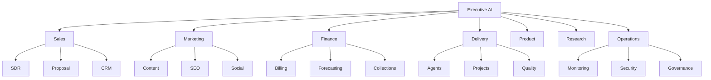

# PRD — AgentX2.ai

## Autonomous AI Consulting, Managed AI Workforce, and Agent Operating System

### Version 3.0 — June 2026

---

## Executive Vision

AgentX2.ai is not a consulting company that uses AI.

AgentX2.ai is an AI-native enterprise where every process, workflow, service, interaction, decision support function, operational system, and delivery capability is AI-augmented or AI-operated.

The company serves as:

* AI Consulting Firm
* AI Systems Integrator
* Agent Factory
* Managed AI Workforce Provider
* AI Transformation Partner
* Autonomous Business Builder
* AI Operating System Provider
* AI Governance Partner
* Enterprise Intelligence Platform

The long-term objective is to create a continuously improving AI-powered organization capable of delivering enterprise outcomes at a scale impossible through traditional consulting models.

---

## Strategic Goals

## Primary

Help companies:

* Deploy AI safely
* Automate knowledge work
* Reduce operating expenses
* Increase employee productivity
* Improve decision quality
* Accelerate software delivery
* Scale without proportional headcount growth

---

## Secondary

Create recurring revenue through:

* AI subscriptions
* Managed agents
* AI operations
* AI governance
* AI strategy retainers
* Executive advisory services

---

## Tertiary

Develop proprietary AI intellectual property:

* Agent frameworks
* Agent orchestration
* Governance engines
* Prompt systems
* Decision intelligence systems
* Autonomous business platforms

---

## Product Position

AgentX2.ai provides:

## AI Strategy

Executive AI adoption

AI roadmap creation

AI operating model design

AI governance

AI transformation

---

## AI Build

Agent development

Workflow automation

RAG systems

Knowledge systems

Enterprise integrations

Multi-agent systems

Digital workers

---

## AI Operate

Managed AI workforce

Agent monitoring

Agent governance

Optimization

Observability

Compliance

Support

---

## AI Improve

Continuous tuning

A/B testing

Prompt optimization

Model optimization

Workflow optimization

ROI tracking

Capability expansion

---

## AI-First Company Architecture

---

## Agent Operating System

Every function is represented by AI agents.

---

## Executive Layer

### Chief Executive Agent

Responsibilities:

* Strategy
* Prioritization
* Resource allocation
* Goal management
* Revenue forecasting

---

### Chief Operating Agent

Responsibilities:

* Operational health
* Workflow orchestration
* Capacity planning
* Delivery coordination

---

### Chief Financial Agent

Responsibilities:

* Budgeting
* Forecasting
* Revenue planning
* Margin analysis
* Cash management

---

### Chief Product Agent

Responsibilities:

* Product roadmap
* Feature prioritization
* Market intelligence

---

## Revenue Agent Swarm

## Lead Discovery Agents

Continuously identify:

* ICP companies
* Decision makers
* Buying signals
* Market opportunities

---

## Outreach Agents

Generate:

* Email campaigns
* LinkedIn campaigns
* Personalization

---

## Proposal Agents

Generate:

* Proposals
* SOWs
* Pricing
* Statements of work

---

## CRM Agents

Manage:

* Opportunities
* Follow-ups
* Pipeline health

---

## Marketing AI Factory

## Content Agents

Generate:

* Blog posts
* Articles
* Whitepapers
* Newsletters
* Reports

---

## SEO Agents

Manage:

* Keywords
* Backlinks
* Technical SEO
* Content optimization

---

## Social Media Agents

Publish:

* LinkedIn
* X
* Threads
* YouTube
* Reddit

---

## Brand Agents

Manage:

* Messaging
* Voice
* Positioning

---

## Client Delivery Platform

## Solution Architect Agents

Create:

* Solution designs
* Reference architectures
* Agent ecosystems

---

## Build Agents

Develop:

* Agents
* Integrations
* APIs
* Automations

---

## QA Agents

Validate:

* Security
* Functionality
* Regression
* Performance

---

## Documentation Agents

Generate:

* User guides
* Runbooks
* SOPs
* Knowledge articles

---

## AI Engineering Platform

## Code Generation Agents

Capabilities:

* Full stack development
* API creation
* Infrastructure as code
* Testing

---

## DevOps Agents

Manage:

* CI/CD
* Deployments
* Kubernetes
* GitHub Actions

---

## Security Agents

Monitor:

* Vulnerabilities
* Secrets
* Supply chain risk

---

## Enterprise AI Services

## Managed AI Workforce™

Digital workers provided as a service.

Examples:

* CFO Agent
* Executive Assistant Agent
* Research Agent
* Sales Agent
* Compliance Agent
* Support Agent
* Recruiting Agent
* Project Manager Agent
* Knowledge Agent

---

## AI Department Replacement

Create agent swarms that augment or partially automate:

* Finance
* Sales
* Marketing
* Operations
* Customer Support
* HR
* IT

---

## Agentic Architecture

## Layer 1

Experience

* Website
* Portal
* Chat
* Voice

---

## Layer 2

Orchestration

* LangGraph
* MCP
* A2A
* Event Bus

---

## Layer 3

Reasoning

* GPT-5.x
* Claude
* Grok
* Gemini
* Local Models

---

## Layer 4

Memory

* Vector DB
* Knowledge Graph
* Episodic Memory
* Semantic Search

---

## Layer 5

Tools

* CRM
* M365
* GitHub
* Jira
* ServiceNow
* Databases
* APIs

---

## Layer 6

Observability

* Tracing
* Logging
* Metrics
* Cost Tracking
* Agent Analytics

---

## AI Everywhere Principle

Every system must support:

## Autonomous Planning

Agents create plans.

---

## Autonomous Execution

Agents execute plans.

---

## Autonomous Validation

Agents verify outcomes.

---

## Autonomous Remediation

Agents fix issues.

---

## Autonomous Learning

Agents improve future outcomes.

---

## Autonomous Documentation

Agents document everything.

---

## Autonomous Governance

Agents enforce policy.

---

## AI Control Tower

Single pane of glass.

Provides:

* Agent registry
* Agent marketplace
* Cost analytics
* Prompt analytics
* Memory analytics
* Workflow analytics
* ROI analytics
* Compliance analytics

---

## Client Portal

Features:

* Project status
* Agent status
* ROI dashboard
* Support
* Reports
* Invoices
* Knowledge base

---

## Website V2

Public website becomes an AI-powered growth engine.

---

## AI Chat Concierge

Trained on:

* Services
* Pricing
* FAQs
* Case studies

---

## AI Consultation Agent

Performs:

* Discovery
* Qualification
* Recommendations

---

## AI Proposal Generator

Creates:

* Custom proposals
* Service recommendations

---

## AI ROI Calculator

Calculates:

* Savings
* Productivity gains
* Payback periods

---

## AI Industry Advisor

Generates industry-specific recommendations.

---

## Data Platform

Capture:

* Website analytics
* CRM analytics
* Proposal analytics
* Conversion analytics
* Agent analytics
* Revenue analytics

All available through natural language.

---

## Security

Zero Trust

RBAC

ABAC

MFA

Secrets Management

Audit Trails

Compliance Controls

Prompt Security

Model Security

Agent Security

Supply Chain Security

---

## Future Roadmap

### Phase 1

Public website

Brand

Lead generation

SEO

---

### Phase 2

AI consultation engine

CRM integration

Proposal automation

---

### Phase 3

Managed AI Workforce platform

Client portal

Agent marketplace

---

### Phase 4

Agent Operating System

Enterprise orchestration

Swarm management

---

### Phase 5

Autonomous Venture Studio

Agent-created SaaS products

Research subscriptions

AI-native businesses

---

## Success Metrics

Revenue

MRR

ARR

Pipeline

Lead conversion

Client retention

Agent utilization

Automation rate

Time saved

Cost reduced

Customer satisfaction

ROI delivered

---

## Ultimate Vision

AgentX2.ai becomes:

**The Operating System for AI-Native Businesses**

A platform where organizations can discover, deploy, govern, monitor, and continuously improve digital workers, autonomous workflows, and enterprise agent swarms from a single unified ecosystem.

The website is merely the entry point.

The actual product is an ever-evolving AI workforce platform, AI consulting practice, agent marketplace, governance engine, orchestration layer, and business operating system built around the principle:

**"If a process can be measured, an agent can improve it. If it can be improved, it can be automated."**
