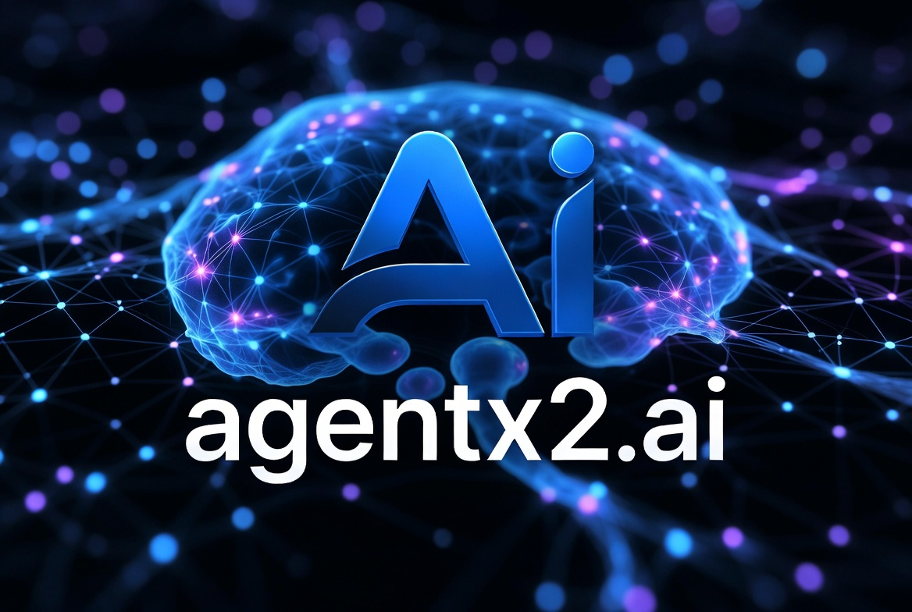

# AgentX2.ai

  

<h1 align="center">AgentX2.ai</h1>

  <strong>AI-Native Consulting. Autonomous Execution. Measurable Business Outcomes.</strong>

  Helping companies deploy Agentic AI, Automation, Data Intelligence, and Digital Workforces through subscription-based services.

---

## 📚 Documentation & Architecture

This repository is an **AI-native, self-building company platform**: local Ollama models, working as
parallel agentic swarms, take it from topic chaos to zero-regression production with full evaluation,
observability, tracing, and recorded learning — everything timestamped and fact-grounded.

- 📖 **[Documentation Index](docs/INDEX.md)** — the hub for everything (≤3 clicks to any doc).
- 🤖 **[AGENTS.md](AGENTS.md)** — the agent operating contract.
- 🏗️ **[AI Build System](docs/01-architecture/AI_BUILD_SYSTEM.md)** — how the repo builds itself.
- 🧭 **[Current State](CURRENT_STATE.md)** — baseline + gap analysis.
- 🗺️ **[Roadmap](docs/09-roadmap/ROADMAP.md)** · 🧠 **[Model Strategy](docs/01-architecture/MODEL_STRATEGY.md)** · 🛡️ **[AI Governance](docs/06-governance/AI_GOVERNANCE.md)** · 📈 **[Observability](docs/05-observability/OBSERVABILITY.md)**

---

## �🚀 Overview

AgentX2.ai is an AI-first consulting and implementation firm specializing in the design, deployment, governance, and continuous optimization of enterprise AI systems.

We help organizations transform operations, finance, customer experiences, software delivery, cybersecurity, compliance, and decision-making through autonomous AI agents and intelligent automation.

Unlike traditional consulting firms, AgentX2.ai operates as an ongoing AI transformation partner through subscription-based services that continuously evolve alongside your business.

---

## 🎯 Mission

To make every organization AI-native.

We help businesses:

- Reduce operating costs
- Increase productivity
- Accelerate innovation
- Improve decision quality
- Automate repetitive work
- Scale without proportional headcount growth
- Create competitive advantages through AI

---

## What We Do

## 🤖 Agentic AI

Design and deployment of autonomous AI agents capable of:

- Planning
- Reasoning
- Decision making
- Workflow execution
- Multi-agent collaboration
- Human-in-the-loop operations
- Continuous optimization

### Examples

- Executive AI Assistants
- Sales Agents
- Finance Agents
- Research Agents
- Customer Support Agents
- Compliance Agents
- DevOps Agents
- Security Operations Agents
- Recruiting Agents
- Knowledge Management Agents

Agentic AI systems combine planning, tool usage, memory, and autonomous task execution to achieve business outcomes with minimal human intervention.

---

## 💰 AI for Finance

### CFO Copilots

- Financial forecasting
- Budget planning
- Scenario modeling
- Cash flow projections
- Cost optimization
- Board reporting

### Investment Intelligence

- Market monitoring
- Research automation
- Earnings analysis
- Portfolio intelligence
- Alternative data insights
- Risk monitoring

### FP&A Automation

- Forecast generation
- Variance analysis
- KPI tracking
- Executive dashboards
- Strategic planning support

---

## 🏢 AI for Business Operations

### Operations Automation

- Process discovery
- Workflow orchestration
- Ticket automation
- Back-office optimization
- Enterprise workflow management

### Customer Experience

- AI customer service
- AI call centers
- Omnichannel support
- Knowledge automation
- Customer journey optimization

### Revenue Operations

- Lead qualification
- Sales automation
- Proposal generation
- CRM intelligence
- Customer success automation

---

## ☁️ AI + Cloud Transformation

### Microsoft Ecosystem

- Microsoft Copilot
- Azure AI
- Power Platform
- Fabric
- Security Copilot
- Dynamics 365

### Enterprise Platforms

- Salesforce
- ServiceNow
- SAP
- Oracle
- Workday
- NetSuite

### Cloud Providers

- Microsoft Azure
- AWS
- Google Cloud

---

## 🔐 AI Governance & Security

We help organizations deploy AI responsibly.

### Services

- AI Governance
- AI Risk Management
- Compliance Controls
- Model Governance
- Responsible AI
- Security Architecture
- Data Protection
- Audit Readiness

Governance, guardrails, permissions, logging, and human oversight are foundational requirements for successful enterprise AI deployments.

---

## 📊 Data & Analytics

Transform data into actionable intelligence.

### Capabilities

- Data Strategy
- Data Warehousing
- Data Engineering
- Business Intelligence
- Predictive Analytics
- AI Analytics
- Real-Time Dashboards
- Executive Reporting

---

## ⚙️ AI Automation

### Process Automation

- Workflow automation
- Document processing
- Email automation
- Knowledge extraction
- Data enrichment
- Approval workflows

### Intelligent Automation

- AI + RPA
- Agentic workflows
- Event-driven automation
- Cross-system orchestration
- Autonomous business processes

---

## 🧠 Executive AI Advisory

### Fractional AI Leadership

- Fractional Chief AI Officer
- AI Strategy Development
- Executive Workshops
- Board Advisory
- AI Roadmaps
- AI Investment Planning

---

## Industries

## Financial Services

- Banking
- Capital Markets
- Asset Management
- Wealth Management
- Insurance
- FinTech

## Healthcare

- Providers
- Payers
- Life Sciences
- Digital Health

## Manufacturing

- Supply Chain
- Logistics
- Operations
- Predictive Maintenance

## Technology

- SaaS
- Cybersecurity
- Cloud Providers
- Software Development

## Professional Services

- Consulting
- Accounting
- Legal
- Staffing

---

## Subscription Plans

## Starter

Ideal for small businesses beginning their AI journey.

### Includes

- AI Readiness Assessment
- Monthly Advisory
- AI Opportunity Identification
- Basic Automation Guidance
- Quarterly Roadmap Reviews

---

## Growth

For organizations implementing AI initiatives.

### Includes

- Dedicated AI Consultant
- AI Solution Architecture
- Agent Deployment Support
- Monthly Optimization Reviews
- Governance Guidance
- KPI Reporting

---

## Enterprise

For organizations scaling AI across departments.

### Includes

- Dedicated AI Team
- Multi-Agent Solutions
- Enterprise Integrations
- Governance Framework
- Security Reviews
- Executive Reporting
- Continuous Optimization

---

## Managed AI Workforce™

Your digital workforce as a service.

### Includes

- AI Agent Fleet
- Monitoring
- Optimization
- Governance
- Reporting
- Continuous Improvements

---

## Delivery Framework

---

## Why AgentX2.ai

### AI-Native

Built around AI from day one.

### Outcome Focused

Measured by business results.

### Subscription Model

Continuous value instead of one-time engagements.

### Enterprise Ready

Security, compliance, governance, and scale.

### Vendor Agnostic

We work across all major AI ecosystems.

### End-to-End Delivery

Strategy → Architecture → Implementation → Operations

---

## Technology Partners

### AI Platforms

- OpenAI
- Anthropic
- Google
- xAI
- Meta
- Mistral
- Cohere

### Enterprise Platforms

- Microsoft
- Salesforce
- ServiceNow
- Oracle
- SAP

### Open Source

- Ollama
- LangGraph
- CrewAI
- AutoGen
- OpenAI Agents SDK
- MCP Ecosystem

---

## Success Metrics

We focus on measurable outcomes.

Typical client objectives:

- 20–70% reduction in manual effort
- Faster decision cycles
- Improved customer satisfaction
- Reduced operational costs
- Increased revenue productivity
- Accelerated software delivery
- Improved compliance posture

---

## Our Process

### 1. AI Readiness Assessment

Evaluate current capabilities and opportunities.

### 2. Opportunity Mapping

Identify highest ROI use cases.

### 3. Solution Architecture

Design secure and scalable AI systems.

### 4. Implementation

Deploy agents, automation, and integrations.

### 5. Governance

Establish controls, monitoring, and compliance.

### 6. Continuous Optimization

Improve performance, adoption, and outcomes.

---

## Contact

## AgentX2.ai

**Website:** https://agentx2.ai

**Email:** hello@agentx2.ai

**LinkedIn:** https://linkedin.com/company/agentx2

**Schedule a Consultation:** https://agentx2.ai/contact

---

## Tagline

> "From AI Strategy to Autonomous Execution."

---

## 🔎 Build provenance

- This repository's documentation foundation was generated on **2026-06-12 (UTC)** and is governed by
  the [Freshness Policy](docs/07-operations/FRESHNESS_POLICY.md) — every doc is timestamped, sourced,
  and kept fresh. See the [Build Report](BUILD_REPORT.md) and [Changelog](CHANGELOG.md).
- Contribute via [Contributing](CONTRIBUTING.md) · responsible disclosure via [Security](SECURITY.md).

---

### Copyright

© 2026 AgentX2.ai. All Rights Reserved.

Built for the future of autonomous business.
