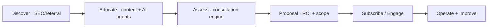

# Personas

> **Breadcrumb:** [Home](../../README.md) › [Docs Index](../INDEX.md) › **Personas**
> **Status:** `Active` · **Owner:** `content-swarm` · **Last verified:** `2026-06-12`

## 1. Purpose

Who we build for. Personas drive [website IA](../02-website/WEBSITE_ARCHITECTURE.md), the
[AI experience](../02-website/AI_EXPERIENCE.md) on each page, and the
[SEO topic clusters](../02-website/SEO_STRATEGY.md).

## 2. Primary personas

| Persona | Goal | Pain | Entry page | On-page AI |
|---------|------|------|-----------|------------|
| **CXO / Founder** | Adopt AI safely, cut cost, grow | Risk, hype, unclear ROI | Home, About | AI Consultation Agent |
| **CFO / Finance leader** | Forecasting, FP&A automation | Manual effort, slow cycles | Finance AI | AI CFO Agent |
| **Head of Ops** | Automate knowledge work | Process sprawl, tickets | Services, Industries | AI Solution Advisor |
| **CISO / Risk** | Govern AI responsibly | Compliance, oversharing | Governance | Governance Q&A Agent |
| **Eng leader** | Ship agents/automation | Build cost, integration | Agentic AI | Agent Builder |
| **Procurement / SMB owner** | Right-sized plan + ROI | Budget, justification | Subscriptions, Pricing | AI ROI Calculator |

## 3. Buying journey

Each stage has an instrumented conversion path ([Analytics](../05-observability/ANALYTICS.md)) and an
AI capability ([AI Experience](../02-website/AI_EXPERIENCE.md)).

## 4. Grounding & Sources

| # | Claim | Source | Accessed |
|---|-------|--------|----------|
| 1 | Industries + service mapping | [`README.md`](../../README.md) | 2026-06-12 |

---

### Freshness

- **Created/Updated/Verified:** 2026-06-12 · **Review cadence:** 90d · **Next review:** 2026-09-10
- See [Freshness Policy](../07-operations/FRESHNESS_POLICY.md).

### Navigation

- 🏠 [Home](../../README.md) · ⬆️ [Docs Index](../INDEX.md)
- ↔️ Related: [AI Experience](../02-website/AI_EXPERIENCE.md) · [SEO Strategy](../02-website/SEO_STRATEGY.md)
