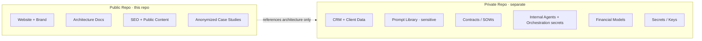

# Public / Private Repository Model

> **Breadcrumb:** [Home](../../README.md) › [Docs Index](../INDEX.md) › **Public / Private Model**
> **Status:** `Active` · **Owner:** `governance-swarm` · **Last verified:** `2026-06-12`

## 1. Purpose

Defines the hard boundary between what lives in the **public** repository (this one) and what must
live in a **private** repository. This boundary is a security control, enforced by CI secret scanning
([Security Architecture](../06-governance/SECURITY_ARCHITECTURE.md)).

## 2. The boundary

## 3. Public repository contains

Website, public documentation, brand assets, SEO content, anonymized case studies, public marketing
content, and the architecture docs in this `docs/` tree.

## 4. Private repository contains

CRM and client data, the operational prompt library, contracts/SOWs, internal agent orchestration and
memory systems, proposal systems, financial models, secrets/keys, and operations runbooks containing
sensitive detail.

## 5. Rules

1. **No secrets, ever, in public.** Enforced by secret scanning in
   [CI/CD](../04-quality/CI_CD.md).
2. **No client-identifying data in public.** Case studies are anonymized and reviewed.
3. **Architecture is public; instances are private.** We describe *how* the system works publicly;
   *specific* customer/agent instances stay private.
4. **One-way references only.** Public docs may describe private architecture abstractly; private
   never leaks into public.

## 6. Grounding & Sources

| # | Claim | Source | Accessed |
|---|-------|--------|----------|
| 1 | Public/private split | [`sysprompt_agentx2.md`](../../sysprompt_agentx2.md) | 2026-06-12 |

---

### Freshness

- **Created/Updated/Verified:** 2026-06-12 · **Review cadence:** 90d · **Next review:** 2026-09-10
- See [Freshness Policy](../07-operations/FRESHNESS_POLICY.md).

### Navigation

- 🏠 [Home](../../README.md) · ⬆️ [Docs Index](../INDEX.md)
- ↔️ Related: [Security Architecture](../06-governance/SECURITY_ARCHITECTURE.md) · [Company Model](COMPANY_MODEL.md)
