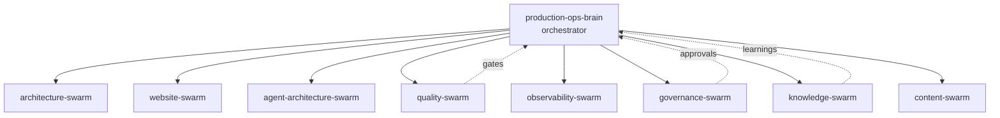

# Agentic Swarm Architecture

> **Breadcrumb:** [Home](../../README.md) › [Docs Index](../INDEX.md) › [Architecture](SYSTEM_ARCHITECTURE.md) › **Agentic Swarm**
> **Status:** `Active` · **Owner:** `architecture-swarm` · **Last verified:** `2026-06-12`

## 1. Purpose

How parallel agent swarms are organized, how they hand off work, and how concurrency stays safe. This
is the execution fabric of the [AI Build System](AI_BUILD_SYSTEM.md).

## 2. Topology



The orchestrator is a **planner-dispatcher**, not a bottleneck: independent tasks run concurrently;
dependent tasks are sequenced by the plan's dependency graph.

## 3. Swarm lanes

| Lane | Mission | Primary outputs |
|------|---------|-----------------|
| architecture-swarm | System + build-system design | architecture docs, ADRs |
| website-swarm | Public site | IA, design system, pages, a11y/perf |
| agent-architecture-swarm | Agent specs | catalog, contracts, consultation engine |
| quality-swarm | Quality | tests, evals, regression, CI |
| observability-swarm | Visibility | tracing, metrics, dashboards |
| governance-swarm | Safety | governance, security, compliance, HITL |
| knowledge-swarm | Memory | learning log, knowledge graph, vault |
| content-swarm | Growth | SEO, content production |

## 4. Concurrency model

- **Parallel by default** within a lane and across independent lanes.
- **Dependency-gated** where outputs feed inputs (spec → plan → build → eval).
- **Concurrency limits** per lane to bound local-model load and cost
  ([Model Strategy](MODEL_STRATEGY.md), [Cost in Metrics](../05-observability/METRICS_CATALOG.md)).
- **Idempotent tasks** so retries are safe.

## 5. Handoff contract (A2A)

Every handoff carries the standard result envelope (see [AGENTS.md](../../AGENTS.md) §2) plus the
`trace_id`, so the receiving agent has full context and the work is auditable. Handoffs are recorded
as OTel agent spans.

```json
{ "from": "spec-agent", "to": "planner", "task_id": "T-123", "payload": {}, "evidence": [], "trace_id": "..." , "timestamp": "2026-06-12T00:00:00Z" }
```

## 6. Failure handling

| Failure | Response |
|---------|----------|
| Task error | retry with backoff (idempotent); after N, escalate |
| Eval below threshold | route back to build with judge feedback |
| Regression detected | block; open remediation task |
| Tool/permission denied | escalate to [HITL](../06-governance/HUMAN_IN_THE_LOOP.md) |
| Stuck/loop | circuit-breaker trips; orchestrator re-plans |

## 7. Safety

Swarms operate within [autonomy tiers](../06-governance/HUMAN_IN_THE_LOOP.md) and the
[AI Governance](../06-governance/AI_GOVERNANCE.md) policy. No swarm can weaken a quality gate or take
an irreversible action without the required approval.

## 8. Grounding & Sources

| # | Claim | Source | Accessed |
|---|-------|--------|----------|
| 1 | Agent span semantics | <https://opentelemetry.io/docs/specs/semconv/gen-ai/gen-ai-agent-spans/> | 2026-06-12 |
| 2 | Tool/context protocol | <https://modelcontextprotocol.io/> | 2026-06-12 |

---

### Freshness

- **Created/Updated/Verified:** 2026-06-12 · **Review cadence:** 45d · **Next review:** 2026-07-27
- See [Freshness Policy](../07-operations/FRESHNESS_POLICY.md).

### Navigation

- 🏠 [Home](../../README.md) · ⬆️ [Docs Index](../INDEX.md)
- ↔️ Related: [AI Build System](AI_BUILD_SYSTEM.md) · [Orchestration](ORCHESTRATION.md) · [Agent Catalog](../03-agents/AGENT_CATALOG.md)
