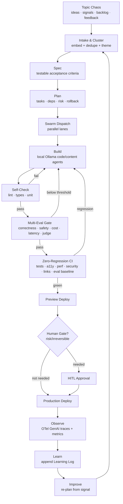
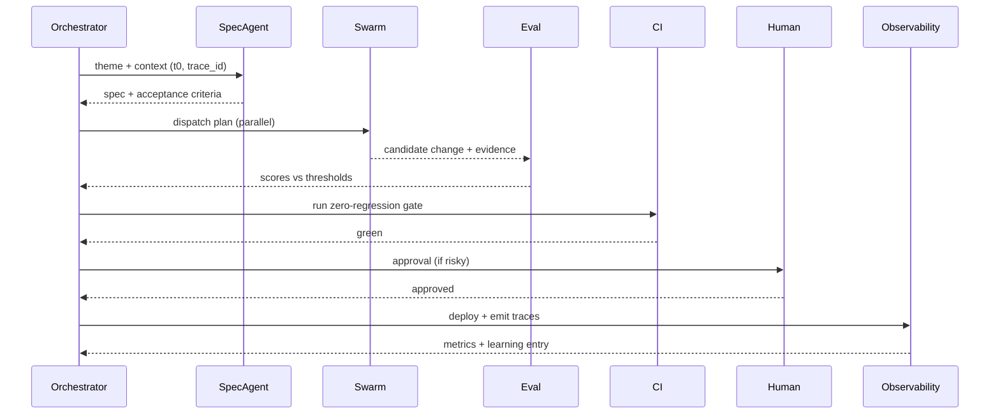

# AI Build System — The Self-Building Loop

> **Breadcrumb:** [Home](../../README.md) › [Docs Index](../INDEX.md) › [Architecture](SYSTEM_ARCHITECTURE.md) › **AI Build System**
> **Status:** `Active` · **Owner:** `architecture-swarm` · **Last verified:** `2026-06-12`

## 1. Purpose

This is the **keystone** document. It defines how AgentX2.ai **builds and improves itself end to end,
fully AI-orchestrated**, using **local Ollama models** working as **parallel agentic swarms** — taking
the repository from *topic chaos* to *zero-regression production* with full multi-eval, observability,
tracing, and recorded learning at every junction. Everything is timestamped (UTC) and fact-grounded.

## 2. The loop (authoritative)

Each arrow is **timestamped** and carries a `trace_id`; the loop never terminates at "build".

## 3. Stages in detail

### 3.1 Topic chaos → intake & cluster

Raw inputs (ideas, market signals, backlog, customer/site feedback, eval failures, incident
learnings) are embedded with a local embedding model and clustered into themes. Duplicates are merged;
each theme becomes a candidate work item with a timestamp and provenance. See
[Memory Architecture](MEMORY_ARCHITECTURE.md) and [Knowledge Architecture](KNOWLEDGE_ARCHITECTURE.md).

### 3.2 Spec

A specification agent converts a theme into **testable acceptance criteria**, data contracts, and edge
cases. No build starts without a spec. Pattern aligns with spec-first delivery.

### 3.3 Plan

A planning agent decomposes the spec into tasks with dependencies, assigns swarm lanes, and writes a
**risk + rollback** plan. The plan is the unit dispatched to swarms.

### 3.4 Swarm dispatch (parallel)

The orchestrator (`production-ops-brain`) dispatches independent tasks to parallel
[swarm lanes](AGENTIC_SWARM.md) with concurrency limits, then manages handoffs, retries, and
escalations via [Orchestration](ORCHESTRATION.md).

### 3.5 Build (local Ollama)

Code/content agents generate changes using local models
([Model Strategy](MODEL_STRATEGY.md)). All generation emits OTel GenAI spans
([Tracing](../05-observability/TRACING.md)) and a cost record (tokens, tool calls, wall time).

### 3.6 Self-check → multi-eval → zero-regression

Three escalating quality stages, each a hard gate:

1. **Self-check:** lint, type-check, unit tests.
2. **Multi-eval:** score the output across correctness, safety (guardian model), cost, latency, and an
   LLM-as-judge rubric ([Eval Framework](../04-quality/EVAL_FRAMEWORK.md)).
3. **Zero-regression CI:** compare against the locked baseline — tests, accessibility, performance,
   security, links, and eval scores may never go backward
   ([Regression Policy](../04-quality/REGRESSION_POLICY.md), [CI/CD](../04-quality/CI_CD.md)).

### 3.7 Preview → human gate → deploy

Green changes deploy to a preview; risky/irreversible actions stop for
[HITL approval](../06-governance/HUMAN_IN_THE_LOOP.md); approved changes promote to production
([Deployment](../07-operations/DEPLOYMENT.md)).

### 3.8 Observe → learn → improve

Production emits traces/metrics ([Observability](../05-observability/OBSERVABILITY.md)); a learning
agent appends a timestamped, fact-grounded entry to the
[Learning Log](../08-knowledge/LEARNING_LOG.md); an improvement agent re-plans from the new signal,
closing the loop ([Continuous Improvement](../07-operations/CONTINUOUS_IMPROVEMENT.md)).

## 4. Control plane

| Concern | Owner | Doc |
|---------|-------|-----|
| Dispatch + handoffs | production-ops-brain | [Orchestration](ORCHESTRATION.md) |
| Concurrency + topology | architecture-swarm | [Agentic Swarm](AGENTIC_SWARM.md) |
| Models | architecture-swarm | [Model Strategy](MODEL_STRATEGY.md) |
| Memory + retrieval | knowledge-swarm | [Memory Architecture](MEMORY_ARCHITECTURE.md) |
| Quality gates | quality-swarm | [Quality Gates](../04-quality/QUALITY_GATES.md) |
| Tracing | observability-swarm | [Tracing](../05-observability/TRACING.md) |
| Approvals | governance-swarm | [HITL](../06-governance/HUMAN_IN_THE_LOOP.md) |

## 5. Invariants (must always hold)

1. Time is anchored (UTC) at run start; all artifacts are timestamped.
2. Every claim is grounded; unverifiable items are marked `[UNVERIFIED]`.
3. Local models are sufficient to run the full loop; cloud is optional.
4. No gate is ever weakened or skipped to pass.
5. Every run emits traces and a learning entry.
6. Every change is reversible or human-gated.

## 6. Reference run (illustrative sequence)

## 7. Grounding & Sources

| # | Claim | Source | Accessed |
|---|-------|--------|----------|
| 1 | GenAI spans/metrics standard | <https://opentelemetry.io/docs/specs/semconv/gen-ai/> | 2026-06-12 |
| 2 | Local model serving | <https://ollama.com/> | 2026-06-12 |
| 3 | Tool/context protocol | <https://modelcontextprotocol.io/> | 2026-06-12 |
| 4 | Changelog discipline | <https://keepachangelog.com/en/1.1.0/> | 2026-06-12 |

---

### Freshness

- **Created:** 2026-06-12 · **Updated:** 2026-06-12 · **Last verified:** 2026-06-12
- **Review cadence:** 30 days · **Staleness threshold:** 60 days · **Next review due:** 2026-07-12
- Governed by the [Freshness Policy](../07-operations/FRESHNESS_POLICY.md).

### Navigation

- 🏠 [Home](../../README.md) · ⬆️ [Docs Index](../INDEX.md)
- ↔️ Related: [Agentic Swarm](AGENTIC_SWARM.md) · [Model Strategy](MODEL_STRATEGY.md) · [Eval Framework](../04-quality/EVAL_FRAMEWORK.md) · [Regression Policy](../04-quality/REGRESSION_POLICY.md) · [Tracing](../05-observability/TRACING.md) · [Learning Log](../08-knowledge/LEARNING_LOG.md)
