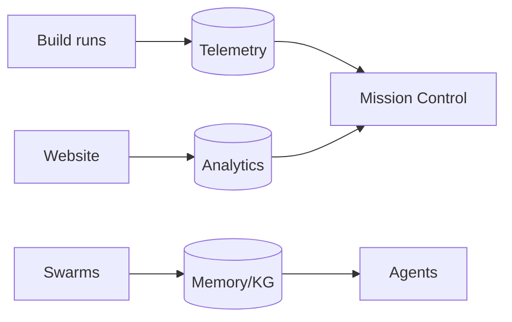

# Data Architecture

> **Breadcrumb:** [Home](../../README.md) › [Docs Index](../INDEX.md) › [Architecture](SYSTEM_ARCHITECTURE.md) › **Data Architecture**
> **Status:** `Active` · **Owner:** `architecture-swarm` · **Last verified:** `2026-06-12`

## 1. Purpose

What data exists, how it flows, where it lives, and how long it is kept — treating every flow as a
pipeline with schemas, freshness SLAs, and observability.

## 2. Data domains

| Domain | Examples | Classification | Home |
|--------|----------|----------------|------|
| Public content | pages, docs, case studies (anonymized) | Public | public repo |
| Build telemetry | traces, eval results, costs, learnings | Internal | observability store |
| Site analytics | page views, conversions (privacy-respecting) | Internal | analytics store |
| Memory/knowledge | embeddings, graph, curated knowledge | Internal | vector + graph stores |
| Client/CRM | leads, contracts, financials | Confidential/Secret | **private repo only** |

## 3. Flows

## 4. Schemas & contracts

- Every record is **timestamped (ISO-8601 UTC)** and carries provenance.
- Schemas are versioned; breaking changes follow
  [Release Engineering](../04-quality/RELEASE_ENGINEERING.md).
- Data quality (completeness, freshness, uniqueness, consistency) is checked in
  [CI/CD](../04-quality/CI_CD.md).

## 5. Retention & privacy

- Minimize collection; no PII or secrets in public artifacts
  ([Public/Private Model](../00-overview/PUBLIC_PRIVATE_MODEL.md),
  [Security Architecture](../06-governance/SECURITY_ARCHITECTURE.md)).
- Retention limits per domain; expired data is purged on schedule.

## 6. Grounding & Sources

| # | Claim | Source | Accessed |
|---|-------|--------|----------|
| 1 | Timestamp format | <https://www.iso.org/iso-8601-date-and-time-format.html> | 2026-06-12 |

---

### Freshness

- **Created/Updated/Verified:** 2026-06-12 · **Review cadence:** 60d · **Next review:** 2026-08-11
- See [Freshness Policy](../07-operations/FRESHNESS_POLICY.md).

### Navigation

- 🏠 [Home](../../README.md) · ⬆️ [Docs Index](../INDEX.md)
- ↔️ Related: [Memory Architecture](MEMORY_ARCHITECTURE.md) · [Analytics](../05-observability/ANALYTICS.md) · [Security Architecture](../06-governance/SECURITY_ARCHITECTURE.md)
