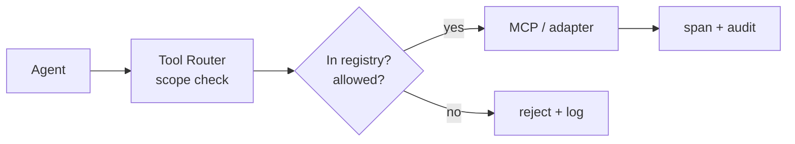

# Integration Architecture

> **Breadcrumb:** [Home](../../README.md) › [Docs Index](../INDEX.md) › [Architecture](SYSTEM_ARCHITECTURE.md) › **Integration Architecture**
> **Status:** `Active` · **Owner:** `architecture-swarm` · **Last verified:** `2026-06-12`

## 1. Purpose

How the system connects to external tools and data via a governed integration surface, primarily the
[Model Context Protocol (MCP)](https://modelcontextprotocol.io/), with least-privilege scopes and
full auditability.

## 2. Principles

- **MCP-first** for tool/context servers; thin adapters otherwise.
- **Least privilege:** every integration declares its scope; agents get only what they need.
- **Auditable:** every external call emits a span and is logged
  ([Tracing](../05-observability/TRACING.md), [Logging](../05-observability/LOGGING.md)).
- **Governed:** new integrations pass a fit review (auth, data classification, throttling, cost)
  before use ([AI Governance](../06-governance/AI_GOVERNANCE.md)).

## 3. Integration registry (shape)

| Field | Example |
|-------|---------|
| name | `web-fetch` |
| type | MCP server / REST adapter |
| auth | token / OAuth / none |
| scope | read-only fetch |
| data class | Public |
| owner | governance-swarm |
| throttle | N req/min |
| lifecycle | active / deprecated |

## 4. Flow

## 5. Security

Integrations honor the [Security Architecture](../06-governance/SECURITY_ARCHITECTURE.md):
no secrets in public, signed/pinned dependencies, and input validation on every tool boundary.

## 6. Grounding & Sources

| # | Claim | Source | Accessed |
|---|-------|--------|----------|
| 1 | MCP as integration standard | <https://modelcontextprotocol.io/> | 2026-06-12 |

---

### Freshness

- **Created/Updated/Verified:** 2026-06-12 · **Review cadence:** 60d · **Next review:** 2026-08-11
- See [Freshness Policy](../07-operations/FRESHNESS_POLICY.md).

### Navigation

- 🏠 [Home](../../README.md) · ⬆️ [Docs Index](../INDEX.md)
- ↔️ Related: [Orchestration](ORCHESTRATION.md) · [AI Governance](../06-governance/AI_GOVERNANCE.md) · [Security Architecture](../06-governance/SECURITY_ARCHITECTURE.md)
