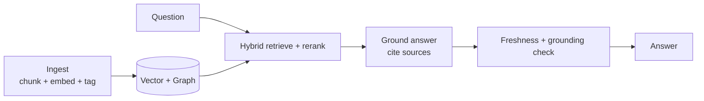

# Knowledge Architecture — Knowledge Graph & RAG

> **Breadcrumb:** [Home](../../README.md) › [Docs Index](../INDEX.md) › [Architecture](SYSTEM_ARCHITECTURE.md) › **Knowledge Architecture**
> **Status:** `Active` · **Owner:** `knowledge-swarm` · **Last verified:** `2026-06-12`

## 1. Purpose

How knowledge is structured, retrieved, and continuously improved — the substrate beneath agents,
content, and the public site's answers.

## 2. Components

| Component | Role | Doc |
|-----------|------|-----|
| Knowledge graph | entities + relations (customers, services, decisions, artifacts) | [Knowledge Graph](../08-knowledge/KNOWLEDGE_GRAPH.md) |
| Vector index | semantic retrieval | [Memory Architecture](MEMORY_ARCHITECTURE.md) |
| Document corpus | docs, content, case studies | this `docs/` tree |
| Obsidian vault | human-navigable graph + Canvas maps | [Obsidian Vault](../08-knowledge/OBSIDIAN_VAULT.md) |
| Learning log | append-only lessons | [Learning Log](../08-knowledge/LEARNING_LOG.md) |

## 3. RAG strategy

Answers are **grounded** (cite sources with access dates) and **fresh** (stale items re-verified),
per the [Freshness Policy](../07-operations/FRESHNESS_POLICY.md).

## 4. Documentation framework

Docs follow [Diátaxis](https://diataxis.fr/) categories (tutorials, how-to, reference, explanation)
so retrieval and human reading both stay coherent. The [Docs Index](../INDEX.md) is the single hub.

## 5. Continuous improvement

Retrieval quality is itself evaluated ([Eval Framework](../04-quality/EVAL_FRAMEWORK.md)); gaps and
contradictions open knowledge tasks. New lessons enter via the
[Learning Log](../08-knowledge/LEARNING_LOG.md).

## 6. Grounding & Sources

| # | Claim | Source | Accessed |
|---|-------|--------|----------|
| 1 | Documentation taxonomy | <https://diataxis.fr/> | 2026-06-12 |

---

### Freshness

- **Created/Updated/Verified:** 2026-06-12 · **Review cadence:** 60d · **Next review:** 2026-08-11
- See [Freshness Policy](../07-operations/FRESHNESS_POLICY.md).

### Navigation

- 🏠 [Home](../../README.md) · ⬆️ [Docs Index](../INDEX.md)
- ↔️ Related: [Knowledge Graph](../08-knowledge/KNOWLEDGE_GRAPH.md) · [Memory Architecture](MEMORY_ARCHITECTURE.md) · [Obsidian Vault](../08-knowledge/OBSIDIAN_VAULT.md)
