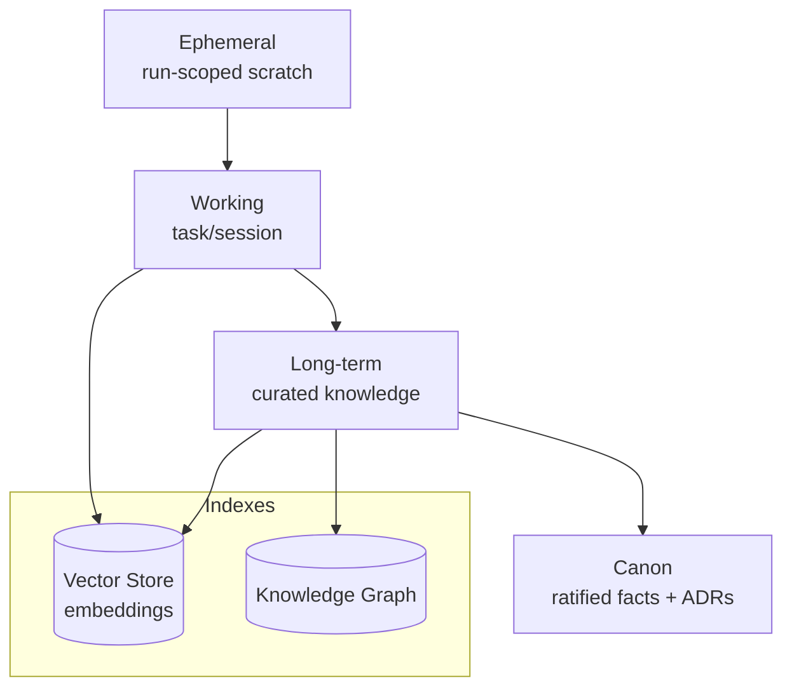
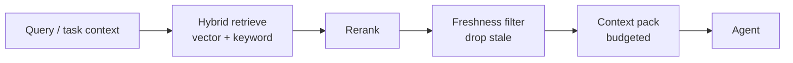

# Memory Architecture — Vector Maps & Retrieval

> **Breadcrumb:** [Home](../../README.md) › [Docs Index](../INDEX.md) › [Architecture](SYSTEM_ARCHITECTURE.md) › **Memory Architecture**
> **Status:** `Active` · **Owner:** `knowledge-swarm` · **Last verified:** `2026-06-12`

## 1. Purpose

How the system remembers: the memory tiers, the vector maps that make retrieval semantic, and the
freshness rules that keep memory true. Memory feeds intake clustering, planning, and every agent's
context window.

## 2. Memory tiers

| Tier | Lifetime | Promotion rule |
|------|----------|----------------|
| Ephemeral | one run | discard unless referenced |
| Working | session/task | promote if reused across runs |
| Long-term | durable | curated, deduped, timestamped |
| Canon | durable + protected | ratified via [ADR](../08-knowledge/DECISION_LOG.md) |

## 3. Vector maps

- **Embeddings:** local `qwen3-embedding:8b` (primary), `embeddinggemma:300m` (fast), `bge-m3`
  (multilingual) — see [Model Strategy](MODEL_STRATEGY.md).
- **Index:** content chunked, embedded, and stored with metadata (source, timestamp, owner, decay
  horizon). Retrieval is hybrid (vector + keyword) with reranking.
- **Visualization:** the embedding/relationship map is mirrored into the
  [Obsidian Vault](../08-knowledge/OBSIDIAN_VAULT.md) graph and Canvas for human-navigable maps.

## 4. Retrieval

Retrieval enforces **freshness**: items past their decay horizon are re-verified before use or
excluded ([Freshness Policy](../07-operations/FRESHNESS_POLICY.md)).

## 5. Freshness & forgetting

- Every memory item carries `created`, `last_verified`, and a `decay_horizon`.
- Default is **forgetting**: retention must be earned by reuse or ratification.
- A scheduled curator promotes, merges duplicates, and prunes/supersedes stale items, recording each
  action to the [Learning Log](../08-knowledge/LEARNING_LOG.md).

## 6. Privacy & isolation

Memory respects the [Public/Private boundary](../00-overview/PUBLIC_PRIVATE_MODEL.md): no
client-identifying data or secrets enter public memory. Sensitive memory lives in the private repo.

## 7. Grounding & Sources

| # | Claim | Source | Accessed |
|---|-------|--------|----------|
| 1 | Local embedding model options | <https://ollama.com/library> | 2026-06-12 |
| 2 | Tool/context interop | <https://modelcontextprotocol.io/> | 2026-06-12 |

---

### Freshness

- **Created/Updated/Verified:** 2026-06-12 · **Review cadence:** 45d · **Next review:** 2026-07-27
- See [Freshness Policy](../07-operations/FRESHNESS_POLICY.md).

### Navigation

- 🏠 [Home](../../README.md) · ⬆️ [Docs Index](../INDEX.md)
- ↔️ Related: [Knowledge Architecture](KNOWLEDGE_ARCHITECTURE.md) · [Obsidian Vault](../08-knowledge/OBSIDIAN_VAULT.md) · [Learning Log](../08-knowledge/LEARNING_LOG.md)
