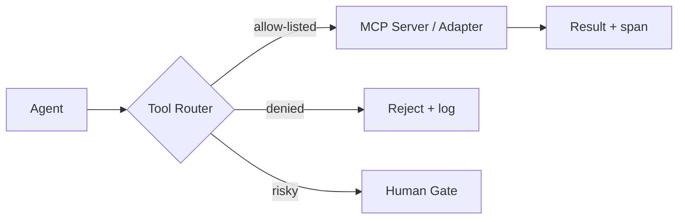

# Orchestration

> **Breadcrumb:** [Home](../../README.md) › [Docs Index](../INDEX.md) › [Architecture](SYSTEM_ARCHITECTURE.md) › **Orchestration**
> **Status:** `Active` · **Owner:** `architecture-swarm` · **Last verified:** `2026-06-12`

## 1. Purpose

How the orchestrator turns a plan into coordinated, observable, recoverable agent work: dispatch, tool
routing, retries, timeouts, and human gates.

## 2. Responsibilities

- **Dispatch** tasks to [swarm lanes](AGENTIC_SWARM.md) honoring the dependency graph.
- **Route tools** per agent allow-list (least privilege) via MCP and internal adapters.
- **Manage state** of in-flight tasks (queued → running → waiting → done/failed).
- **Recover** via retries with backoff, circuit breakers, and re-planning.
- **Gate** risky actions to [HITL](../06-governance/HUMAN_IN_THE_LOOP.md).
- **Emit** OTel GenAI spans for every dispatch, tool call, and handoff.

## 3. Tool routing

Each tool call validates inputs, enforces the agent's scope, and is auditable
([Integration Architecture](INTEGRATION_ARCHITECTURE.md), [Tracing](../05-observability/TRACING.md)).

## 4. Reliability patterns

| Pattern | Purpose |
|---------|---------|
| Idempotency keys | safe retries |
| Exponential backoff | transient failures |
| Circuit breaker | stop runaway loops / cost spikes |
| Timeout + cancel | bound latency |
| Dead-letter queue | capture unrecoverable tasks |
| Re-plan hook | orchestrator replans on repeated failure |

## 5. State & cost

The orchestrator records per-task cost (tokens, tool calls, wall time) to the
[Metrics Catalog](../05-observability/METRICS_CATALOG.md) and enforces per-run budget ceilings.

## 6. Grounding & Sources

| # | Claim | Source | Accessed |
|---|-------|--------|----------|
| 1 | Span model for operations | <https://opentelemetry.io/docs/specs/semconv/gen-ai/gen-ai-spans/> | 2026-06-12 |
| 2 | Tool/context protocol | <https://modelcontextprotocol.io/> | 2026-06-12 |

---

### Freshness

- **Created/Updated/Verified:** 2026-06-12 · **Review cadence:** 45d · **Next review:** 2026-07-27
- See [Freshness Policy](../07-operations/FRESHNESS_POLICY.md).

### Navigation

- 🏠 [Home](../../README.md) · ⬆️ [Docs Index](../INDEX.md)
- ↔️ Related: [Agentic Swarm](AGENTIC_SWARM.md) · [Integration Architecture](INTEGRATION_ARCHITECTURE.md) · [HITL](../06-governance/HUMAN_IN_THE_LOOP.md)
