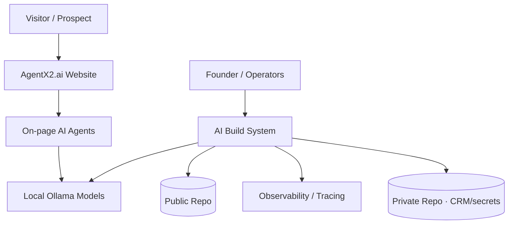
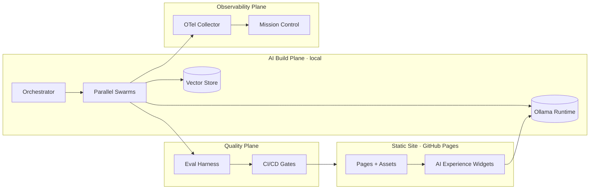

# System Architecture

> **Breadcrumb:** [Home](../../README.md) › [Docs Index](../INDEX.md) › **System Architecture**
> **Status:** `Active` · **Owner:** `architecture-swarm` · **Last verified:** `2026-06-12`

## 1. Purpose

The whole system on one page: the layers, how they fit, and where each is documented. Uses the
[C4 model](https://c4model.com/) (Context → Container → Component).

## 2. Context (C1)

## 3. Layered architecture

Aligned with the agentic layers in [`PRD_AgentX2.md`](../../PRD_AgentX2.md):

| Layer | Responsibility | Doc |
|-------|----------------|-----|
| 1 Experience | Website, chat, future portal | [Website Architecture](../02-website/WEBSITE_ARCHITECTURE.md) |
| 2 Orchestration | Swarm dispatch, MCP, event bus | [Orchestration](ORCHESTRATION.md) |
| 3 Reasoning | Local Ollama models (cloud optional) | [Model Strategy](MODEL_STRATEGY.md) |
| 4 Memory | Vector maps, knowledge graph, episodic | [Memory Architecture](MEMORY_ARCHITECTURE.md) |
| 5 Tools | Integrations, MCP servers, APIs | [Integration Architecture](INTEGRATION_ARCHITECTURE.md) |
| 6 Observability | Tracing, logging, metrics, cost | [Observability](../05-observability/OBSERVABILITY.md) |
| 7 Governance | Policy, security, HITL, compliance | [AI Governance](../06-governance/AI_GOVERNANCE.md) |

## 4. Containers (C2)

## 5. Cross-cutting concerns

- **Freshness/grounding:** [Freshness Policy](../07-operations/FRESHNESS_POLICY.md)
- **Zero regression:** [Regression Policy](../04-quality/REGRESSION_POLICY.md)
- **Security:** [Security Architecture](../06-governance/SECURITY_ARCHITECTURE.md)
- **Data:** [Data Architecture](DATA_ARCHITECTURE.md)

## 6. Grounding & Sources

| # | Claim | Source | Accessed |
|---|-------|--------|----------|
| 1 | C4 modelling approach | <https://c4model.com/> | 2026-06-12 |
| 2 | Layered agentic architecture | [`PRD_AgentX2.md`](../../PRD_AgentX2.md) | 2026-06-12 |

---

### Freshness

- **Created/Updated/Verified:** 2026-06-12 · **Review cadence:** 60d · **Next review:** 2026-08-11
- See [Freshness Policy](../07-operations/FRESHNESS_POLICY.md).

### Navigation

- 🏠 [Home](../../README.md) · ⬆️ [Docs Index](../INDEX.md)
- ↔️ Related: [AI Build System](AI_BUILD_SYSTEM.md) · [Agentic Swarm](AGENTIC_SWARM.md) · [Tech Stack](TECH_STACK.md)
