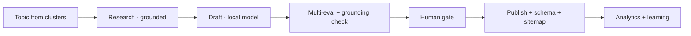

# Content Factory

> **Breadcrumb:** [Home](../../README.md) › [Docs Index](../INDEX.md) › [Website](WEBSITE_ARCHITECTURE.md) › **Content Factory**
> **Status:** `Active` · **Owner:** `content-swarm` · **Last verified:** `2026-06-12`

## 1. Purpose

The content production swarm that fuels [SEO](SEO_STRATEGY.md) and thought leadership — grounded,
evaluated, and human-gated before publish.

## 2. Content agents

Per [`sysprompt_agentx2.md`](../../sysprompt_agentx2.md):

| Agent | Output |
|-------|--------|
| Blog Agent | articles, posts |
| SEO Agent | keywords, on-page optimization |
| Research Agent | grounded source material |
| Social Agent | platform posts |
| Newsletter Agent | digests |
| Repurposing Agent | one source → many formats |

## 3. Pipeline

## 4. Quality rules

- **Helpful, original, grounded** — no thin or fabricated content
  ([Search Essentials](https://developers.google.com/search/docs/essentials),
  [Responsible AI](../06-governance/RESPONSIBLE_AI.md)).
- Passes [Quality Gates](../04-quality/QUALITY_GATES.md) (a11y, perf, links, grounding).
- Every piece is timestamped and cited; performance feeds back via
  [Analytics](../05-observability/ANALYTICS.md) and the
  [Learning Log](../08-knowledge/LEARNING_LOG.md).

## 5. Grounding & Sources

| # | Claim | Source | Accessed |
|---|-------|--------|----------|
| 1 | Content engine roles | [`sysprompt_agentx2.md`](../../sysprompt_agentx2.md) | 2026-06-12 |
| 2 | Helpful-content standard | <https://developers.google.com/search/docs/essentials> | 2026-06-12 |

---

### Freshness

- **Created/Updated/Verified:** 2026-06-12 · **Review cadence:** 45d · **Next review:** 2026-07-27
- See [Freshness Policy](../07-operations/FRESHNESS_POLICY.md).

### Navigation

- 🏠 [Home](../../README.md) · ⬆️ [Docs Index](../INDEX.md)
- ↔️ Related: [SEO Strategy](SEO_STRATEGY.md) · [Agent Catalog](../03-agents/AGENT_CATALOG.md) · [Quality Gates](../04-quality/QUALITY_GATES.md)
