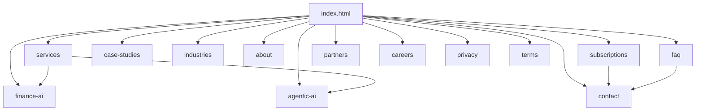

# Website Architecture

> **Breadcrumb:** [Home](../../README.md) › [Docs Index](../INDEX.md) › **Website Architecture**
> **Status:** `Active` · **Owner:** `website-swarm` · **Last verified:** `2026-06-12`

## 1. Purpose

The information architecture of the public site: pages, navigation, and the **≤3-click** guarantee.
Every page is clickable, discoverable, searchable, responsive, observable, and measurable — no dead
ends, no orphans.

## 2. Sitemap

## 3. Page inventory

Per [`sysprompt_agentx2.md`](../../sysprompt_agentx2.md):

| Page | Purpose | On-page AI | Primary CTA |
|------|---------|-----------|-------------|
| `index.html` | Home / value prop | AI Consultation Agent | Book consult |
| `services` | Service catalog | AI Solution Advisor | Explore / contact |
| `finance-ai` | Finance AI | AI CFO Agent | Assess ROI |
| `agentic-ai` | Agentic AI | Agent Builder | Start build |
| `subscriptions` | Plans | AI ROI Calculator | Choose plan |
| `case-studies` | Proof | Case Q&A | Contact |
| `industries` | Verticals | Industry Advisor | Contact |
| `about` | Company | Concierge | Contact |
| `contact` | Convert | AI Discovery Agent | Submit |
| `faq` | Answers | Knowledge Agent | Contact |
| `partners` | Ecosystem | Concierge | Partner inquiry |
| `careers` | Hiring | Concierge | Apply |
| `privacy` / `terms` | Legal | — | — |

## 4. Navigation rules

- **Global nav + footer** expose every top-level destination from every page.
- **≤3 clicks** to any page (Home → section → page).
- **Search** and a persistent **AI concierge** provide non-linear access
  ([AI Experience](AI_EXPERIENCE.md)).
- Every page ships SEO metadata, [schema.org](https://schema.org/) structured data, analytics hooks,
  and conversion tracking ([SEO](SEO_STRATEGY.md), [Analytics](../05-observability/ANALYTICS.md)).

## 5. Build & output

Built with Astro to **static** output for GitHub Pages ([Tech Stack](../01-architecture/TECH_STACK.md)),
meeting [Accessibility](ACCESSIBILITY.md) and [Performance](PERFORMANCE.md) gates before deploy.

## 6. Grounding & Sources

| # | Claim | Source | Accessed |
|---|-------|--------|----------|
| 1 | Page list + on-page AI | [`sysprompt_agentx2.md`](../../sysprompt_agentx2.md) | 2026-06-12 |
| 2 | Structured data | <https://schema.org/> | 2026-06-12 |

---

### Freshness

- **Created/Updated/Verified:** 2026-06-12 · **Review cadence:** 45d · **Next review:** 2026-07-27
- See [Freshness Policy](../07-operations/FRESHNESS_POLICY.md).

### Navigation

- 🏠 [Home](../../README.md) · ⬆️ [Docs Index](../INDEX.md)
- ↔️ Related: [Design System](DESIGN_SYSTEM.md) · [AI Experience](AI_EXPERIENCE.md) · [SEO Strategy](SEO_STRATEGY.md) · [Accessibility](ACCESSIBILITY.md) · [Performance](PERFORMANCE.md)
