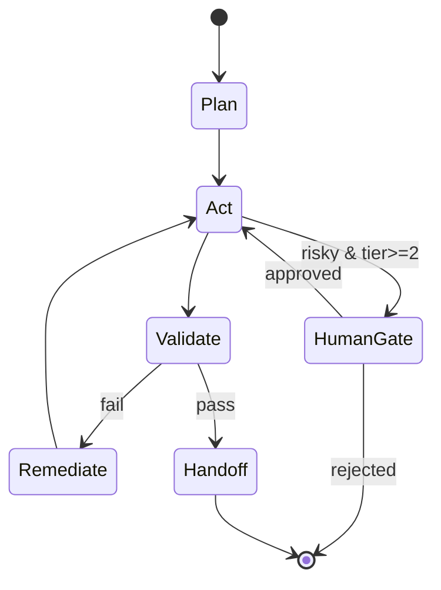

# Agent Contracts

> **Breadcrumb:** [Home](../../README.md) › [Docs Index](../INDEX.md) › [Agent Catalog](AGENT_CATALOG.md) › **Agent Contracts**
> **Status:** `Active` · **Owner:** `agent-architecture-swarm` · **Last verified:** `2026-06-12`

## 1. Purpose

The shared contract every agent honors, so agents are interchangeable, observable, and safe. Concrete
agents fill in the [Agent Spec Template](../_templates/AGENT_SPEC_TEMPLATE.md).

## 2. Required fields

Mission · inputs/outputs (typed) · tools (allow-list) · model (primary + fallback, local) · memory
(read/write scope) · autonomy tier · metrics · escalation/approval rules.

## 3. I/O schemas

```json
// input
{ "task_id": "string", "intent": "string", "context": {}, "constraints": {}, "trace_id": "string" }
```

```json
// output
{ "task_id": "string", "status": "ok|needs_human|failed", "result": {}, "evidence": [], "cost": {}, "timestamp": "2026-06-12T00:00:00Z", "trace_id": "string" }
```

Outputs are **never free-text-only** — they carry status, evidence, cost, and a trace id.

## 4. Lifecycle



## 5. Obligations

1. Anchor time; open a trace; emit agent spans
   ([OTel agent spans](https://opentelemetry.io/docs/specs/semconv/gen-ai/gen-ai-agent-spans/)).
2. Use only allow-listed tools at the declared [autonomy tier](../06-governance/HUMAN_IN_THE_LOOP.md).
3. Ground outputs; never fabricate; mark `[UNVERIFIED]` where needed.
4. Pass the agent's [eval bar](../04-quality/EVAL_FRAMEWORK.md) before its output is trusted.
5. Record a [learning entry](../08-knowledge/LEARNING_LOG.md) on meaningful runs.

## 6. Grounding & Sources

| # | Claim | Source | Accessed |
|---|-------|--------|----------|
| 1 | Agent span attributes | <https://opentelemetry.io/docs/specs/semconv/gen-ai/gen-ai-agent-spans/> | 2026-06-12 |

---

### Freshness

- **Created/Updated/Verified:** 2026-06-12 · **Review cadence:** 60d · **Next review:** 2026-08-11
- See [Freshness Policy](../07-operations/FRESHNESS_POLICY.md).

### Navigation

- 🏠 [Home](../../README.md) · ⬆️ [Docs Index](../INDEX.md)
- ↔️ Related: [Agent Catalog](AGENT_CATALOG.md) · [HITL](../06-governance/HUMAN_IN_THE_LOOP.md) · [Eval Framework](../04-quality/EVAL_FRAMEWORK.md)
