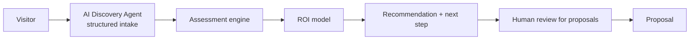

# AI Consultation Engine

> **Breadcrumb:** [Home](../../README.md) › [Docs Index](../INDEX.md) › [Agent Catalog](AGENT_CATALOG.md) › **Consultation Engine**
> **Status:** `Active` · **Owner:** `agent-architecture-swarm` · **Last verified:** `2026-06-12`

## 1. Purpose

The lead-to-proposal engine: structured AI assessments that qualify prospects and produce grounded
recommendations and ROI — the core conversion machinery of the public site.

## 2. Assessments

Per [`sysprompt_agentx2.md`](../../sysprompt_agentx2.md):

| Assessment | Output |
|------------|--------|
| AI Opportunity Assessment | ranked opportunities |
| AI Readiness Assessment | readiness score + gaps |
| Automation Assessment | candidate processes |
| ROI Assessment | savings, productivity, payback |
| Digital Workforce Assessment | agent fleet recommendation |

## 3. Flow

## 4. Rules

- **Grounded ROI:** numbers derive from declared inputs + transparent assumptions — never invented
  ([Responsible AI](../06-governance/RESPONSIBLE_AI.md)).
- **Observable:** each step emits funnel events ([Analytics](../05-observability/ANALYTICS.md)).
- **Human-gated proposals:** generated proposals are reviewed before they reach a prospect
  ([HITL](../06-governance/HUMAN_IN_THE_LOOP.md)).
- **Private data stays private:** captured lead data flows to the private CRM, not the public repo
  ([Public/Private Model](../00-overview/PUBLIC_PRIVATE_MODEL.md)).

## 5. Grounding & Sources

| # | Claim | Source | Accessed |
|---|-------|--------|----------|
| 1 | Assessment set | [`sysprompt_agentx2.md`](../../sysprompt_agentx2.md) | 2026-06-12 |
| 2 | Consultation + proposal agents | [`PRD_AgentX2.md`](../../PRD_AgentX2.md) | 2026-06-12 |

---

### Freshness

- **Created/Updated/Verified:** 2026-06-12 · **Review cadence:** 60d · **Next review:** 2026-08-11
- See [Freshness Policy](../07-operations/FRESHNESS_POLICY.md).

### Navigation

- 🏠 [Home](../../README.md) · ⬆️ [Docs Index](../INDEX.md)
- ↔️ Related: [Agent Catalog](AGENT_CATALOG.md) · [AI Experience](../02-website/AI_EXPERIENCE.md) · [Company Model](../00-overview/COMPANY_MODEL.md)
