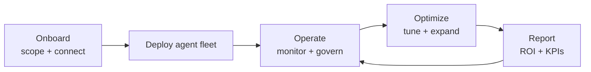

# Managed AI Workforce

> **Breadcrumb:** [Home](../../README.md) › [Docs Index](../INDEX.md) › [Agent Catalog](AGENT_CATALOG.md) › **Managed AI Workforce**
> **Status:** `Active` · **Owner:** `agent-architecture-swarm` · **Last verified:** `2026-06-12`

## 1. Purpose

The platform foundation for **Managed AI Workforce™** — digital workers delivered as a subscription
service, governed and observable from a single control plane.

## 2. Agent departments

Per [`sysprompt_agentx2.md`](../../sysprompt_agentx2.md) and [`PRD_AgentX2.md`](../../PRD_AgentX2.md):

| Department | Example agents |
|------------|----------------|
| Executive | CEO/COO/CFO/Product agents |
| Finance | CFO copilot, FP&A, collections |
| Sales | lead discovery, outreach, proposal, CRM |
| Marketing | content, SEO, social, brand |
| Support | customer service, knowledge |
| Engineering | code, DevOps, security |
| Operations | monitoring, workflow |
| Compliance | governance, audit |
| Research | market + technical research |

## 3. Service model

## 4. Governance & visibility

Every workforce agent runs under [AI Governance](../06-governance/AI_GOVERNANCE.md) with
[autonomy tiers](../06-governance/HUMAN_IN_THE_LOOP.md), is fully traced
([Tracing](../05-observability/TRACING.md)), and is surfaced on
[Mission Control](../05-observability/MISSION_CONTROL.md) (executions, escalations, savings, ROI).

## 5. Grounding & Sources

| # | Claim | Source | Accessed |
|---|-------|--------|----------|
| 1 | Workforce departments | [`sysprompt_agentx2.md`](../../sysprompt_agentx2.md) | 2026-06-12 |
| 2 | Enterprise AI services | [`PRD_AgentX2.md`](../../PRD_AgentX2.md) | 2026-06-12 |

---

### Freshness

- **Created/Updated/Verified:** 2026-06-12 · **Review cadence:** 60d · **Next review:** 2026-08-11
- See [Freshness Policy](../07-operations/FRESHNESS_POLICY.md).

### Navigation

- 🏠 [Home](../../README.md) · ⬆️ [Docs Index](../INDEX.md)
- ↔️ Related: [Agent Catalog](AGENT_CATALOG.md) · [AI Governance](../06-governance/AI_GOVERNANCE.md) · [Mission Control](../05-observability/MISSION_CONTROL.md)
