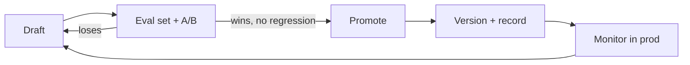

# Prompt Library

> **Breadcrumb:** [Home](../../README.md) › [Docs Index](../INDEX.md) › [Agent Catalog](AGENT_CATALOG.md) › **Prompt Library**
> **Status:** `Active` · **Owner:** `agent-architecture-swarm` · **Last verified:** `2026-06-12`

## 1. Purpose

How prompts are written, versioned, evaluated, and hardened. (Sensitive operational prompts live in
the private repo; this doc defines the **standard**, see
[Public/Private Model](../00-overview/PUBLIC_PRIVATE_MODEL.md).)

## 2. Prompt standard

- **Structured:** role, task, constraints, output schema, grounding instructions.
- **Versioned:** every prompt has an id + semver; changes are diffable and recorded.
- **Evaluated:** prompts ship with an eval set; changes are A/B-tested
  ([Eval Framework](../04-quality/EVAL_FRAMEWORK.md)).
- **Grounded & safe:** instruct models to cite, refuse unsafe requests, and avoid fabrication.

## 3. Injection defense

Per [OWASP Top 10 for LLM Applications](https://genai.owasp.org/llm-top-10/):

- Treat all external/tool/user content as untrusted; enforce an instruction hierarchy.
- Sanitize inputs; validate outputs; never let retrieved content override system policy.
- Guardian model screens for injection, data-exfil, and unsafe tool use
  ([Responsible AI](../06-governance/RESPONSIBLE_AI.md), [Security](../06-governance/SECURITY_ARCHITECTURE.md)).

## 4. Lifecycle

## 5. Grounding & Sources

| # | Claim | Source | Accessed |
|---|-------|--------|----------|
| 1 | LLM injection risks + defenses | <https://genai.owasp.org/llm-top-10/> | 2026-06-12 |

---

### Freshness

- **Created/Updated/Verified:** 2026-06-12 · **Review cadence:** 45d · **Next review:** 2026-07-27
- See [Freshness Policy](../07-operations/FRESHNESS_POLICY.md).

### Navigation

- 🏠 [Home](../../README.md) · ⬆️ [Docs Index](../INDEX.md)
- ↔️ Related: [Agent Contracts](AGENT_CONTRACTS.md) · [Eval Framework](../04-quality/EVAL_FRAMEWORK.md) · [Security Architecture](../06-governance/SECURITY_ARCHITECTURE.md)
