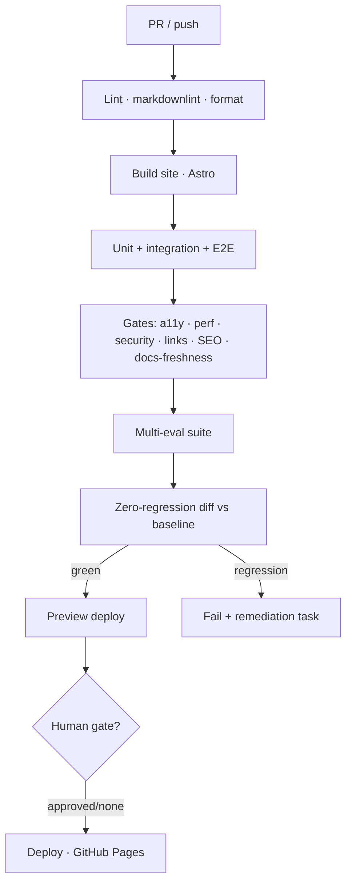

# CI/CD — Pipelines & Gates

> **Breadcrumb:** [Home](../../README.md) › [Docs Index](../INDEX.md) › [Quality](QUALITY_GATES.md) › **CI/CD**
> **Status:** `Active` · **Owner:** `quality-swarm` · **Last verified:** `2026-06-12`

## 1. Purpose

The automation that enforces every [quality gate](QUALITY_GATES.md) and the
[zero-regression policy](REGRESSION_POLICY.md) on every change, then deploys safely. Runs on
[GitHub Actions](https://docs.github.com/en/actions).

## 2. Pipelines

## 3. Workflows

| Workflow | Trigger | Does |
|----------|---------|------|
| `ci` | PR / push | lint, build, test, gates, eval, regression diff |
| `deploy` | merge to `main` (green) | build + publish to [Pages](https://docs.github.com/en/pages/getting-started-with-github-pages/configuring-a-publishing-source-for-your-github-pages-site) |
| `security` | PR + schedule | secret scan, dependency scan, [Scorecard](https://securityscorecards.dev/) |
| `freshness` | daily schedule | staleness scan + link check ([Freshness](../07-operations/FRESHNESS_POLICY.md)) |
| `eval-trend` | schedule | re-run evals, trend on [Mission Control](../05-observability/MISSION_CONTROL.md) |

## 4. Principles

- **Fast + reliable:** cache deps; quarantine flaky tests; fail fast on the cheapest gate first.
- **Secure by default:** secret scanning blocks any credential; least-privilege workflow tokens;
  pinned action versions ([Security Architecture](../06-governance/SECURITY_ARCHITECTURE.md)).
- **Every gate is required:** no gate is skipped; `--no-verify` and force-push to `main` are
  prohibited (see [AGENTS.md](../../AGENTS.md)).
- **Reproducible:** pinned toolchain + model settings; runs are timestamped and traced.

## 5. Provenance

Each deploy records commit, PR, eval run, and build run ids — the
[provenance chain](../07-operations/FRESHNESS_POLICY.md) from live site back to source.

## 6. Grounding & Sources

| # | Claim | Source | Accessed |
|---|-------|--------|----------|
| 1 | CI engine | <https://docs.github.com/en/actions> | 2026-06-12 |
| 2 | Pages deploy | <https://docs.github.com/en/pages/getting-started-with-github-pages/configuring-a-publishing-source-for-your-github-pages-site> | 2026-06-12 |
| 3 | Supply-chain scoring | <https://securityscorecards.dev/> | 2026-06-12 |

---

### Freshness

- **Created/Updated/Verified:** 2026-06-12 · **Review cadence:** 45d · **Next review:** 2026-07-27
- See [Freshness Policy](../07-operations/FRESHNESS_POLICY.md).

### Navigation

- 🏠 [Home](../../README.md) · ⬆️ [Docs Index](../INDEX.md)
- ↔️ Related: [Quality Gates](QUALITY_GATES.md) · [Regression Policy](REGRESSION_POLICY.md) · [Deployment](../07-operations/DEPLOYMENT.md)
