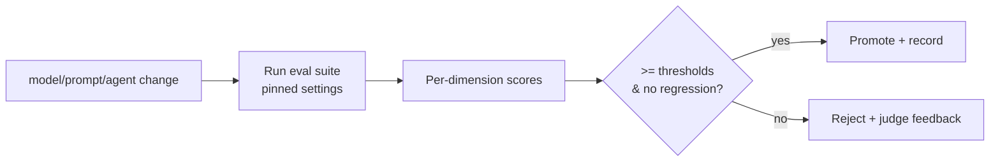

# Eval Framework — Multi-Eval & LLM-as-Judge

> **Breadcrumb:** [Home](../../README.md) › [Docs Index](../INDEX.md) › [Quality](QUALITY_GATES.md) › **Eval Framework**
> **Status:** `Active` · **Owner:** `quality-swarm` · **Last verified:** `2026-06-12`

## 1. Purpose

How AI outputs are measured so the [self-build loop](../01-architecture/AI_BUILD_SYSTEM.md) can gate
on quality, not vibes. Every model/prompt/agent change is scored on a **multi-dimensional** eval and
must clear thresholds with **no regression**.

## 2. Eval dimensions

| Dimension | What it measures | Method |
|-----------|------------------|--------|
| Correctness | does it meet the spec / ground truth | exact/semantic match, rubric |
| Faithfulness / grounding | claims supported by sources, no fabrication | judge + citation check |
| Safety | refuses unsafe, resists injection | guardian model + adversarial set ([OWASP LLM](https://genai.owasp.org/llm-top-10/)) |
| Helpfulness | usefulness to the persona | LLM-as-judge rubric |
| Latency | p50/p95 response time | OTel metrics |
| Cost | tokens + tool calls per task | cost ledger ([Metrics](../05-observability/METRICS_CATALOG.md)) |
| Format | valid output schema | schema validation |

## 3. Methods

- **Ground-truth comparison** for tasks with known answers.
- **Rubric scoring** for open-ended outputs.
- **LLM-as-judge** using a local judge model (`qwen3.6` / `glm-4.7-flash`,
  [Model Strategy](../01-architecture/MODEL_STRATEGY.md)) with a fixed rubric and pinned settings for
  reproducibility.
- **Guardian screening** (`granite4.1-guardian` / `llama-guard3`) for safety.
- **Adversarial suite** for prompt-injection / data-exfil resistance.

## 4. Eval datasets

- Versioned **golden sets** per agent/role (`eval/golden_*.jsonl`), timestamped and grounded.
- Cases are added from production failures and incident learnings
  ([Learning Log](../08-knowledge/LEARNING_LOG.md)).
- Datasets themselves are reviewed for freshness on the 30-day cadence.

## 5. Gate & baseline

Scores are compared to a locked **baseline**; a drop in any dimension is a regression
([Regression Policy](REGRESSION_POLICY.md)). Results run in [CI/CD](CI_CD.md) and trend on
[Mission Control](../05-observability/MISSION_CONTROL.md).

## 6. Reproducibility

Pin model id/tag, temperature, and seed; record dataset version, model version, and timestamp with
every eval run so results are auditable and comparable over time.

## 7. Grounding & Sources

| # | Claim | Source | Accessed |
|---|-------|--------|----------|
| 1 | GenAI metric conventions | <https://opentelemetry.io/docs/specs/semconv/gen-ai/gen-ai-metrics/> | 2026-06-12 |
| 2 | LLM risk classes for safety evals | <https://genai.owasp.org/llm-top-10/> | 2026-06-12 |
| 3 | Local judge/guardian models | <https://ollama.com/library> | 2026-06-12 |

---

### Freshness

- **Created:** 2026-06-12 · **Updated:** 2026-06-12 · **Last verified:** 2026-06-12
- **Review cadence:** 30 days · **Staleness threshold:** 45 days · **Next review due:** 2026-07-12

### Navigation

- 🏠 [Home](../../README.md) · ⬆️ [Docs Index](../INDEX.md)
- ↔️ Related: [Regression Policy](REGRESSION_POLICY.md) · [CI/CD](CI_CD.md) · [Model Strategy](../01-architecture/MODEL_STRATEGY.md) · [Metrics Catalog](../05-observability/METRICS_CATALOG.md)
