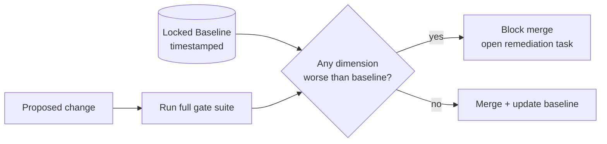

# Zero-Regression Policy

> **Breadcrumb:** [Home](../../README.md) › [Docs Index](../INDEX.md) › [Quality](QUALITY_GATES.md) › **Zero-Regression Policy**
> **Status:** `Active` · **Owner:** `quality-swarm` · **Last verified:** `2026-06-12`

## 1. Purpose

The rule that keeps quality moving **only forward**: no change may worsen any tracked quality
dimension versus the locked baseline. This is the safety rail of the
[self-build loop](../01-architecture/AI_BUILD_SYSTEM.md) — autonomous swarms can build fast precisely
because they cannot regress.

## 2. Tracked dimensions (the baseline)

| Dimension | Baseline metric | Regression = |
|-----------|-----------------|--------------|
| Tests | pass count / coverage % | any failure or coverage drop |
| Evals | per-dimension scores | any dimension below baseline ([Eval](EVAL_FRAMEWORK.md)) |
| Accessibility | axe violations (0) / score | new violation or score drop ([a11y](../02-website/ACCESSIBILITY.md)) |
| Performance | LCP/INP/CLS, Lighthouse | any metric out of "Good" or score drop ([perf](../02-website/PERFORMANCE.md)) |
| Security | scan findings | any new finding ([security](../06-governance/SECURITY_ARCHITECTURE.md)) |
| Links | broken-link count (0) | any new broken link |
| SEO | metadata/schema checks | any new failure ([SEO](../02-website/SEO_STRATEGY.md)) |
| Docs freshness | stale-doc count | any new stale/missing-frontmatter doc |

## 3. How it works

- The baseline is **versioned and timestamped**; updating it requires a green run.
- A regression **blocks merge** and routes back to build with the failing evidence.
- Baselines are never lowered to "make it pass"; a deliberate, justified change to a threshold
  requires an [ADR](../08-knowledge/DECISION_LOG.md).

## 4. Exceptions

The only path to accept a temporary regression is an explicit, time-boxed waiver approved via
[HITL](../06-governance/HUMAN_IN_THE_LOOP.md), recorded with rationale and an expiry date, and tracked
on the [Risk Register](../06-governance/RISK_REGISTER.md).

## 5. Grounding & Sources

| # | Claim | Source | Accessed |
|---|-------|--------|----------|
| 1 | Gate set that forms the baseline | [`sysprompt_agentx2.md`](../../sysprompt_agentx2.md) | 2026-06-12 |
| 2 | Performance thresholds | <https://web.dev/articles/vitals> | 2026-06-12 |

---

### Freshness

- **Created/Updated/Verified:** 2026-06-12 · **Review cadence:** 45d · **Next review:** 2026-07-27
- See [Freshness Policy](../07-operations/FRESHNESS_POLICY.md).

### Navigation

- 🏠 [Home](../../README.md) · ⬆️ [Docs Index](../INDEX.md)
- ↔️ Related: [Quality Gates](QUALITY_GATES.md) · [Eval Framework](EVAL_FRAMEWORK.md) · [CI/CD](CI_CD.md)
