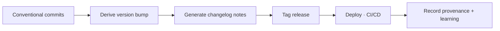

# Release Engineering

> **Breadcrumb:** [Home](../../README.md) › [Docs Index](../INDEX.md) › [Quality](QUALITY_GATES.md) › **Release Engineering**
> **Status:** `Active` · **Owner:** `quality-swarm` · **Last verified:** `2026-06-12`

## 1. Purpose

How changes become versioned, traceable releases.

## 2. Standards

- **Versioning:** [SemVer 2.0.0](https://semver.org/) — MAJOR.MINOR.PATCH.
- **Commits:** [Conventional Commits 1.0.0](https://www.conventionalcommits.org/en/v1.0.0/) drive the
  version bump and changelog.
- **Changelog:** [Keep a Changelog 1.1.0](https://keepachangelog.com/en/1.1.0/) with an `Unreleased`
  section; see [`CHANGELOG.md`](../../CHANGELOG.md).

## 3. Flow

## 4. Rules

- Releases ship only when all [gates](QUALITY_GATES.md) are green and there is **no regression**.
- Every release is timestamped, tagged, and traceable to its commits and eval run.
- Rollback is always available ([Deployment](../07-operations/DEPLOYMENT.md)).

## 5. Grounding & Sources

| # | Claim | Source | Accessed |
|---|-------|--------|----------|
| 1 | SemVer rules | <https://semver.org/> | 2026-06-12 |
| 2 | Commit convention | <https://www.conventionalcommits.org/en/v1.0.0/> | 2026-06-12 |
| 3 | Changelog format | <https://keepachangelog.com/en/1.1.0/> | 2026-06-12 |

---

### Freshness

- **Created/Updated/Verified:** 2026-06-12 · **Review cadence:** 60d · **Next review:** 2026-08-11
- See [Freshness Policy](../07-operations/FRESHNESS_POLICY.md).

### Navigation

- 🏠 [Home](../../README.md) · ⬆️ [Docs Index](../INDEX.md)
- ↔️ Related: [CI/CD](CI_CD.md) · [Deployment](../07-operations/DEPLOYMENT.md) · [Decision Log](../08-knowledge/DECISION_LOG.md)
