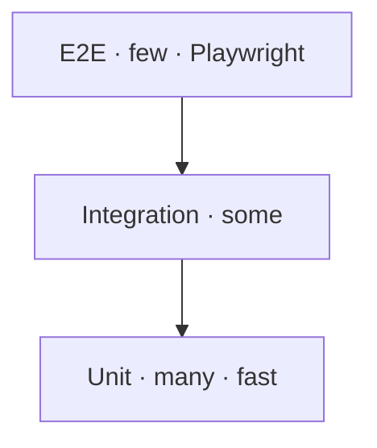

# Testing Strategy

> **Breadcrumb:** [Home](../../README.md) › [Docs Index](../INDEX.md) › [Quality](QUALITY_GATES.md) › **Testing Strategy**
> **Status:** `Active` · **Owner:** `quality-swarm` · **Last verified:** `2026-06-12`

## 1. Purpose

What we test and at which level, so quality is fast to verify and cheap to keep green.

## 2. The pyramid

Target mix ≈ 70% unit / 20% integration / 10% E2E
([test pyramid](https://martinfowler.com/articles/practical-test-pyramid.html)).

## 3. Layers

| Layer | Scope | Examples |
|-------|-------|----------|
| Unit | pure functions, components | token utils, formatters, component props |
| Integration | wiring | build steps, adapter ↔ Ollama, sitemap/schema generation |
| E2E | user journeys | nav ≤3 clicks, contact flow, AI widget basic flow ([Playwright](https://playwright.dev/)) |
| Non-functional | gates | a11y, perf, security, links (see [Quality Gates](QUALITY_GATES.md)) |
| AI quality | model outputs | [Eval Framework](EVAL_FRAMEWORK.md) |

## 4. Principles

- Deterministic + fast by default; flaky tests are quarantined and fixed, not ignored.
- Tests run in [CI/CD](CI_CD.md) on every change; coverage floor enforced and ratcheted upward.
- AI behavior is validated by **evals**, not brittle string assertions.

## 5. Grounding & Sources

| # | Claim | Source | Accessed |
|---|-------|--------|----------|
| 1 | Pyramid ratios | <https://martinfowler.com/articles/practical-test-pyramid.html> | 2026-06-12 |
| 2 | Browser E2E | <https://playwright.dev/> | 2026-06-12 |

---

### Freshness

- **Created/Updated/Verified:** 2026-06-12 · **Review cadence:** 60d · **Next review:** 2026-08-11
- See [Freshness Policy](../07-operations/FRESHNESS_POLICY.md).

### Navigation

- 🏠 [Home](../../README.md) · ⬆️ [Docs Index](../INDEX.md)
- ↔️ Related: [Quality Gates](QUALITY_GATES.md) · [Eval Framework](EVAL_FRAMEWORK.md) · [CI/CD](CI_CD.md)
