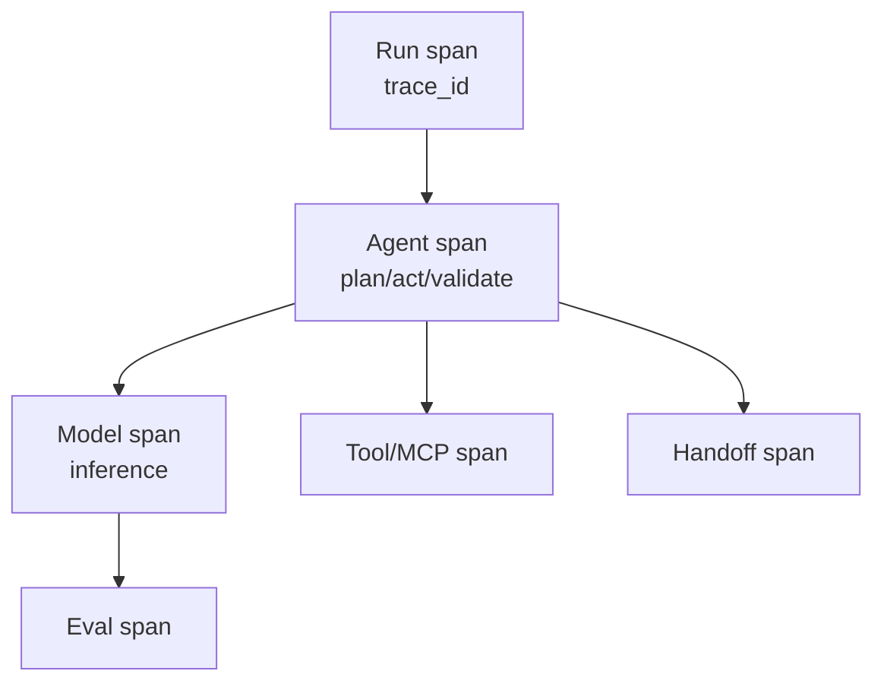

# Tracing — OpenTelemetry GenAI

> **Breadcrumb:** [Home](../../README.md) › [Docs Index](../INDEX.md) › [Observability](OBSERVABILITY.md) › **Tracing**
> **Status:** `Active` · **Owner:** `observability-swarm` · **Last verified:** `2026-06-12`

## 1. Purpose

How every agent run, model call, tool call, and handoff becomes a trace, using the OpenTelemetry
**GenAI semantic conventions** (v1.41.1 as accessed). This is what makes the
[self-build loop](../01-architecture/AI_BUILD_SYSTEM.md) auditable end to end.

## 2. Span model

- **Model spans** follow [GenAI spans](https://opentelemetry.io/docs/specs/semconv/gen-ai/gen-ai-spans/)
  (operation, model, token usage, etc.).
- **Agent/framework spans** follow
  [GenAI agent spans](https://opentelemetry.io/docs/specs/semconv/gen-ai/gen-ai-agent-spans/).
- **Tool calls** to MCP servers follow
  [MCP semconv](https://opentelemetry.io/docs/specs/semconv/gen-ai/mcp/).
- **Inputs/outputs** captured as
  [GenAI events](https://opentelemetry.io/docs/specs/semconv/gen-ai/gen-ai-events/) (with redaction of
  sensitive content per [Security](../06-governance/SECURITY_ARCHITECTURE.md)).

## 3. Conventions

- Opt in to the latest conventions: `OTEL_SEMCONV_STABILITY_OPT_IN=gen_ai_latest_experimental`.
- Every span carries `trace_id`, timestamps (UTC), and links to the originating task.
- Spans connect to cost + latency metrics in the [Metrics Catalog](METRICS_CATALOG.md).

## 4. End-to-end correlation

A single `trace_id` threads intake → spec → plan → build → eval → CI → deploy → observe, so any live
artifact is traceable to its source (the [provenance chain](../07-operations/FRESHNESS_POLICY.md)).

## 5. Privacy

Prompts/outputs may contain sensitive content; events are redacted and respect the
[Public/Private boundary](../00-overview/PUBLIC_PRIVATE_MODEL.md). No secrets or client data in public
traces.

## 6. Grounding & Sources

| # | Claim | Source | Accessed |
|---|-------|--------|----------|
| 1 | Model span attributes | <https://opentelemetry.io/docs/specs/semconv/gen-ai/gen-ai-spans/> | 2026-06-12 |
| 2 | Agent span attributes | <https://opentelemetry.io/docs/specs/semconv/gen-ai/gen-ai-agent-spans/> | 2026-06-12 |
| 3 | MCP span attributes | <https://opentelemetry.io/docs/specs/semconv/gen-ai/mcp/> | 2026-06-12 |
| 4 | Input/output events | <https://opentelemetry.io/docs/specs/semconv/gen-ai/gen-ai-events/> | 2026-06-12 |

---

### Freshness

- **Created:** 2026-06-12 · **Updated:** 2026-06-12 · **Last verified:** 2026-06-12
- **Review cadence:** 30 days · **Staleness threshold:** 45 days · **Next review due:** 2026-07-12
- GenAI conventions are evolving; re-verify attribute names on cadence.

### Navigation

- 🏠 [Home](../../README.md) · ⬆️ [Docs Index](../INDEX.md)
- ↔️ Related: [Observability](OBSERVABILITY.md) · [Metrics Catalog](METRICS_CATALOG.md) · [AI Build System](../01-architecture/AI_BUILD_SYSTEM.md)
