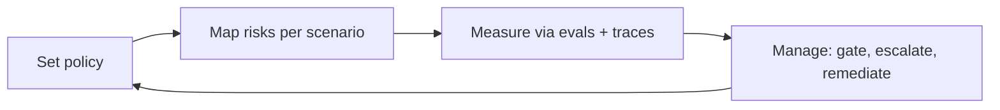

# AI Governance

> **Breadcrumb:** [Home](../../README.md) › [Docs Index](../INDEX.md) › **AI Governance**
> **Status:** `Active` · **Owner:** `governance-swarm` · **Last verified:** `2026-06-12`

## 1. Purpose

The policy layer that keeps autonomous swarms safe, accountable, and auditable — model, prompt, agent,
and data governance with human oversight. Aligned to the
[NIST AI RMF](https://www.nist.gov/itl/ai-risk-management-framework) functions (Govern, Map, Measure,
Manage).

## 2. Governance domains

| Domain | Controls |
|--------|----------|
| Model | approved model registry, promotion via eval, deprecation ([Model Strategy](../01-architecture/MODEL_STRATEGY.md)) |
| Prompt | versioned, evaluated, injection-hardened ([Prompt Library](../03-agents/PROMPT_LIBRARY.md)) |
| Agent | specs, autonomy tiers, lifecycle, sunset ([Agent Contracts](../03-agents/AGENT_CONTRACTS.md)) |
| Data | classification, minimization, retention ([Data Architecture](../01-architecture/DATA_ARCHITECTURE.md)) |
| Human oversight | approval gates ([HITL](HUMAN_IN_THE_LOOP.md)) |
| Audit | traces + logs + provenance ([Tracing](../05-observability/TRACING.md)) |
| Risk | live register ([Risk Register](RISK_REGISTER.md)) |

## 3. Controls (per [`sysprompt_agentx2.md`](../../sysprompt_agentx2.md))

Model/prompt/agent/data governance · human approval policies · security controls · audit trails ·
compliance controls · risk management — all enforced in [CI/CD](../04-quality/CI_CD.md) and surfaced
on [Mission Control](../05-observability/MISSION_CONTROL.md).

## 4. Operating rhythm

## 5. Safety baseline

Every agent is screened by a guardian model and bound by an [autonomy tier](HUMAN_IN_THE_LOOP.md);
injection and tool-abuse defenses follow [OWASP LLM Top 10](https://genai.owasp.org/llm-top-10/)
([Responsible AI](RESPONSIBLE_AI.md), [Security](SECURITY_ARCHITECTURE.md)).

## 6. Grounding & Sources

| # | Claim | Source | Accessed |
|---|-------|--------|----------|
| 1 | RMF functions | <https://www.nist.gov/itl/ai-risk-management-framework> | 2026-06-12 |
| 2 | LLM risk classes | <https://genai.owasp.org/llm-top-10/> | 2026-06-12 |
| 3 | Governance control set | [`sysprompt_agentx2.md`](../../sysprompt_agentx2.md) | 2026-06-12 |

---

### Freshness

- **Created/Updated/Verified:** 2026-06-12 · **Review cadence:** 45d · **Next review:** 2026-07-27
- See [Freshness Policy](../07-operations/FRESHNESS_POLICY.md).

### Navigation

- 🏠 [Home](../../README.md) · ⬆️ [Docs Index](../INDEX.md)
- ↔️ Related: [Responsible AI](RESPONSIBLE_AI.md) · [Security Architecture](SECURITY_ARCHITECTURE.md) · [HITL](HUMAN_IN_THE_LOOP.md) · [Compliance](COMPLIANCE.md) · [Risk Register](RISK_REGISTER.md)
