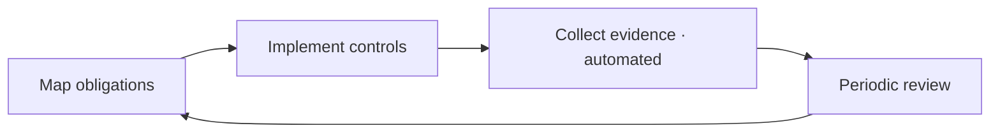

# Compliance

> **Breadcrumb:** [Home](../../README.md) › [Docs Index](../INDEX.md) › [Governance](AI_GOVERNANCE.md) › **Compliance**
> **Status:** `Active` · **Owner:** `governance-swarm` · **Last verified:** `2026-06-12`

## 1. Purpose

How AgentX2.ai stays audit-ready: the frameworks we map to and the evidence we keep. Compliance scope
expands with the business; this doc is the living anchor.

## 2. Frameworks (mapping targets)

| Framework | Relevance | Status |
|-----------|-----------|--------|
| [NIST AI RMF](https://www.nist.gov/itl/ai-risk-management-framework) | AI risk management | mapped via [AI Governance](AI_GOVERNANCE.md) |
| [EU AI Act](https://digital-strategy.ec.europa.eu/en/policies/regulatory-framework-ai) | transparency obligations for AI systems | monitor + disclose AI use `[UNVERIFIED applicability per offering]` |
| Privacy (GDPR/CCPA-class) | personal data handling | data minimization ([Data Architecture](../01-architecture/DATA_ARCHITECTURE.md)) |
| SOC2-class controls | security + availability | aligned via [Security](SECURITY_ARCHITECTURE.md) `[UNVERIFIED certification]` |

## 3. Evidence

Audit-grade evidence is produced automatically: traces, eval results, approvals, change history, and
the [provenance chain](../07-operations/FRESHNESS_POLICY.md) — all timestamped and queryable.

## 4. Process

## 5. Open items

Specific certifications and per-jurisdiction applicability are marked `[UNVERIFIED]` until confirmed
with counsel; tracked on the [Risk Register](RISK_REGISTER.md).

## 6. Grounding & Sources

| # | Claim | Source | Accessed |
|---|-------|--------|----------|
| 1 | AI risk framework | <https://www.nist.gov/itl/ai-risk-management-framework> | 2026-06-12 |
| 2 | EU AI Act framework | <https://digital-strategy.ec.europa.eu/en/policies/regulatory-framework-ai> | 2026-06-12 |

---

### Freshness

- **Created/Updated/Verified:** 2026-06-12 · **Review cadence:** 60d · **Next review:** 2026-08-11
- See [Freshness Policy](../07-operations/FRESHNESS_POLICY.md).

### Navigation

- 🏠 [Home](../../README.md) · ⬆️ [Docs Index](../INDEX.md)
- ↔️ Related: [AI Governance](AI_GOVERNANCE.md) · [Security Architecture](SECURITY_ARCHITECTURE.md) · [Risk Register](RISK_REGISTER.md)
