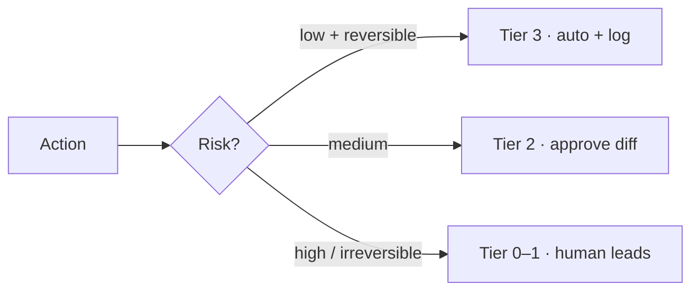

# Human-in-the-Loop & Autonomy Tiers

> **Breadcrumb:** [Home](../../README.md) › [Docs Index](../INDEX.md) › [Governance](AI_GOVERNANCE.md) › **Human-in-the-Loop**
> **Status:** `Active` · **Owner:** `governance-swarm` · **Last verified:** `2026-06-12`

## 1. Purpose

When agents must pause for a human. This is the trust model that lets swarms run fast on reversible
work while keeping a human on every irreversible or high-risk action.

## 2. Autonomy tiers

| Tier | Name | Behavior | Example |
|------|------|----------|---------|
| 0 | Manual | human does it; agent assists | sensitive legal copy |
| 1 | Suggest | agent proposes; human applies | content drafts |
| 2 | Act-with-approval | agent acts after a human approves the diff | publish a page, send a proposal |
| 3 | Autonomous-within-policy | agent acts alone within guardrails; logged | lint fixes, doc link repair |

Each [agent spec](../_templates/AGENT_SPEC_TEMPLATE.md) declares its tier.

## 3. Risk tiering → gate

Irreversible or shared-impact actions (deploys to prod with user impact, deletions, external
sends, secret/infra changes) **always** require approval — never auto.

## 4. Approval packet

When an agent pauses, the human sees: what will change, why, evidence (trace + eval), risk, and the
rollback plan. A **timeout default** is defined per gate (default: do nothing / hold).

## 5. Auditability

Every approval/rejection is logged with identity + timestamp and linked to the
[trace](../05-observability/TRACING.md); waivers to the
[Regression Policy](../04-quality/REGRESSION_POLICY.md) are recorded on the
[Risk Register](RISK_REGISTER.md).

## 6. Grounding & Sources

| # | Claim | Source | Accessed |
|---|-------|--------|----------|
| 1 | Manage/oversight function | <https://www.nist.gov/itl/ai-risk-management-framework> | 2026-06-12 |

---

### Freshness

- **Created/Updated/Verified:** 2026-06-12 · **Review cadence:** 45d · **Next review:** 2026-07-27
- See [Freshness Policy](../07-operations/FRESHNESS_POLICY.md).

### Navigation

- 🏠 [Home](../../README.md) › ⬆️ [Docs Index](../INDEX.md)
- ↔️ Related: [AI Governance](AI_GOVERNANCE.md) · [Agentic Swarm](../01-architecture/AGENTIC_SWARM.md) · [Risk Register](RISK_REGISTER.md)
