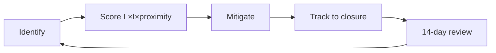

# Risk Register

> **Breadcrumb:** [Home](../../README.md) › [Docs Index](../INDEX.md) › [Governance](AI_GOVERNANCE.md) › **Risk Register**
> **Status:** `Active` · **Owner:** `governance-swarm` · **Last verified:** `2026-06-12`

## 1. Purpose

The living list of risks (likelihood × impact × proximity), their mitigations, and owners. Short
cadence (14d) because risk changes fast.

## 2. Register (initial, 2026-06-12)

| ID | Risk | Likelihood | Impact | Mitigation | Owner | Status |
|----|------|-----------|--------|------------|-------|--------|
| R-001 | Stale model ids break local build | Med | Med | 30d model re-verify ([Model Strategy](../01-architecture/MODEL_STRATEGY.md)) | architecture-swarm | Open |
| R-002 | Prompt injection via web/tool content | Med | High | injection defenses + guardian ([Prompt Library](../03-agents/PROMPT_LIBRARY.md)) | governance-swarm | Open |
| R-003 | Secret leakage into public repo | Low | High | secret scanning gate ([CI/CD](../04-quality/CI_CD.md)) | governance-swarm | Mitigated |
| R-004 | Autonomous action causes irreversible harm | Low | High | autonomy tiers + HITL ([HITL](HUMAN_IN_THE_LOOP.md)) | governance-swarm | Mitigated |
| R-005 | Doc/knowledge staleness misleads agents | Med | Med | freshness scans ([Freshness](../07-operations/FRESHNESS_POLICY.md)) | operations-swarm | Open |
| R-006 | Eval gaming / unnoticed quality drift | Med | Med | multi-eval + zero-regression ([Eval](../04-quality/EVAL_FRAMEWORK.md)) | quality-swarm | Open |
| R-007 | Brand asset licensing unverified | Low | Low | verify `logo.jpg` license in P3 | website-swarm | Open |

## 3. Process

Materialized risks convert to incidents ([Incident Response](../07-operations/INCIDENT_RESPONSE.md));
accepted regressions are recorded here with expiry.

## 4. Grounding & Sources

| # | Claim | Source | Accessed |
|---|-------|--------|----------|
| 1 | Risk map/measure/manage | <https://www.nist.gov/itl/ai-risk-management-framework> | 2026-06-12 |

---

### Freshness

- **Created/Updated/Verified:** 2026-06-12 · **Review cadence:** 14d · **Next review:** 2026-06-26
- See [Freshness Policy](../07-operations/FRESHNESS_POLICY.md).

### Navigation

- 🏠 [Home](../../README.md) · ⬆️ [Docs Index](../INDEX.md)
- ↔️ Related: [AI Governance](AI_GOVERNANCE.md) · [HITL](HUMAN_IN_THE_LOOP.md) · [Incident Response](../07-operations/INCIDENT_RESPONSE.md)
