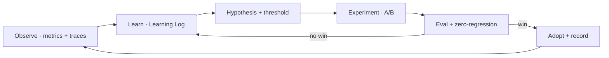

# Continuous Improvement

> **Breadcrumb:** [Home](../../README.md) › [Docs Index](../INDEX.md) › **Continuous Improvement**
> **Status:** `Active` · **Owner:** `operations-swarm` · **Last verified:** `2026-06-12`

## 1. Purpose

How the system gets better every cycle — the loops that turn observation into the next improvement.
This is the back half of the [self-build loop](../01-architecture/AI_BUILD_SYSTEM.md).

## 2. Improvement loops

Every system defines metrics, thresholds, and a loop (per
[`sysprompt_agentx2.md`](../../sysprompt_agentx2.md)):

| Loop | Signal | Action |
|------|--------|--------|
| Quality | eval trend, regression count | tune prompts/models ([Eval](../04-quality/EVAL_FRAMEWORK.md)) |
| Performance | Core Web Vitals | optimize assets ([Performance](../02-website/PERFORMANCE.md)) |
| Conversion | funnel metrics | improve AI experience ([AI Experience](../02-website/AI_EXPERIENCE.md)) |
| Cost | $/task | right-size models ([Model Strategy](../01-architecture/MODEL_STRATEGY.md)) |
| Reliability | MTTR, incidents | strengthen runbooks ([Runbooks](RUNBOOKS.md)) |
| Knowledge | retrieval quality | refine memory ([Memory](../01-architecture/MEMORY_ARCHITECTURE.md)) |

## 3. The mechanism

## 4. Cadence

Improvement is continuous (per-run learnings) and periodic (retros). Each adopted change is recorded
in the [Learning Log](../08-knowledge/LEARNING_LOG.md) and, if structural, an
[ADR](../08-knowledge/DECISION_LOG.md).

## 5. Grounding & Sources

| # | Claim | Source | Accessed |
|---|-------|--------|----------|
| 1 | Improvement-loop requirement | [`sysprompt_agentx2.md`](../../sysprompt_agentx2.md) | 2026-06-12 |

---

### Freshness

- **Created/Updated/Verified:** 2026-06-12 · **Review cadence:** 45d · **Next review:** 2026-07-27
- See [Freshness Policy](FRESHNESS_POLICY.md).

### Navigation

- 🏠 [Home](../../README.md) · ⬆️ [Docs Index](../INDEX.md)
- ↔️ Related: [AI Build System](../01-architecture/AI_BUILD_SYSTEM.md) · [Learning Log](../08-knowledge/LEARNING_LOG.md) · [Mission Control](../05-observability/MISSION_CONTROL.md)
