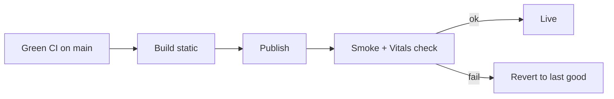

# Deployment

> **Breadcrumb:** [Home](../../README.md) › [Docs Index](../INDEX.md) › [Operations](CONTINUOUS_IMPROVEMENT.md) › **Deployment**
> **Status:** `Active` · **Owner:** `operations-swarm` · **Last verified:** `2026-06-12`

## 1. Purpose

Where and how the site deploys, and how we roll back. Static-first keeps deploys boring and safe.

## 2. Environments

| Env | Purpose | Source |
|-----|---------|--------|
| Preview | per-PR build | CI artifact |
| Production | live site | `main` (green only) |

## 3. Targets

- **Primary:** [GitHub Pages](https://docs.github.com/en/pages) (static; fits the public repo).
- **Alternates:** [Cloudflare Pages](https://developers.cloudflare.com/pages/),
  [Azure Static Web Apps](https://learn.microsoft.com/en-us/azure/static-web-apps/) — documented for
  portability ([Tech Stack](../01-architecture/TECH_STACK.md)).

## 4. Rollout & rollback

- Deploy only when all [gates](../04-quality/QUALITY_GATES.md) pass and there is no regression.
- **Rollback** = redeploy the last good build (static makes this instant); every deploy records its
  provenance ([CI/CD](../04-quality/CI_CD.md)).

## 5. DNS & domain

`agentx2.ai` maps to the chosen host; configuration is recorded in the private ops repo (no secrets in
public). Domain/DNS specifics `[UNVERIFIED]` until confirmed.

## 6. Grounding & Sources

| # | Claim | Source | Accessed |
|---|-------|--------|----------|
| 1 | Pages hosting | <https://docs.github.com/en/pages> | 2026-06-12 |
| 2 | Cloudflare Pages | <https://developers.cloudflare.com/pages/> | 2026-06-12 |
| 3 | Azure Static Web Apps | <https://learn.microsoft.com/en-us/azure/static-web-apps/> | 2026-06-12 |

---

### Freshness

- **Created/Updated/Verified:** 2026-06-12 · **Review cadence:** 60d · **Next review:** 2026-08-11
- See [Freshness Policy](FRESHNESS_POLICY.md).

### Navigation

- 🏠 [Home](../../README.md) · ⬆️ [Docs Index](../INDEX.md)
- ↔️ Related: [CI/CD](../04-quality/CI_CD.md) · [Release Engineering](../04-quality/RELEASE_ENGINEERING.md) · [Incident Response](INCIDENT_RESPONSE.md)
