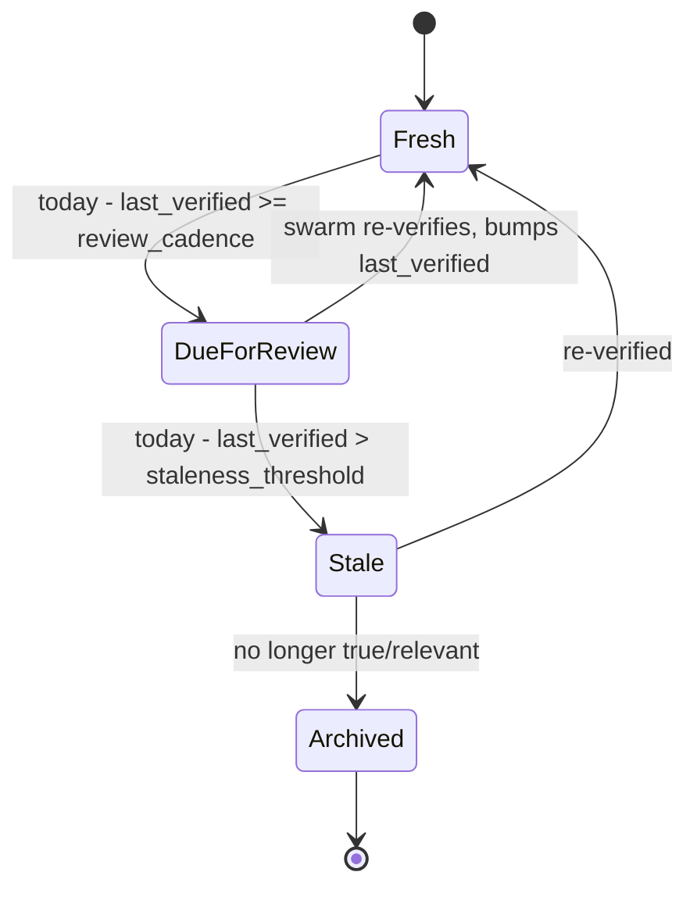

# Freshness & Grounding Policy

> **Breadcrumb:** [Home](../../README.md) › [Docs Index](../INDEX.md) › [Operations](./CONTINUOUS_IMPROVEMENT.md) › **Freshness Policy**
> **Status:** `Active` · **Owner:** `operations-swarm` · **Last verified:** `2026-06-12`

## 1. Purpose

This policy guarantees that **everything in this repository is timestamped, grounded in
verifiable facts, and kept fresh** — automatically, end to end. It is the contract every
document, agent, and CI job obeys. It exists because an AI-native company that builds itself
must never act on stale or unsourced information.

## 2. The three obligations

1. **Timestamp everything (UTC, ISO-8601).** Every doc carries `created`, `updated`, and
   `last_verified`. Every learning entry, trace, eval result, and build artifact is stamped at
   capture time. Wall-clock truth is anchored at the start of each agent run (see
   [AGENTS.md](../../AGENTS.md) §"Time anchor").
2. **Ground every claim.** Any factual or "best-practice" statement cites an authoritative
   source with an **access date**. Unverifiable statements are marked `[UNVERIFIED]` and logged
   as open questions. Numbers a swarm cannot substantiate are never invented.
3. **Keep it fresh.** Each doc declares a `review_cadence` and a `staleness_threshold`. CI
   compares `today − last_verified` and acts (below).

## 3. Freshness state machine

## 4. Defaults by document class

| Class | review_cadence | staleness_threshold | Notes |
|-------|----------------|---------------------|-------|
| Standards / architecture | 90d | 120d | Re-ground against upstream sources |
| Agent specs | 60d | 90d | Models + tools change fast |
| Model strategy | 30d | 45d | Local model landscape moves weekly |
| Roadmap / backlog | 14d | 30d | Living planning docs |
| ADRs | n/a (immutable) | n/a | Supersede, never edit once Accepted |
| Learning log entries | per-entry decay horizon | — | Re-verify or supersede |

## 5. How freshness is enforced (automation)

- **Frontmatter audit (CI):** every `*.md` must carry `created`, `updated`, `last_verified`,
  `owner`, `review_cadence`, `staleness_threshold`, and `sources`. Missing fields fail the build.
- **Staleness scan (scheduled swarm):** a daily job computes `today − last_verified`; `DueForReview`
  docs are routed to the owning swarm, `Stale` docs are labelled and surfaced on
  [Mission Control](../05-observability/MISSION_CONTROL.md).
- **Source liveness:** link-checker validates intra-repo links and pings external sources; dead
  sources open a remediation task.
- **Grounding gate:** the docs-quality CI step flags any `[UNVERIFIED]` markers introduced since
  the last commit and requires either a citation or an explicit waiver.
- **Time anchor:** the first action of every agent run records the current UTC date so all
  generated timestamps and "since cutoff" comparisons are correct.

## 6. Grounding standard

- Prefer **primary, authoritative** sources (official specs, vendor docs, standards bodies).
- Record **title + URL + publisher + access date** in the doc's "Grounding & Sources" table.
- When sources conflict, note the conflict and the chosen interpretation with rationale.
- Re-confirm any fact older than its decay horizon before relying on it
  (see [Memory Refresh](../01-architecture/MEMORY_ARCHITECTURE.md)).

## 7. Provenance chain

Every shipped artifact is traceable backward: **deploy → commit → PR → eval run → build run →
plan → spec → ADR → source**. Each hop is timestamped and linked, so any claim on the live site
can be traced to the fact and decision that produced it. This is the
[Continuous Improvement](./CONTINUOUS_IMPROVEMENT.md) and
[Tracing](../05-observability/TRACING.md) backbone.

## 8. Grounding & Sources

| # | Claim it supports | Source | Publisher | Accessed |
|---|-------------------|--------|-----------|----------|
| 1 | Changelog format + "Unreleased" discipline | <https://keepachangelog.com/en/1.1.0/> | Keep a Changelog | 2026-06-12 |
| 2 | UTC timestamp format | <https://www.iso.org/iso-8601-date-and-time-format.html> | ISO | 2026-06-12 |

---

### Freshness

- **Created:** 2026-06-12 · **Updated:** 2026-06-12 · **Last verified:** 2026-06-12
- **Review cadence:** 90 days · **Staleness threshold:** 120 days · **Next review due:** 2026-09-10

### Navigation

- ⬆️ [Operations](./CONTINUOUS_IMPROVEMENT.md) · [Docs Index](../INDEX.md) · 🏠 [Home](../../README.md)
- ↔️ Related: [Learning Log](../08-knowledge/LEARNING_LOG.md) · [Continuous Improvement](./CONTINUOUS_IMPROVEMENT.md) · [CI/CD](../04-quality/CI_CD.md)
