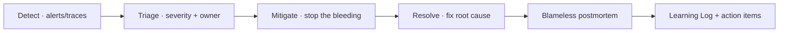

# Incident Response

> **Breadcrumb:** [Home](../../README.md) › [Docs Index](../INDEX.md) › [Operations](CONTINUOUS_IMPROVEMENT.md) › **Incident Response**
> **Status:** `Active` · **Owner:** `operations-swarm` · **Last verified:** `2026-06-12`

## 1. Purpose

How we detect, respond to, and learn from incidents — fast, calm, and blameless.

## 2. Lifecycle

## 3. Severity

| Sev | Meaning | Response |
|-----|---------|----------|
| Sev1 | site down / data risk | all-hands, immediate |
| Sev2 | major degradation | urgent |
| Sev3 | minor / contained | scheduled |

## 4. Roles

Incident commander (coordinates), responders (fix), scribe (timeline). For AI incidents, the guardian
and governance swarm assess safety impact ([AI Governance](../06-governance/AI_GOVERNANCE.md)).

## 5. Postmortem

Blameless, within a fixed window: timeline, root cause, contributing factors, action items (owners +
dates). Findings feed the [Learning Log](../08-knowledge/LEARNING_LOG.md) and
[Risk Register](../06-governance/RISK_REGISTER.md)
([SRE incident practice](https://sre.google/sre-book/managing-incidents/)).

## 6. Grounding & Sources

| # | Claim | Source | Accessed |
|---|-------|--------|----------|
| 1 | Incident management roles/process | <https://sre.google/sre-book/managing-incidents/> | 2026-06-12 |

---

### Freshness

- **Created/Updated/Verified:** 2026-06-12 · **Review cadence:** 60d · **Next review:** 2026-08-11
- See [Freshness Policy](FRESHNESS_POLICY.md).

### Navigation

- 🏠 [Home](../../README.md) · ⬆️ [Docs Index](../INDEX.md)
- ↔️ Related: [Runbooks](RUNBOOKS.md) · [Risk Register](../06-governance/RISK_REGISTER.md) · [Learning Log](../08-knowledge/LEARNING_LOG.md)
