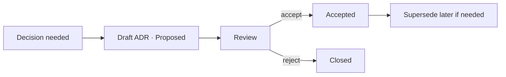

# Decision Log (ADR Register)

> **Breadcrumb:** [Home](../../README.md) › [Docs Index](../INDEX.md) › [Knowledge](LEARNING_LOG.md) › **Decision Log**
> **Status:** `Active` · **Owner:** `architecture-swarm` · **Last verified:** `2026-06-12`

## 1. Purpose

The register of [Architecture Decision Records](https://cognitect.com/blog/2011/11/15/documenting-architecture-decisions).
ADRs are immutable once accepted; change is made by superseding with a new ADR. New ADRs use the
[ADR Template](../_templates/ADR_TEMPLATE.md).

## 2. Register

| ADR | Title | Status | Date |
|-----|-------|--------|------|
| [0001](adr/ADR-0001-tech-stack.md) | Static-first stack: Astro + Tailwind on GitHub Pages | Accepted | 2026-06-12 |
| [0002](adr/ADR-0002-local-ollama-first.md) | Local Ollama-first models (cloud optional) | Accepted | 2026-06-12 |
| [0003](adr/ADR-0003-otel-genai-observability.md) | OpenTelemetry GenAI for observability | Accepted | 2026-06-12 |
| [0004](adr/ADR-0004-zero-regression-policy.md) | Zero-regression quality bar | Accepted | 2026-06-12 |
| [0005](adr/ADR-0005-agentic-swarm-topology.md) | Parallel agentic-swarm topology | Accepted | 2026-06-12 |

## 3. Process

Structural decisions arising from the [Learning Log](LEARNING_LOG.md) become ADRs here.

## 4. Grounding & Sources

| # | Claim | Source | Accessed |
|---|-------|--------|----------|
| 1 | ADR practice | <https://cognitect.com/blog/2011/11/15/documenting-architecture-decisions> | 2026-06-12 |

---

### Freshness

- **Created/Updated/Verified:** 2026-06-12 · **Review cadence:** 60d · **Next review:** 2026-08-11
- See [Freshness Policy](../07-operations/FRESHNESS_POLICY.md).

### Navigation

- 🏠 [Home](../../README.md) · ⬆️ [Docs Index](../INDEX.md)
- ↔️ Related: [Learning Log](LEARNING_LOG.md) · [System Architecture](../01-architecture/SYSTEM_ARCHITECTURE.md) · [ADR Template](../_templates/ADR_TEMPLATE.md)
