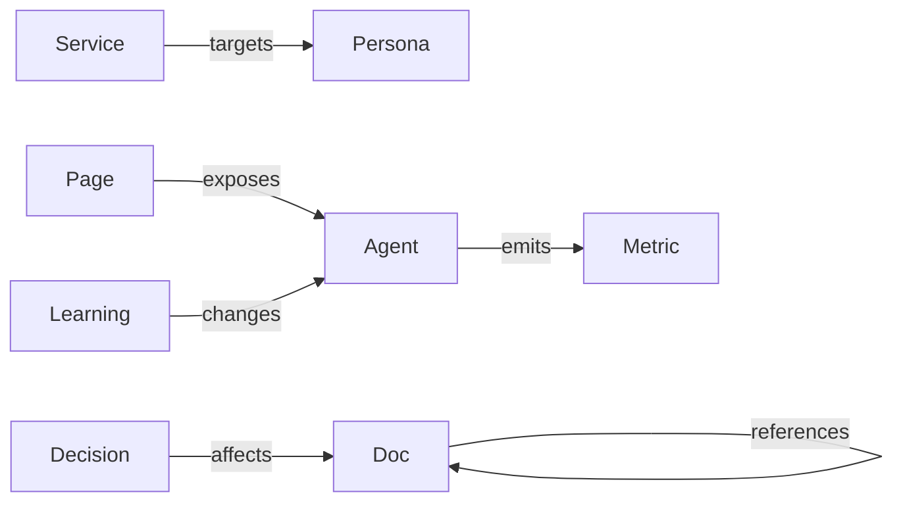

# Knowledge Graph

> **Breadcrumb:** [Home](../../README.md) › [Docs Index](../INDEX.md) › [Knowledge](LEARNING_LOG.md) › **Knowledge Graph**
> **Status:** `Active` · **Owner:** `knowledge-swarm` · **Last verified:** `2026-06-12`

## 1. Purpose

The machine-readable entity-and-relation model that makes retrieval structural (not just lexical) and
keeps the system's understanding of itself coherent.

## 2. Core entities

| Entity | Examples |
|--------|----------|
| Doc | every file in `docs/` |
| Agent | catalog entries ([Agent Catalog](../03-agents/AGENT_CATALOG.md)) |
| Decision | ADRs ([Decision Log](DECISION_LOG.md)) |
| Metric | [Metrics Catalog](../05-observability/METRICS_CATALOG.md) entries |
| Service | [Company Model](../00-overview/COMPANY_MODEL.md) offerings |
| Persona | [Personas](../00-overview/PERSONAS.md) |
| Learning | [Learning Log](LEARNING_LOG.md) entries |

## 3. Relations

`doc —references→ doc` · `agent —emits→ metric` · `decision —affects→ doc` ·
`learning —changes→ doc/agent` · `service —targets→ persona` · `page —exposes→ agent`.

## 4. Sourcing & freshness

The graph is built from the same links that power navigation and the
[Obsidian vault](OBSIDIAN_VAULT.md); nodes carry timestamps and are re-verified on the
[Freshness](../07-operations/FRESHNESS_POLICY.md) cadence. It feeds retrieval in
[Memory Architecture](../01-architecture/MEMORY_ARCHITECTURE.md).

## 5. Grounding & Sources

| # | Claim | Source | Accessed |
|---|-------|--------|----------|
| 1 | Doc taxonomy underpinning entities | <https://diataxis.fr/> | 2026-06-12 |

---

### Freshness

- **Created/Updated/Verified:** 2026-06-12 · **Review cadence:** 60d · **Next review:** 2026-08-11
- See [Freshness Policy](../07-operations/FRESHNESS_POLICY.md).

### Navigation

- 🏠 [Home](../../README.md) · ⬆️ [Docs Index](../INDEX.md)
- ↔️ Related: [Obsidian Vault](OBSIDIAN_VAULT.md) · [Knowledge Architecture](../01-architecture/KNOWLEDGE_ARCHITECTURE.md) · [Memory Architecture](../01-architecture/MEMORY_ARCHITECTURE.md)
