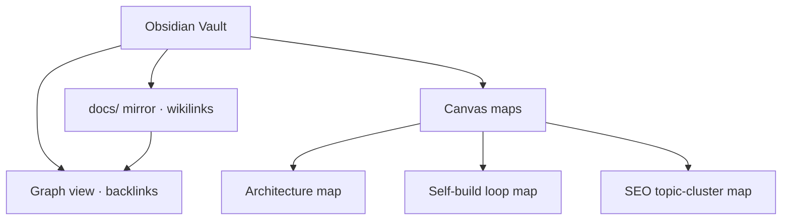

# Obsidian Vault — Graph & Canvas Maps

> **Breadcrumb:** [Home](../../README.md) › [Docs Index](../INDEX.md) › [Knowledge](LEARNING_LOG.md) › **Obsidian Vault**
> **Status:** `Active` · **Owner:** `knowledge-swarm` · **Last verified:** `2026-06-12`

## 1. Purpose

How the repository's knowledge is mirrored into a human-navigable **[Obsidian](https://obsidian.md/)**
vault — using the graph view and **[Canvas](https://obsidian.md/canvas)** maps to visualize how docs,
decisions, agents, and concepts relate. This makes the vector/relationship maps from
[Memory Architecture](../01-architecture/MEMORY_ARCHITECTURE.md) explorable by people.

## 2. Why Obsidian

- The docs are already plain Markdown with frontmatter — a vault needs no conversion.
- The **graph view** renders the link structure (the same links that guarantee ≤3-click nav).
- **Canvas** (open [JSON Canvas](https://jsoncanvas.org/) format) builds curated mind-maps of the
  architecture, the self-build loop, and topic clusters.

## 3. Vault structure

## 4. Maintenance

- A vault-writer agent keeps wikilinks/backlinks and Canvas maps in sync as docs change
  ([Knowledge Architecture](../01-architecture/KNOWLEDGE_ARCHITECTURE.md)).
- Maps are **timestamped**; stale maps are flagged on the
  [Freshness](../07-operations/FRESHNESS_POLICY.md) cadence.
- Canvas files use the open JSON Canvas spec so they are portable and diffable.

## 5. Relationship to the knowledge graph

The Obsidian graph is the **human view**; the [Knowledge Graph](KNOWLEDGE_GRAPH.md) is the
**machine view** (entities + relations for retrieval). Both derive from the same source links.

## 6. Grounding & Sources

| # | Claim | Source | Accessed |
|---|-------|--------|----------|
| 1 | Vault = Markdown + graph | <https://obsidian.md/> | 2026-06-12 |
| 2 | Canvas visual maps | <https://obsidian.md/canvas> | 2026-06-12 |
| 3 | Open Canvas format | <https://jsoncanvas.org/> | 2026-06-12 |

---

### Freshness

- **Created/Updated/Verified:** 2026-06-12 · **Review cadence:** 60d · **Next review:** 2026-08-11
- See [Freshness Policy](../07-operations/FRESHNESS_POLICY.md).

### Navigation

- 🏠 [Home](../../README.md) · ⬆️ [Docs Index](../INDEX.md)
- ↔️ Related: [Knowledge Graph](KNOWLEDGE_GRAPH.md) · [Memory Architecture](../01-architecture/MEMORY_ARCHITECTURE.md) · [Knowledge Architecture](../01-architecture/KNOWLEDGE_ARCHITECTURE.md)
