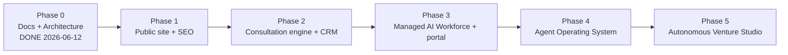

# Roadmap

> **Breadcrumb:** [Home](../../README.md) › [Docs Index](../INDEX.md) › **Roadmap**
> **Status:** `Active` · **Owner:** `human:founder` · **Last verified:** `2026-06-12`

## 1. Purpose

The phased path from documentation foundation to autonomous platform, grounded in
[`PRD_AgentX2.md`](../../PRD_AgentX2.md).

## 2. Phases

| Phase | Outcome | Key docs |
|-------|---------|----------|
| 0 (done) | Documentation + architecture foundation | this `docs/` tree |
| 1 | Public website + brand + SEO, AI-everywhere | [Website Architecture](../02-website/WEBSITE_ARCHITECTURE.md) |
| 2 | Consultation engine + CRM + proposals | [Consultation Engine](../03-agents/CONSULTATION_ENGINE.md) |
| 3 | Managed AI Workforce platform + client portal | [Managed AI Workforce](../03-agents/MANAGED_AI_WORKFORCE.md) |
| 4 | Agent Operating System + orchestration | [Agentic Swarm](../01-architecture/AGENTIC_SWARM.md) |
| 5 | Autonomous venture studio | [Vision](../00-overview/VISION.md) |

## 3. Immediate next steps (post-foundation)

1. Scaffold the Astro project + CI/CD per [Tech Stack](../01-architecture/TECH_STACK.md) and
   [CI/CD](../04-quality/CI_CD.md).
2. Stand up the local Ollama orchestration + eval harness
   ([AI Build System](../01-architecture/AI_BUILD_SYSTEM.md)).
3. Build Phase-1 pages with AI-everywhere ([AI Experience](../02-website/AI_EXPERIENCE.md)).

Tracked in the [Backlog](BACKLOG.md); dated targets in [Milestones](MILESTONES.md).

## 4. Grounding & Sources

| # | Claim | Source | Accessed |
|---|-------|--------|----------|
| 1 | Phase model | [`PRD_AgentX2.md`](../../PRD_AgentX2.md) | 2026-06-12 |

---

### Freshness

- **Created/Updated/Verified:** 2026-06-12 · **Review cadence:** 14d · **Next review:** 2026-06-26
- See [Freshness Policy](../07-operations/FRESHNESS_POLICY.md).

### Navigation

- 🏠 [Home](../../README.md) · ⬆️ [Docs Index](../INDEX.md)
- ↔️ Related: [Backlog](BACKLOG.md) · [Milestones](MILESTONES.md) · [Vision](../00-overview/VISION.md)
