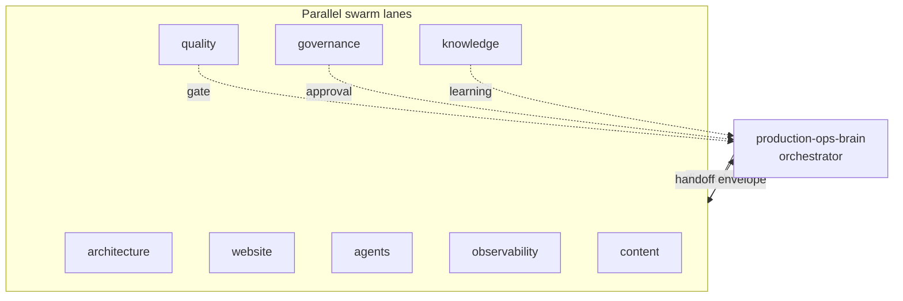
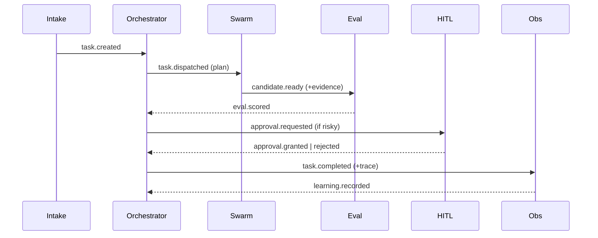

# Agent Orchestration

> **Breadcrumb:** [Home](../README.md) › [Docs Index](INDEX.md) › **Agent Orchestration**
> **Status:** `Active` · **Owner:** `production-ops-brain` · **Last verified:** `2026-06-12`

## 1. Purpose

The **builder-facing, end-to-end view of how agents coordinate** — orchestrator, swarm lanes, agent
run protocol, handoffs, event flow, and human gates. It consolidates the deep docs
([Agentic Swarm](01-architecture/AGENTIC_SWARM.md), [Orchestration](01-architecture/ORCHESTRATION.md),
[Agent Contracts](03-agents/AGENT_CONTRACTS.md)) into one map and adds the **event flow** an
implementer wires up.

## 2. Control plane



## 3. Agent run protocol

Every agent, every run (full contract: [Agent Contracts](03-agents/AGENT_CONTRACTS.md)):

1. Anchor time (UTC); open trace (`trace_id`, `run_id`).
2. Load context + memory; re-verify stale facts.
3. Plan → act (allow-listed tools only, at the declared
   [autonomy tier](06-governance/HUMAN_IN_THE_LOOP.md)).
4. Validate vs spec + [Quality Gates](04-quality/QUALITY_GATES.md); remediate (never weaken a gate).
5. Emit spans/metrics; record a [Learning Log](08-knowledge/LEARNING_LOG.md) entry; hand off.

## 4. Event flow

The orchestration substrate is an event stream; each event is timestamped and carries `trace_id`.



### Event types (minimum set)

| Event | Emitted by | Carries |
|-------|-----------|---------|
| `task.created` | intake | task_id, intent, context |
| `task.dispatched` | orchestrator | task_id, plan, lane |
| `candidate.ready` | swarm | task_id, artifact, evidence |
| `eval.scored` | quality | task_id, scores, pass/fail |
| `approval.requested/granted/rejected` | governance | task_id, packet, decision |
| `task.completed/failed` | orchestrator | task_id, status, trace_id |
| `learning.recorded` | knowledge | learning_id, links |

## 5. Handoff envelope (A2A)

```json
{
  "from": "spec-agent",
  "to": "planner",
  "task_id": "T-123",
  "payload": {},
  "evidence": ["trace_id", "eval_run_id"],
  "trace_id": "string",
  "timestamp": "2026-06-12T00:00:00Z"
}
```

## 6. Reliability & safety

Idempotent tasks · retries with backoff · circuit breakers · timeouts · re-plan on repeated failure
([Orchestration](01-architecture/ORCHESTRATION.md)); autonomy tiers + HITL for risky actions
([HITL](06-governance/HUMAN_IN_THE_LOOP.md)); every tool call validated, scoped, and traced
([API Contracts](API_CONTRACTS.md), [Tracing](05-observability/TRACING.md)).

## 7. Grounding & Sources

| # | Claim | Source | Accessed |
|---|-------|--------|----------|
| 1 | Swarm topology + lanes | [Agentic Swarm](01-architecture/AGENTIC_SWARM.md) | 2026-06-12 |
| 2 | Dispatch + tool routing | [Orchestration](01-architecture/ORCHESTRATION.md) | 2026-06-12 |
| 3 | Agent span semantics | <https://opentelemetry.io/docs/specs/semconv/gen-ai/gen-ai-agent-spans/> | 2026-06-12 |

---

### Freshness

- **Created/Updated/Verified:** 2026-06-12 · **Review cadence:** 45d · **Next review:** 2026-07-27
- See [Freshness Policy](07-operations/FRESHNESS_POLICY.md).

### Navigation

- 🏠 [Home](../README.md) · ⬆️ [Docs Index](INDEX.md)
- ↔️ Related: [Agentic Swarm](01-architecture/AGENTIC_SWARM.md) · [Orchestration](01-architecture/ORCHESTRATION.md) · [Agent Contracts](03-agents/AGENT_CONTRACTS.md) · [API Contracts](API_CONTRACTS.md)
