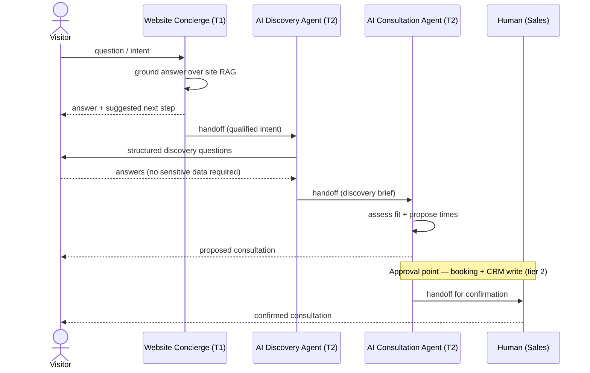
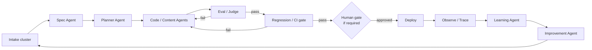
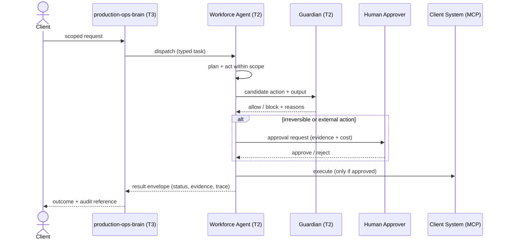

# Agent Workflows

> **Breadcrumb:** [Home](../README.md) › [Docs Index](INDEX.md) › **Agent Workflows**
> **Status:** `Active` · **Owner:** `agent-architecture-swarm` · **Last verified:** `2026-06-12`

## 1. Purpose

The canonical multi-agent workflows — how agents from the [Agent Registry](AGENT_REGISTRY.md) chain
together to deliver an outcome. Each workflow names its **triggers, steps, tools, handoffs, and
approval points** so the path of any run is unambiguous and auditable end to end via a single
`trace_id` ([Tracing](05-observability/TRACING.md)).

## 2. Context & Scope

- Workflows span three planes: the **web** lead path, the internal **build** self-build loop, and the
  **workforce** task path.
- Every handoff is an explicit, typed agent-to-agent transfer using the standard result envelope in
  [Agent Contracts](03-agents/AGENT_CONTRACTS.md); handoffs are observable as GenAI spans.
- **Approval points** are governed by [Human-in-the-Loop](06-governance/HUMAN_IN_THE_LOOP.md): tier-2
  actions that are irreversible or external pause for a human; tier-3 orchestration escalates on
  critical risk.

## 3. Workflow A — Website lead-to-consultation

**Triggers:** a visitor opens an on-page AI widget, asks a qualifying question, or requests a demo.

| Step | Agent | Tools | Handoff / Approval |
|------|-------|-------|--------------------|
| Answer + orient | Website Concierge | site RAG, nav | handoff to Discovery |
| Structured discovery | AI Discovery Agent | form (MCP), CRM (MCP) | handoff to Consultation |
| Fit + scheduling | AI Consultation Agent | calendar (MCP), CRM (MCP) | **approval:** booking + lead write |
| Human confirmation | Human (Sales) | CRM | closes the loop |

**Telemetry:** `ai_widget_open`, `ai_message`, `lead_captured`, `consultation_booked`
([Telemetry Schema](TELEMETRY_SCHEMA.md)). No PII is required in the AI exchange; the human owns any
sensitive capture.

## 4. Workflow B — Build-system self-build loop

**Triggers:** new intake cluster (idea/signal/backlog), a failed gate to remediate, or a scheduled
improvement run. Orchestrated by `production-ops-brain` (tier 3).

| Stage | Agent | Tools | Handoff / Approval |
|-------|-------|-------|--------------------|
| Spec | Spec Agent | FS, docs RAG | **approval:** spec ratification (PR) |
| Plan | Planner Agent | FS | **approval:** plan approval (PR) |
| Build | Code / Content Agents | FS, test runner | handoff to Eval |
| Multi-eval | Eval / Judge + Guardian | judge + guardian models | advisory + safety gate |
| Regression / CI | CI gates | CI runner | **merge gate** (zero regression) |
| Deploy | production-ops-brain | deploy tools | **approval:** human gate if required |
| Observe | Observability Agent | OTel collector (MCP) | feeds metrics + alerts |
| Learn / improve | Learning + Improvement | FS | re-plan into intake |

**Guarantee:** the loop never stops at build — build is always followed by eval, zero-regression CI,
observation, and a recorded learning, per [`AGENTS.md`](../AGENTS.md) §1 and the
[AI Build System](01-architecture/AI_BUILD_SYSTEM.md).

## 5. Workflow C — Managed-workforce task execution with HITL gate

**Triggers:** a scoped client request arrives for a workforce agent (e.g., Support, Finance, Sales).

| Step | Agent | Tools | Handoff / Approval |
|------|-------|-------|--------------------|
| Dispatch | production-ops-brain | orchestration | handoff to workforce agent |
| Plan + act | Workforce Agent | client systems (MCP, scoped) | handoff to Guardian |
| Safety screen | Guardian Agent | guardian model | **block on unsafe** |
| Human gate | Human Approver | review surface | **approval:** irreversible/external |
| Execute + report | Workforce Agent | client systems (MCP) | result envelope to orchestrator |

**Isolation:** workforce tools and memory are client-scoped; cross-client access is prohibited and
audited ([AI Governance](06-governance/AI_GOVERNANCE.md), [Risk Register](06-governance/RISK_REGISTER.md)).

## 6. Decisions & Rationale

| # | Decision | Rationale |
|---|----------|-----------|
| 1 | Approval points are explicit nodes in every diagram | Makes the human gate impossible to overlook and easy to audit |
| 2 | Handoffs use the standard result envelope | Agents stay interchangeable and every transfer is traceable |
| 3 | The build loop diagram always returns to observe + learn | Encodes the non-negotiable "never stop at build" rule |
| 4 | Guardian screens before any workforce execution | Safety is enforced before action, not detected after |

## 7. Risks & Open Questions

- **Latency vs. safety.** Extra guardian and approval hops add latency; the trade is intentional for
  irreversible actions. `[UNVERIFIED]` ideal placement of the guardian hop for read-only workforce
  tasks pending eval data.
- **Handoff loss.** A dropped handoff must fail closed (escalate), never silently complete; covered by
  [Alerting](ALERTING.md) circuit-breaker policy.
- **Web-path abandonment.** Visitors may drop before the human gate; the funnel is instrumented so
  drop-off is visible ([Analytics](05-observability/ANALYTICS.md)).

## 8. Grounding & Sources

| # | Claim | Source | Accessed |
|---|-------|--------|----------|
| 1 | Runs/handoffs are GenAI spans on a single trace | <https://opentelemetry.io/docs/specs/semconv/gen-ai/> | 2026-06-12 |
| 2 | Workforce tools are MCP servers | <https://modelcontextprotocol.io/> | 2026-06-12 |
| 3 | Self-build loop never stops at build | [`AGENTS.md`](../AGENTS.md) | 2026-06-12 |
| 4 | Website agent flow (Concierge → Discovery → Consultation) | [`sysprompt_agentx2.md`](../sysprompt_agentx2.md) | 2026-06-12 |

---

### Freshness

- **Created/Updated/Verified:** 2026-06-12 · **Review cadence:** 60d · **Next review:** 2026-08-11
- See [Freshness Policy](07-operations/FRESHNESS_POLICY.md).

### Navigation

- 🏠 [Home](../README.md) · ⬆️ [Docs Index](INDEX.md)
- ↔️ Related: [Agent Registry](AGENT_REGISTRY.md) · [AI Build System](01-architecture/AI_BUILD_SYSTEM.md) · [Agentic Swarm](01-architecture/AGENTIC_SWARM.md) · [HITL](06-governance/HUMAN_IN_THE_LOOP.md)
