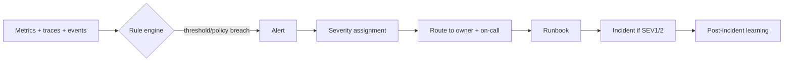

# Alerting and On-Call

> **Breadcrumb:** [Home](../README.md) › [Docs Index](INDEX.md) › **Alerting and On-Call**
> **Status:** `Active` · **Owner:** `observability-swarm` · **Last verified:** `2026-06-12`

## 1. Purpose

How signals become **actionable alerts** and how those alerts route to the right responder. This binds
the [Metrics Catalog](05-observability/METRICS_CATALOG.md) and [Telemetry Schema](TELEMETRY_SCHEMA.md)
to the [Incident Response](07-operations/INCIDENT_RESPONSE.md) and [Runbooks](07-operations/RUNBOOKS.md)
processes, so every alert is tied to a severity, an owner, and a remediation path.

## 2. Context & Scope

- Alerts fire on **policy thresholds**, not hard-coded magic numbers; thresholds are defined per metric,
  reviewed on cadence, and recorded with their owner. **No threshold values are fabricated here.**
- Every alert links a **runbook** and an **owner swarm**; an alert with no action is a defect to remove
  (alert hygiene).
- The build/deploy gates that block merges are defined in the
  [Regression Policy](04-quality/REGRESSION_POLICY.md); this doc covers **runtime + pipeline alerting**.

## 3. Alert classes

| Class | Signal source | Example trigger (policy) | Default severity | Routing | Runbook |
|-------|---------------|--------------------------|------------------|---------|---------|
| Availability | uptime/health checks | endpoint unavailable beyond policy window | SEV1 | on-call + orchestrator | [Runbooks](07-operations/RUNBOOKS.md) |
| Error-rate | error metrics/logs | error ratio exceeds baseline policy | SEV2 | on-call | [Runbooks](07-operations/RUNBOOKS.md) |
| Latency | `gen_ai.client.operation.duration`, web vitals | p95 latency over budget per policy | SEV2/3 | observability-swarm | [Runbooks](07-operations/RUNBOOKS.md) |
| AI cost spike | `gen_ai.client.token.usage`, cost metrics | token/cost rate above guardrail policy | SEV2/3 | observability-swarm + governance | [Runbooks](07-operations/RUNBOOKS.md) |
| Eval-score drop | `eval.score` trend | per-dimension score falls below gate | SEV2 | quality-swarm + governance | [Prompt Governance](PROMPT_GOVERNANCE.md) rollback |
| Circuit-breaker open | breaker state | breaker trips to `open` (see §6) | SEV2 | orchestrator | [Runbooks](07-operations/RUNBOOKS.md) |
| Build/deploy failure | CI/CD pipeline | gate or deploy step fails | SEV2/3 | quality-swarm | [CI/CD](04-quality/CI_CD.md) |
| Safety spike | `safety.flags` | guardian flags above policy | SEV1/2 | governance-swarm | [Incident Response](07-operations/INCIDENT_RESPONSE.md) |

## 4. Severity levels

| Severity | Definition | Response posture | Comms |
|----------|------------|------------------|-------|
| SEV1 | Critical: outage, data-safety, or active harm risk | Immediate, all-hands until mitigated | Continuous updates to stakeholders until resolved |
| SEV2 | Major: significant degradation or repeated failures | Rapid, prioritized over feature work | Regular updates per [Incident Response](07-operations/INCIDENT_RESPONSE.md) |
| SEV3 | Minor: localized or non-urgent degradation | Scheduled, next working window | Logged; summarized in routine review |

> Concrete numeric thresholds and timing live with the owning team as **policy** and are reviewed on
> cadence; they are intentionally not pinned in this document to avoid stale or fabricated values.

## 5. Routing and on-call

- **Routing** is by class → owner swarm → on-call responder; SEV1/SEV2 page on-call and open an
  incident, SEV3 is queued.
- **Escalation** follows the [Human-in-the-Loop](06-governance/HUMAN_IN_THE_LOOP.md) and
  [Incident Response](07-operations/INCIDENT_RESPONSE.md) chains; unacknowledged SEV1/2 escalate
  automatically.
- **Every alert carries context**: triggering metric, `trace_id`, runbook link, and suggested first
  action — so the responder starts from evidence, not a blank page.
- **Alert hygiene:** alerts are de-duplicated and grouped; flapping or non-actionable alerts are tuned
  or removed in routine review ([Continuous Improvement](07-operations/CONTINUOUS_IMPROVEMENT.md)).

## 6. Circuit-breaker model

Agents and integrations are protected by circuit breakers that fail closed (escalate) rather than
silently continuing. The breaker is observable; tripping to `open` raises a SEV2 alert.

| State | Meaning | Entry condition | Behavior | Exit condition |
|-------|---------|-----------------|----------|----------------|
| Closed | Healthy | normal operation | calls flow; failures counted | failure measure exceeds policy → Open |
| Open | Tripped | failure/cost/safety policy breached | calls blocked; fast-fail + escalate | cool-down elapses → Half-open |
| Half-open | Probing | cool-down elapsed | limited trial calls allowed | trials succeed → Closed; trials fail → Open |

## 7. Decisions & Rationale

| # | Decision | Rationale |
|---|----------|-----------|
| 1 | Thresholds are policy owned by teams, not constants in docs | Prevents stale/fabricated numbers and keeps tuning where the data is |
| 2 | Every alert links a runbook and owner | Eliminates non-actionable noise; speeds mean-time-to-resolve |
| 3 | Circuit breakers fail closed and are observable | Protects clients and prevents silent runaway cost/harm |
| 4 | Eval-score drops route to prompt rollback | Quality regressions get a fast, defined recovery path |

## 8. Risks & Open Questions

- **Alert fatigue.** Poorly tuned thresholds cause noise; routine hygiene review is mandatory.
  `[UNVERIFIED]` optimal thresholds per metric until baselines accumulate.
- **Cost-alert lag.** Token/cost spikes must be caught early; sampling/aggregation windows are a trade
  between sensitivity and noise.
- **Breaker tuning.** Too-aggressive breakers harm availability; too-loose breakers harm safety —
  reviewed with [AI Governance](06-governance/AI_GOVERNANCE.md).

## 9. Grounding & Sources

| # | Claim | Source | Accessed |
|---|-------|--------|----------|
| 1 | AI cost/latency signals (token usage, operation duration) | <https://opentelemetry.io/docs/specs/semconv/gen-ai/> | 2026-06-12 |
| 2 | Observability + ops control set | [`sysprompt_agentx2.md`](../sysprompt_agentx2.md) | 2026-06-12 |

---

### Freshness

- **Created/Updated/Verified:** 2026-06-12 · **Review cadence:** 60d · **Next review:** 2026-08-11
- See [Freshness Policy](07-operations/FRESHNESS_POLICY.md).

### Navigation

- 🏠 [Home](../README.md) · ⬆️ [Docs Index](INDEX.md)
- ↔️ Related: [Metrics Catalog](05-observability/METRICS_CATALOG.md) · [Telemetry Schema](TELEMETRY_SCHEMA.md) · [Incident Response](07-operations/INCIDENT_RESPONSE.md) · [Runbooks](07-operations/RUNBOOKS.md)
