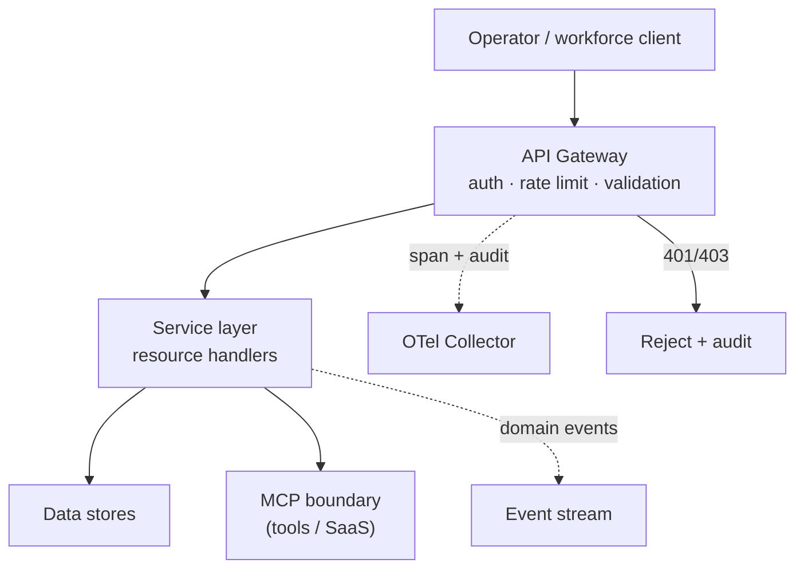

# API Architecture

> **Breadcrumb:** [Home](../README.md) › [Docs Index](INDEX.md) › **API Architecture**
> **Status:** `Active` · **Owner:** `architecture-swarm` · **Last verified:** `2026-06-12`

## 1. Purpose

This document defines the architecture of the **private API platform** that will power the managed AI
workforce and operator tooling. It complements the concrete interface shapes in
[API Contracts](API_CONTRACTS.md) and is described, machine-readably, by the repository-root
**[`openapi.yaml`](../openapi.yaml)** ([OpenAPI 3.1](https://spec.openapis.org/oas/v3.1.0)).

## 2. Context & scope

> The **public website is static and exposes no application API** ([Tech Stack](01-architecture/TECH_STACK.md)).
> The platform described here is the **future private operations plane**; it is specified now so the
> contract is stable before implementation begins.

In scope: API design principles, the resource set, cross-cutting concerns (auth, validation, rate
limiting, idempotency, pagination, error envelope, audit, telemetry), and the topology. Out of scope:
per-endpoint field schemas (generated from `openapi.yaml`) and the data model
([Data Model](DATA_MODEL.md)).

## 3. Design principles

- **Spec-first** — every resource is defined in `openapi.yaml` before code; the spec is the contract.
- **Resource-oriented REST** — nouns as resources, standard HTTP verbs, predictable status codes.
- **Secure by default** — authenticated, validated, rate-limited, and audited on every route.
- **Idempotent writes** — unsafe operations accept an idempotency key so retries are safe.
- **Observable** — every request emits an [OTel span](https://opentelemetry.io/docs/specs/semconv/gen-ai/)
  and an audit event.
- **Versioned** — breaking changes require an [ADR](08-knowledge/DECISION_LOG.md) and a major version.

## 4. Resource set

| Resource | Path | Purpose | Key operations | Data class |
|----------|------|---------|----------------|------------|
| Leads | `/v1/leads` | Inbound prospect capture | create, list, get | Confidential-PII |
| Contacts | `/v1/contacts` | Known people / accounts | CRUD | Confidential-PII |
| Consultations | `/v1/consultations` | AI consultation sessions | create, get, list | Confidential |
| Assessments | `/v1/assessments` | Readiness / fit assessments | create, get | Confidential |
| ROI | `/v1/roi` | ROI calculations | create, get | Internal |
| Agents | `/v1/agents` | Managed agent catalog | list, get, register | Internal |
| Prompts | `/v1/prompts` | Versioned prompt templates | list, get, version | Internal |
| Workflows | `/v1/workflows` | Multi-agent workflow runs | create, get, cancel | Internal |
| Telemetry | `/v1/telemetry` | Span/metric ingestion | create (write-only) | Internal |
| Events | `/v1/events` | Domain event stream | list, get | Internal |
| Dashboards | `/v1/dashboards` | Aggregated operator views | get | Aggregated |
| Auth | `/v1/auth` | Token issuance / introspection | token, revoke | Secret |
| Admin | `/v1/admin` | Operator administration | scoped ops | Confidential |
| Webhooks | `/v1/webhooks` | Outbound event subscriptions | CRUD | Internal |
| Integrations | `/v1/integrations` | MCP / adapter registry surface | list, get | Internal |
| Audit logs | `/v1/audit-logs` | Tamper-evident audit trail | list, get (read-only) | Confidential |

## 5. Topology

Requests enter through a gateway that authenticates, rate-limits, and validates before any service
logic runs. Services reach data stores and the outside world **only** through the data layer and the
governed [MCP boundary](MCP_ARCHITECTURE.md).



## 6. Cross-cutting concerns

| Concern | Mechanism | Standard |
|---------|-----------|----------|
| Schema | Single source of truth at `/openapi.yaml` | [OpenAPI 3.1](https://spec.openapis.org/oas/v3.1.0) |
| AuthN/Z | Bearer tokens; scoped, least-privilege | [OAuth 2.0](https://datatracker.ietf.org/doc/html/rfc6749) |
| Validation | Request/response validated against schema | OpenAPI 3.1 |
| Rate limiting | Per-principal quotas; `429` + `Retry-After` | [RFC 6585](https://www.rfc-editor.org/rfc/rfc6585) |
| Idempotency | `Idempotency-Key` on unsafe writes | IETF idempotency-key draft `[UNVERIFIED — draft]` |
| Pagination | Cursor-based with stable ordering | OpenAPI 3.1 conventions |
| Error envelope | `application/problem+json` | [RFC 9457](https://www.rfc-editor.org/rfc/rfc9457) |
| Audit | Every mutating call writes an audit event | internal policy |
| Telemetry | Span + metrics per request | [OTel GenAI](https://opentelemetry.io/docs/specs/semconv/gen-ai/) |

### 6.1 Error envelope

Errors use a consistent [`problem+json`](https://www.rfc-editor.org/rfc/rfc9457) body so clients parse
failures uniformly:

```json
{
  "type": "https://agentx2.ai/problems/validation-error",
  "title": "Validation failed",
  "status": 422,
  "detail": "field 'email' is required",
  "instance": "/v1/leads",
  "trace_id": "string"
}
```

## 7. Versioning

The API is versioned in the path (`/v1`). Additive changes are minor; breaking changes require a major
version, an [ADR](08-knowledge/DECISION_LOG.md), and a migration note
([Release Engineering](04-quality/RELEASE_ENGINEERING.md)). The `openapi.yaml` is validated in
[CI/CD](04-quality/CI_CD.md) and changes are diffed for compatibility.

## 8. Decisions

- **D-1 Spec-first.** No endpoint ships without an `openapi.yaml` definition.
- **D-2 Gateway choke point.** Auth, rate limiting, and validation are enforced at the edge, once.
- **D-3 Problem+json everywhere.** One error shape across all resources.
- **D-4 Side effects via MCP.** Services do not call SaaS directly; they go through the governed MCP
  boundary.

## 9. Risks & open questions

- **[UNVERIFIED]** The idempotency-key header is an active IETF draft; the platform adopts the pattern
  but the wire detail may change before ratification.
- **Spec/implementation drift** — mitigated by contract validation and response checking in CI.
- **Per-principal rate-limit tuning** is an operational decision deferred to first load tests; defaults
  are policy, not vendor facts.

## 10. Grounding & Sources

| # | Claim | Source | Accessed |
|---|-------|--------|----------|
| 1 | Contract format is OpenAPI 3.1 | <https://spec.openapis.org/oas/v3.1.0> | 2026-06-12 |
| 2 | Bearer-token authorization model | <https://datatracker.ietf.org/doc/html/rfc6749> | 2026-06-12 |
| 3 | Uniform error envelope (problem+json) | <https://www.rfc-editor.org/rfc/rfc9457> | 2026-06-12 |
| 4 | `429 Too Many Requests` for rate limiting | <https://www.rfc-editor.org/rfc/rfc6585> | 2026-06-12 |
| 5 | Per-request telemetry spans | <https://opentelemetry.io/docs/specs/semconv/gen-ai/> | 2026-06-12 |

---

### Freshness

- **Created/Updated/Verified:** 2026-06-12 · **Review cadence:** 60d · **Next review:** 2026-08-11
- See [Freshness Policy](07-operations/FRESHNESS_POLICY.md).

### Navigation

- 🏠 [Home](../README.md) · ⬆️ [Docs Index](INDEX.md)
- ↔️ Related: [API Contracts](API_CONTRACTS.md) · [Integration Architecture](01-architecture/INTEGRATION_ARCHITECTURE.md) · [MCP Architecture](MCP_ARCHITECTURE.md)
