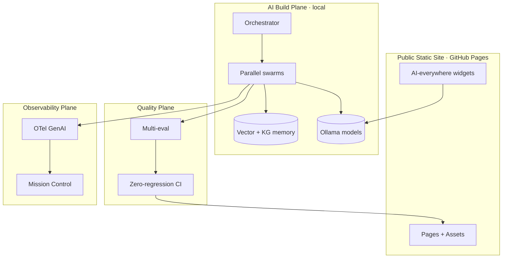

# Architecture (Canonical Overview)

> **Breadcrumb:** [Home](../README.md) › [Docs Index](INDEX.md) › **Architecture**
> **Status:** `Active` · **Owner:** `architecture-swarm` · **Last verified:** `2026-06-12`

## 1. Purpose

This is the **canonical architecture entry point** — the single front door an autonomous builder reads
first. It summarizes the system and links to the authoritative deep docs (the source of truth) under
[`docs/01-architecture/`](01-architecture/SYSTEM_ARCHITECTURE.md). It does not duplicate them.

## 2. One-page system view

## 3. Authoritative deep docs

| Concern | Read |
|---------|------|
| Whole system (C4) | [System Architecture](01-architecture/SYSTEM_ARCHITECTURE.md) |
| Self-build loop (keystone) | [AI Build System](01-architecture/AI_BUILD_SYSTEM.md) |
| Parallel swarms | [Agentic Swarm](01-architecture/AGENTIC_SWARM.md) |
| Orchestration + tool routing | [Orchestration](01-architecture/ORCHESTRATION.md) |
| Local models | [Model Strategy](01-architecture/MODEL_STRATEGY.md) |
| Memory + vector maps | [Memory Architecture](01-architecture/MEMORY_ARCHITECTURE.md) |
| Knowledge + RAG | [Knowledge Architecture](01-architecture/KNOWLEDGE_ARCHITECTURE.md) |
| Data flows + retention | [Data Architecture](01-architecture/DATA_ARCHITECTURE.md) |
| Concrete data entities | [Data Model](DATA_MODEL.md) |
| Interfaces + contracts | [API Contracts](API_CONTRACTS.md) |
| Technologies + rationale | [Tech Stack](01-architecture/TECH_STACK.md) |
| External systems + MCP | [Integration Architecture](01-architecture/INTEGRATION_ARCHITECTURE.md) |
| Decisions (ADRs) | [Decision Log](08-knowledge/DECISION_LOG.md) |

## 4. Layers (summary)

Experience → Orchestration → Reasoning (local models) → Memory → Tools → Observability → Governance.
Full definitions: [System Architecture](01-architecture/SYSTEM_ARCHITECTURE.md) §3.

## 5. Cross-cutting

Freshness ([Freshness](07-operations/FRESHNESS_POLICY.md)) · zero-regression
([Regression Policy](04-quality/REGRESSION_POLICY.md)) · security ([Security](SECURITY.md)) ·
governance/HITL ([HITL](06-governance/HUMAN_IN_THE_LOOP.md)).

## 6. Grounding & Sources

| # | Claim | Source | Accessed |
|---|-------|--------|----------|
| 1 | C4 modelling approach | <https://c4model.com/> | 2026-06-12 |

---

### Freshness

- **Created/Updated/Verified:** 2026-06-12 · **Review cadence:** 45d · **Next review:** 2026-07-27
- See [Freshness Policy](07-operations/FRESHNESS_POLICY.md).

### Navigation

- 🏠 [Home](../README.md) · ⬆️ [Docs Index](INDEX.md)
- ↔️ Related: [System Architecture](01-architecture/SYSTEM_ARCHITECTURE.md) · [AI Build System](01-architecture/AI_BUILD_SYSTEM.md) · [Data Model](DATA_MODEL.md) · [API Contracts](API_CONTRACTS.md)
