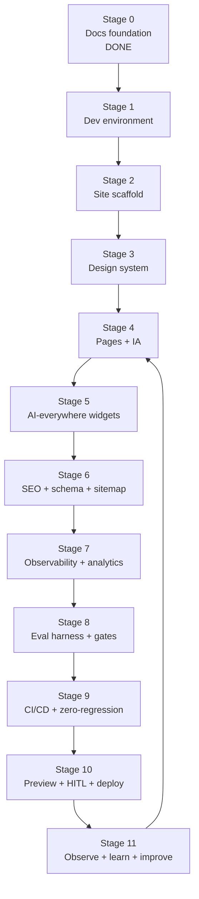

# Autonomous Build Plan

> **Breadcrumb:** [Home](../README.md) › [Docs Index](INDEX.md) › **Autonomous Build Plan**
> **Status:** `Active` · **Owner:** `production-ops-brain` · **Last verified:** `2026-06-12`

## 1. Purpose

The **concrete, ordered, executable sequence** that takes this repository from its current
documentation foundation to a live, production-grade public site built by local-Ollama swarms. Where
[AI Build System](01-architecture/AI_BUILD_SYSTEM.md) defines the *loop* conceptually, this document
defines *exactly what to do, in what order, and when each step is done*. It is written so an
autonomous agent can execute it with minimal ambiguity.

## 2. Operating rules (inherited)

- Anchor time (UTC) at run start; everything timestamped + grounded
  ([Freshness](07-operations/FRESHNESS_POLICY.md)).
- Local-first models; cloud optional ([Model Strategy](01-architecture/MODEL_STRATEGY.md)).
- Every stage ends green on its [Quality Gates](04-quality/QUALITY_GATES.md); **zero regression**
  ([Regression Policy](04-quality/REGRESSION_POLICY.md)).
- Risky/irreversible steps stop for [HITL](06-governance/HUMAN_IN_THE_LOOP.md).
- Each stage emits traces ([Tracing](05-observability/TRACING.md)) and a
  [Learning Log](08-knowledge/LEARNING_LOG.md) entry.

## 3. Build sequence (stage gates)

## 4. Stage detail

Each stage lists **inputs → actions → outputs → exit criteria (Definition of Done)**. Commands are
illustrative; the toolchain is fixed in [Tech Stack](01-architecture/TECH_STACK.md).

### Stage 0 — Documentation foundation — DONE (2026-06-12)

- **Output:** this `docs/` tree + governance/quality/observability specs.
- **DoD:** lint-clean; ≤3-click nav; no orphans ([Documentation Audit](DOCUMENTATION_AUDIT.md)).

### Stage 1 — Dev environment & guardrails

- **Inputs:** [Tech Stack](01-architecture/TECH_STACK.md), [Model Strategy](01-architecture/MODEL_STRATEGY.md).
- **Actions:** install Node toolchain + Ollama; `ollama pull` the role models; add `.editorconfig`,
  `.gitignore`, `.nvmrc`/engines, secret-scanning config; document env vars (see
  [API Contracts](API_CONTRACTS.md) §Env).
- **Outputs:** reproducible local env; models resident.
- **DoD:** `ollama list` shows required models; fresh clone builds docs lint-clean; no secrets tracked.

### Stage 2 — Site scaffold (Astro + Tailwind)

- **Actions:** `npm create astro@latest`; add Tailwind; configure **static** output for GitHub Pages;
  wire base path; commit a "hello world" page that passes gates.
- **Outputs:** buildable static site skeleton.
- **DoD:** `astro build` succeeds; Lighthouse ≥95 on the skeleton; a11y 0 violations.

### Stage 3 — Design system

- **Inputs:** [Design System](02-website/DESIGN_SYSTEM.md).
- **Actions:** implement tokens (color/type/space/radius/motion) in Tailwind theme; build base
  components (button, card, nav, footer, AI-widget shell, form); dark-mode-first.
- **DoD:** components meet WCAG 2.2 AA contrast + 44px targets; tokens are the only style source.

### Stage 4 — Pages & information architecture

- **Inputs:** [Website Architecture](02-website/WEBSITE_ARCHITECTURE.md) sitemap + page inventory.
- **Actions:** build every page; global nav + footer expose all destinations; verify ≤3-click reach.
- **DoD:** all pages render; no dead ends/orphans; nav map matches the sitemap.

### Stage 5 — AI-everywhere widgets

- **Inputs:** [AI Experience](02-website/AI_EXPERIENCE.md), [Agent Catalog](03-agents/AGENT_CATALOG.md),
  [API Contracts](API_CONTRACTS.md).
- **Actions:** implement per-page AI widgets calling the local model endpoint; ground answers; guardian
  screen; load after first paint; full keyboard/ARIA support.
- **DoD:** each page's AI loads non-blocking; answers grounded; safety evals pass; widgets accessible.

### Stage 6 — SEO, schema & sitemap

- **Inputs:** [SEO Strategy](02-website/SEO_STRATEGY.md).
- **Actions:** per-page titles/meta/canonical; schema.org JSON-LD; generate `sitemap.xml` + `robots.txt`;
  internal-link the topic clusters.
- **DoD:** structured data validates; sitemap complete; SEO lint passes.

### Stage 7 — Observability & analytics

- **Inputs:** [Observability](OBSERVABILITY.md), [Tracing](05-observability/TRACING.md),
  [Analytics](05-observability/ANALYTICS.md).
- **Actions:** wire OTel GenAI traces for widget/model/tool calls; instrument funnel + Web Vitals;
  structured logs correlated by `trace_id`.
- **DoD:** a sample interaction produces a complete trace; funnel + Vitals events recorded.

### Stage 8 — Eval harness & quality gates

- **Inputs:** [Eval Framework](04-quality/EVAL_FRAMEWORK.md), [Quality Gates](04-quality/QUALITY_GATES.md).
- **Actions:** create golden eval sets per agent (`eval/golden_*.jsonl`); implement multi-eval
  (correctness/faithfulness/safety/latency/cost/format) with a local judge; lock the baseline.
- **DoD:** eval suite runs reproducibly; thresholds defined; baseline committed + timestamped.

### Stage 9 — CI/CD & zero-regression

- **Inputs:** [CI/CD](CI_CD.md), [Regression Policy](04-quality/REGRESSION_POLICY.md).
- **Actions:** GitHub Actions `ci`/`deploy`/`security`/`freshness`/`eval-trend` workflows; wire all
  gates; secret + dependency scanning; baseline diff blocks regressions.
- **DoD:** PR with a deliberate regression is blocked; green PR deploys to preview.

### Stage 10 — Preview, HITL & production deploy

- **Inputs:** [Deployment](DEPLOYMENT.md), [HITL](06-governance/HUMAN_IN_THE_LOOP.md).
- **Actions:** per-PR preview; human gate for first production go-live; deploy to GitHub Pages; smoke +
  Vitals check; rollback path verified.
- **DoD:** site live at the domain; smoke passes; rollback rehearsed.

### Stage 11 — Observe, learn & improve (continuous)

- **Inputs:** [Continuous Improvement](07-operations/CONTINUOUS_IMPROVEMENT.md),
  [Learning Log](08-knowledge/LEARNING_LOG.md).
- **Actions:** monitor traces/metrics; append learnings; re-plan from signal; loop back to Stage 4+.
- **DoD:** loop demonstrably closes (a learning produced a backlog item that shipped with 0 regression).

## 5. Swarm assignments

| Stage | Lead swarm | Support |
|-------|-----------|---------|
| 1–2 | architecture-swarm | quality-swarm |
| 3–4 | website-swarm | architecture-swarm |
| 5 | agent-architecture-swarm | website-swarm |
| 6 | content-swarm | website-swarm |
| 7 | observability-swarm | architecture-swarm |
| 8–9 | quality-swarm | observability-swarm |
| 10 | production-ops-brain | governance-swarm (HITL) |
| 11 | knowledge-swarm | all |

Topology + handoffs: [Agentic Swarm](01-architecture/AGENTIC_SWARM.md).

## 6. Global Definition of Done (release)

A release ships only when **all** are true (see [Acceptance Criteria](ACCEPTANCE_CRITERIA.md)):

- [ ] All [Quality Gates](04-quality/QUALITY_GATES.md) green.
- [ ] **Zero regression** vs the locked baseline.
- [ ] Multi-eval ≥ thresholds (where AI behavior changed).
- [ ] Traces + a Learning Log entry recorded.
- [ ] HITL approval obtained for any risky/irreversible action.
- [ ] Docs updated, timestamped, linked from [Docs Index](INDEX.md).

## 7. Grounding & Sources

| # | Claim | Source | Accessed |
|---|-------|--------|----------|
| 1 | Self-build loop semantics | [AI Build System](01-architecture/AI_BUILD_SYSTEM.md) | 2026-06-12 |
| 2 | Static site build | <https://astro.build/> | 2026-06-12 |
| 3 | CI engine | <https://docs.github.com/en/actions> | 2026-06-12 |
| 4 | Local model serving | <https://ollama.com/> | 2026-06-12 |

---

### Freshness

- **Created:** 2026-06-12 · **Updated:** 2026-06-12 · **Last verified:** 2026-06-12
- **Review cadence:** 30 days · **Staleness threshold:** 60 days · **Next review due:** 2026-07-12

### Navigation

- 🏠 [Home](../README.md) · ⬆️ [Docs Index](INDEX.md)
- ↔️ Related: [AI Build System](01-architecture/AI_BUILD_SYSTEM.md) · [Implementation Plan](IMPLEMENTATION_PLAN.md) · [Acceptance Criteria](ACCEPTANCE_CRITERIA.md) · [CI/CD](CI_CD.md)
