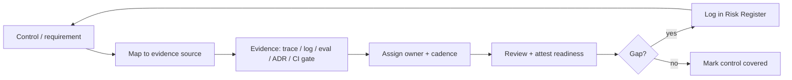

# Compliance Model

> **Breadcrumb:** [Home](../README.md) › [Docs Index](INDEX.md) › **Compliance Model**
> **Status:** `Active` · **Owner:** `governance-swarm` · **Last verified:** `2026-06-12`

## 1. Purpose

The **approach** AgentX2.ai uses to stay continuously auditable against the AI-governance and data
frameworks that matter to enterprise buyers: which frameworks are tracked, how evidence is mapped to
controls, how data is classified, and how the audit trail is built. It complements the in-repo
[Compliance](06-governance/COMPLIANCE.md) and [Responsible AI](06-governance/RESPONSIBLE_AI.md) docs
with a concrete operating model.

> **Important:** this document describes a **model and methodology**, not a certification, attestation,
> or legal claim. Any statement that a specific certification has been achieved would be `[UNVERIFIED]`
> until independently audited; this doc makes no such claim.

## 2. Context & Scope

- The model is anchored to the [NIST AI RMF](https://www.nist.gov/itl/ai-risk-management-framework)
  functions — **Govern, Map, Measure, Manage** — already adopted by [AI Governance](06-governance/AI_GOVERNANCE.md).
- It tracks additional framework **families at a policy level** (SOC 2 Trust Services Criteria, GDPR
  principles, EU AI Act transparency); authoritative framework texts are referenced via the in-repo
  [Compliance](06-governance/COMPLIANCE.md) doc rather than restated here.
- Evidence is drawn from systems that already exist: traces ([Tracing](05-observability/TRACING.md)),
  logs, eval runs ([Eval Framework](04-quality/EVAL_FRAMEWORK.md)), decision records, and CI gates.

## 3. Frameworks tracked

| Framework | Focus | How we map evidence | Note |
|-----------|-------|---------------------|------|
| NIST AI RMF | AI risk lifecycle (Govern/Map/Measure/Manage) | governance cadence, risk register, eval + trace evidence | primary anchor |
| SOC 2 (Trust Services Criteria) | security, availability, processing integrity, confidentiality, privacy | control → CI gate / log / access policy evidence | control-family mapping, **not** an attestation |
| GDPR (principles) | lawfulness, minimization, purpose limitation, storage limitation | data classification + retention + redaction policy | principle-level mapping |
| EU AI Act (transparency) | disclosure that users interact with AI, traceability | AI-disclosure in UX + provenance trace | transparency-obligation mapping |

> Framework coverage is **mapping and readiness**, not a claim of compliance or certification. Gaps are
> tracked openly in the [Risk Register](06-governance/RISK_REGISTER.md).

## 4. Evidence-mapping approach

| Control input | Evidence source | Owner |
|---------------|-----------------|-------|
| Human-oversight requirement | approval records ([HITL](06-governance/HUMAN_IN_THE_LOOP.md)) | governance-swarm |
| Safety/injection requirement | guardian flags + red-team results ([Prompt Governance](PROMPT_GOVERNANCE.md)) | governance-swarm |
| Change-control requirement | CI gates + PR records ([CI/CD](04-quality/CI_CD.md)) | quality-swarm |
| Traceability requirement | GenAI traces ([Tracing](05-observability/TRACING.md)) | observability-swarm |
| Data-handling requirement | classification + redaction policy (§5) | governance-swarm |

## 5. Data classification

Telemetry and content are classified so handling rules are unambiguous; the public site and public
traces only ever carry `Public` data ([Telemetry Schema](TELEMETRY_SCHEMA.md), [Security](06-governance/SECURITY_ARCHITECTURE.md)).

| Class | Description | Handling |
|-------|-------------|----------|
| Public | Intended for public release | may appear in public repo/site/traces |
| Internal | Operational, non-sensitive | internal systems only; not in public artifacts |
| Confidential | Sensitive business/client data | access-controlled; encrypted; never in public traces |
| Restricted | Secrets, credentials, regulated PII | vaulted; least-privilege; redacted from all telemetry |

## 6. Audit-trail model

- **Timestamped + trace-linked:** every governed action (approval, deploy, prompt promotion, escalation)
  is recorded with a UTC timestamp and `trace_id`, forming a provenance chain from intake to live
  artifact ([Tracing](05-observability/TRACING.md), [Freshness Policy](07-operations/FRESHNESS_POLICY.md)).
- **Append-only intent:** audit records are treated as immutable history; corrections are new entries,
  not edits.
- **Evidence on demand:** because controls map to existing traces/logs/eval runs/CI records, an audit
  request resolves to **retrieval**, not reconstruction.
- **Retention + minimization:** records are retained per policy and minimized to exclude `Restricted`
  data; redaction follows [Security Architecture](06-governance/SECURITY_ARCHITECTURE.md).

## 7. Decisions & Rationale

| # | Decision | Rationale |
|---|----------|-----------|
| 1 | Anchor on NIST AI RMF functions | A recognized, framework-neutral spine for AI risk and evidence |
| 2 | Map frameworks at the control/principle level | Honest readiness mapping without overclaiming certification |
| 3 | Reuse existing traces/logs/evals as evidence | Compliance becomes a by-product of good engineering, not extra work |
| 4 | Explicit "model, not certification" disclaimer | Prevents misreading readiness as an audited claim |

## 8. Risks & Open Questions

- **Overclaiming.** Readiness must never be presented as certification; the disclaimer in §1 is binding.
  `[UNVERIFIED]` status of any external audit until one is performed.
- **Regulatory drift.** Frameworks (notably the EU AI Act) evolve; mappings are re-verified on cadence
  with [Compliance](06-governance/COMPLIANCE.md).
- **Evidence completeness.** A mapped control is only as strong as its evidence source; gaps are tracked
  in the [Risk Register](06-governance/RISK_REGISTER.md).

## 9. Grounding & Sources

| # | Claim | Source | Accessed |
|---|-------|--------|----------|
| 1 | Govern/Map/Measure/Manage functions anchor the model | <https://www.nist.gov/itl/ai-risk-management-framework> | 2026-06-12 |
| 2 | LLM risk classes inform safety controls/evidence | <https://owasp.org/www-project-top-10-for-large-language-model-applications/> | 2026-06-12 |
| 3 | Governance + compliance control set | [`sysprompt_agentx2.md`](../sysprompt_agentx2.md) | 2026-06-12 |

---

### Freshness

- **Created/Updated/Verified:** 2026-06-12 · **Review cadence:** 60d · **Next review:** 2026-08-11
- See [Freshness Policy](07-operations/FRESHNESS_POLICY.md).

### Navigation

- 🏠 [Home](../README.md) · ⬆️ [Docs Index](INDEX.md)
- ↔️ Related: [Compliance](06-governance/COMPLIANCE.md) · [Responsible AI](06-governance/RESPONSIBLE_AI.md) · [AI Governance](06-governance/AI_GOVERNANCE.md) · [Security Architecture](06-governance/SECURITY_ARCHITECTURE.md)
