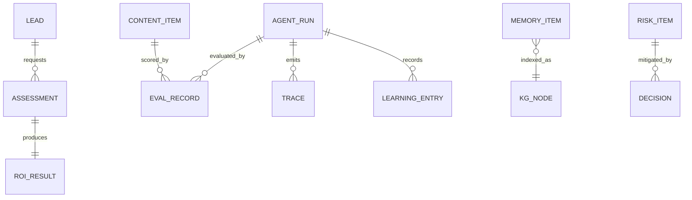

# Data Model

> **Breadcrumb:** [Home](../README.md) › [Docs Index](INDEX.md) › **Data Model**
> **Status:** `Active` · **Owner:** `architecture-swarm` · **Last verified:** `2026-06-12`

## 1. Purpose

The **concrete entities and schemas** the platform produces and consumes. Where
[Data Architecture](01-architecture/DATA_ARCHITECTURE.md) defines flows, retention, and classification
at the system level, this document defines the **record shapes** an implementer creates. Every record
is timestamped (ISO-8601 UTC) and carries provenance.

## 2. Entity overview

## 3. Public-plane entities

### CONTENT_ITEM (page/article)

| Field | Type | Notes |
|-------|------|-------|
| id | string | slug |
| type | enum | page \| article \| case-study |
| title, description | string | SEO metadata |
| persona | enum | target persona ([Personas](00-overview/PERSONAS.md)) |
| cluster | string | SEO topic cluster |
| schema_type | string | schema.org type |
| created, updated, last_verified | datetime | UTC |
| sources | array | grounding refs |

### EVAL_RECORD

| Field | Type | Notes |
|-------|------|-------|
| id | string | run id |
| target | string | agent/prompt/content id |
| dimension | enum | correctness \| faithfulness \| safety \| latency \| cost \| format |
| score | number | 0–1 |
| threshold | number | pass bar |
| model, dataset_version | string | reproducibility |
| timestamp | datetime | UTC |

### TRACE / SPAN

Follows OTel GenAI semconv ([Tracing](05-observability/TRACING.md)): `trace_id`, `span_id`,
operation, model, token usage, latency, timestamps; tool/agent/model span kinds.

### LEARNING_ENTRY

Per the [Learning Entry Template](_templates/LEARNING_ENTRY_TEMPLATE.md): `id`, `timestamp`,
`captured_by`, `trigger`, `trace_id`, `observation`, `insight`, `action`, `generalization`,
`confidence`, `decay_horizon`, `supersedes`, `sources`.

### MEMORY_ITEM / KG_NODE+EDGE

Memory item: `id`, `text`, `embedding`, `source`, `created`, `last_verified`, `decay_horizon`, `tier`
([Memory Architecture](01-architecture/MEMORY_ARCHITECTURE.md)). Graph: `node{id,type,attrs}`,
`edge{from,to,relation}` ([Knowledge Graph](08-knowledge/KNOWLEDGE_GRAPH.md)).

### RISK_ITEM / DECISION

Risk: `id`, `risk`, `likelihood`, `impact`, `mitigation`, `owner`, `status`
([Risk Register](RISK_REGISTER.md)). Decision: ADR fields
([Decision Log](08-knowledge/DECISION_LOG.md)).

## 4. Private-plane entities (architecture reference only)

These live in the **private repo**, never the public one
([Public/Private Model](00-overview/PUBLIC_PRIVATE_MODEL.md)):

### LEAD / CONTACT

| Field | Type | Classification |
|-------|------|----------------|
| id | string | Confidential |
| name, email, company, role | string | Confidential / PII |
| source, persona | string | Internal |
| consent | bool | Confidential |
| created | datetime | — |

### ASSESSMENT / ROI_RESULT

Assessment: `id`, `lead_id`, `type` (opportunity \| readiness \| automation \| roi \| workforce),
`inputs`, `findings`, `timestamp`. ROI result: `inputs{...}`, `savings`, `productivity_gain`,
`payback_period`, `assumptions[]` — derived only from declared inputs, never invented
([Consultation Engine](03-agents/CONSULTATION_ENGINE.md)).

## 5. Classification & retention

| Entity | Classification | Home | Retention |
|--------|----------------|------|-----------|
| CONTENT_ITEM | Public | public repo | with site |
| EVAL_RECORD, TRACE | Internal | telemetry store | policy-bounded |
| LEARNING_ENTRY | Public/Internal | knowledge store | append-only |
| MEMORY_ITEM, KG | Internal | vector/graph store | curated/decay |
| LEAD, ASSESSMENT, ROI | Confidential | **private repo** | minimal, consent-bound |

Rules per [Security Architecture](06-governance/SECURITY_ARCHITECTURE.md) and
[Data Architecture](01-architecture/DATA_ARCHITECTURE.md): minimize collection; no PII/secrets in
public artifacts; schemas versioned ([Release Engineering](04-quality/RELEASE_ENGINEERING.md)).

## 6. Grounding & Sources

| # | Claim | Source | Accessed |
|---|-------|--------|----------|
| 1 | Flows, classification, retention | [Data Architecture](01-architecture/DATA_ARCHITECTURE.md) | 2026-06-12 |
| 2 | Timestamp format | <https://www.iso.org/iso-8601-date-and-time-format.html> | 2026-06-12 |
| 3 | Trace/eval record shape | <https://opentelemetry.io/docs/specs/semconv/gen-ai/> | 2026-06-12 |

---

### Freshness

- **Created/Updated/Verified:** 2026-06-12 · **Review cadence:** 45d · **Next review:** 2026-07-27
- See [Freshness Policy](07-operations/FRESHNESS_POLICY.md).

### Navigation

- 🏠 [Home](../README.md) · ⬆️ [Docs Index](INDEX.md)
- ↔️ Related: [Data Architecture](01-architecture/DATA_ARCHITECTURE.md) · [API Contracts](API_CONTRACTS.md) · [Memory Architecture](01-architecture/MEMORY_ARCHITECTURE.md)
