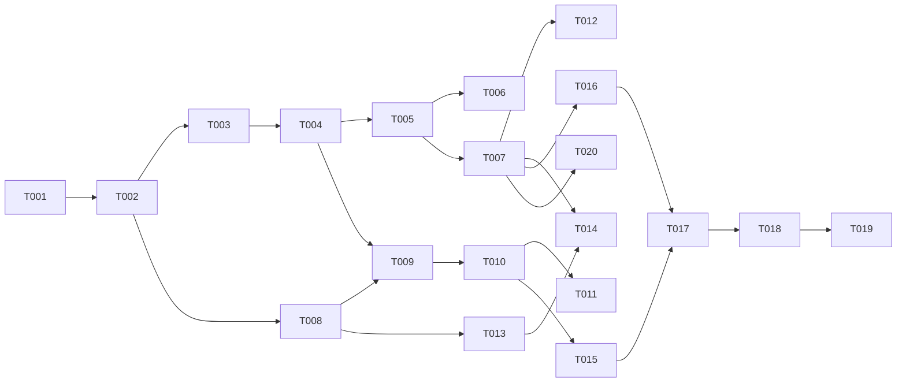

# Implementation Plan

> **Breadcrumb:** [Home](../README.md) › [Docs Index](INDEX.md) › **Implementation Plan**
> **Status:** `Active` · **Owner:** `production-ops-brain` · **Last verified:** `2026-06-12`

## 1. Purpose

The **task-level work breakdown** that turns the [Autonomous Build Plan](AUTONOMOUS_BUILD_PLAN.md) into
concrete, dependency-ordered tasks mapped to files/components, owners, estimates, and acceptance. It
is the executable bridge between the [PRD](PRD.md) and shipped code, and it stays in sync with the
[Backlog](09-roadmap/BACKLOG.md) (14-day cadence).

## 2. Work breakdown

Status legend: `todo` · `doing` · `done` · `blocked`. IDs map to backlog items where applicable.

| Task | Stage | Produces (files/components) | Depends on | Owner | Est. | Status |
|------|-------|-----------------------------|-----------|-------|------|--------|
| T-001 Dev env + model pull | 1 | `.nvmrc`, `.editorconfig`, `.gitignore`, env doc | — | architecture-swarm | S | todo |
| T-002 Astro scaffold (static) | 2 | `astro.config.*`, `package.json`, `src/` | T-001 | architecture-swarm | M | todo |
| T-003 Design tokens | 3 | `tailwind.config.*`, `src/styles/tokens.css` | T-002 | website-swarm | M | todo |
| T-004 Base components | 3 | `src/components/{Button,Card,Nav,Footer,AIWidget,Form}` | T-003 | website-swarm | M | todo |
| T-005 Layout + global nav/footer | 4 | `src/layouts/Base.astro` | T-004 | website-swarm | S | todo |
| T-006 Home page | 4 | `src/pages/index.astro` | T-005 | website-swarm | M | todo |
| T-007 Core pages | 4 | `services, finance-ai, agentic-ai, subscriptions, contact, faq, industries, case-studies, about, partners, careers, privacy, terms` | T-005 | website-swarm | L | todo |
| T-008 Model provider adapter | 5 | `src/lib/model.ts` (OpenAI-compatible client) | T-002 | agent-architecture-swarm | M | todo |
| T-009 AI widget runtime | 5 | `src/components/ai/*`, widget ↔ model wiring | T-004,T-008 | agent-architecture-swarm | L | todo |
| T-010 Per-page agents | 5 | agent configs per [Catalog](03-agents/AGENT_CATALOG.md) | T-009 | agent-architecture-swarm | L | todo |
| T-011 Consultation engine | 5 | assessment + ROI flow | T-010 | agent-architecture-swarm | L | todo |
| T-012 SEO + schema + sitemap | 6 | `src/lib/seo.ts`, JSON-LD, `sitemap.xml`, `robots.txt` | T-007 | content-swarm | M | todo |
| T-013 OTel GenAI tracing | 7 | `src/lib/otel.ts`, collector config | T-008 | observability-swarm | M | todo |
| T-014 Analytics + funnel | 7 | event wiring, Web Vitals | T-007,T-013 | observability-swarm | M | todo |
| T-015 Eval harness + golden sets | 8 | `eval/`, judge runner | T-010 | quality-swarm | L | todo |
| T-016 Quality gates | 8 | a11y/perf/seo/link/security checks | T-007 | quality-swarm | M | todo |
| T-017 CI workflows | 9 | `.github/workflows/{ci,deploy,security,freshness,eval-trend}.yml` | T-015,T-016 | quality-swarm | M | todo |
| T-018 Zero-regression baseline | 9 | `baseline.json` + diff step | T-017 | quality-swarm | S | todo |
| T-019 Deploy + rollback | 10 | Pages deploy, smoke, rollback runbook | T-017 | production-ops-brain | M | todo |
| T-020 Obsidian vault generator | 11 | vault mirror + Canvas maps | T-007 | knowledge-swarm | M | todo |
| T-021 Verify logo licensing (R-007) | 0 | license note | — | website-swarm | S | todo |

## 3. Dependency graph

## 4. Critical path

`T-001 → T-002 → T-008 → T-009 → T-010 → T-015 → T-017 → T-018 → T-019`. Compress by running the
website lane (T-003…T-007, T-012) in parallel with the AI lane (T-008…T-011) per
[Agentic Swarm](01-architecture/AGENTIC_SWARM.md).

## 5. Estimates & sizing

`S` ≈ small, `M` ≈ medium, `L` ≈ large (relative complexity, not hours — hours are not invented).
Re-estimate at the 14-day [Backlog](09-roadmap/BACKLOG.md) review.

## 6. Per-task acceptance

Every task is "done" only when its slice of [Acceptance Criteria](ACCEPTANCE_CRITERIA.md) passes and
the change ships with **zero regression** ([Regression Policy](04-quality/REGRESSION_POLICY.md)).

## 7. Grounding & Sources

| # | Claim | Source | Accessed |
|---|-------|--------|----------|
| 1 | Stage structure | [Autonomous Build Plan](AUTONOMOUS_BUILD_PLAN.md) | 2026-06-12 |
| 2 | Backlog items | [Backlog](09-roadmap/BACKLOG.md) | 2026-06-12 |

---

### Freshness

- **Created/Updated/Verified:** 2026-06-12 · **Review cadence:** 14d · **Next review:** 2026-06-26
- See [Freshness Policy](07-operations/FRESHNESS_POLICY.md).

### Navigation

- 🏠 [Home](../README.md) · ⬆️ [Docs Index](INDEX.md)
- ↔️ Related: [Autonomous Build Plan](AUTONOMOUS_BUILD_PLAN.md) · [Backlog](09-roadmap/BACKLOG.md) · [Acceptance Criteria](ACCEPTANCE_CRITERIA.md)
