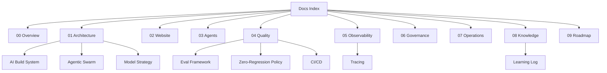

# AgentX2.ai Documentation Index

> **Breadcrumb:** [Home](../README.md) › **Docs Index**
> **Status:** `Active` · **Owner:** `production-ops-brain` · **Last verified:** `2026-06-12`

This is the **navigation hub** for the AgentX2.ai AI-native company platform. Every document is
reachable from here in **one click**, so any document is **≤3 clicks** from any other (doc → index →
doc). Every doc is timestamped, fact-grounded, and kept fresh per the
[Freshness Policy](07-operations/FRESHNESS_POLICY.md).

## Start here

| If you want to… | Read |
|-----------------|------|
| Understand the agent contract | [`AGENTS.md`](../AGENTS.md) |
| Understand how the repo builds itself | [AI Build System](01-architecture/AI_BUILD_SYSTEM.md) |
| See the company vision & model | [Vision](00-overview/VISION.md) · [Company Model](00-overview/COMPANY_MODEL.md) |
| See the current state & gaps | [Current State](../CURRENT_STATE.md) |
| Contribute | [Contributing](../CONTRIBUTING.md) · [DOC_TEMPLATE](_templates/DOC_TEMPLATE.md) |

## Documentation map

## Build & delivery — canonical entry points

The flat, predictably-named docs an autonomous builder reads first. Several are **front doors** that
defer to an authoritative deep doc (linked inside).

| Doc | Purpose |
|-----|---------|
| [PRD](PRD.md) | Structured requirements (FR/NFR), goals, metrics, personas |
| [Architecture](ARCHITECTURE.md) | Canonical architecture overview |
| [Autonomous Build Plan](AUTONOMOUS_BUILD_PLAN.md) | Ordered, executable build sequence + DoD |
| [Implementation Plan](IMPLEMENTATION_PLAN.md) | Task WBS + dependency graph |
| [Agent Orchestration](AGENT_ORCHESTRATION.md) | Orchestration + event flow |
| [API Contracts](API_CONTRACTS.md) | Interfaces, envelopes, env vars |
| [Data Model](DATA_MODEL.md) | Concrete entities + schemas |
| [Acceptance Criteria](ACCEPTANCE_CRITERIA.md) | Testable acceptance + Definition of Done |
| [Security](SECURITY.md) · [Observability](OBSERVABILITY.md) · [Testing Strategy](TESTING_STRATEGY.md) | Quality + safety entry points |
| [CI/CD](CI_CD.md) · [Deployment](DEPLOYMENT.md) · [Runbook](RUNBOOK.md) | Delivery + ops entry points |
| [Risk Register](RISK_REGISTER.md) · [Roadmap](ROADMAP.md) | Risk + plan entry points |
| [Documentation Audit](DOCUMENTATION_AUDIT.md) | Inventory + completeness scores |

## Platform, MCP, keys & telemetry — flat reference docs

Net-new flat docs for the platform build, plus front doors to canonical deep docs. The live website
also ships these as interactive pages (`/mission-control/`, `/demo/`, `/roi-calculator/`).

| Doc | Purpose |
|-----|---------|
| [System Context](SYSTEM_CONTEXT.md) | C4 context: actors, external systems, trust boundaries |
| [API Architecture](API_ARCHITECTURE.md) · [openapi.yaml](../openapi.yaml) | API platform + OpenAPI 3.1 contract |
| [MCP Architecture](MCP_ARCHITECTURE.md) · [MCP Registry](MCP_REGISTRY.md) · [MCP Security](MCP_SECURITY.md) | Model Context Protocol tool boundary |
| [Key Management](KEY_MANAGEMENT.md) | Secrets/API keys, rotation, `.env.example` mapping |
| [Agent Registry](AGENT_REGISTRY.md) · [Agent Workflows](AGENT_WORKFLOWS.md) · [Prompt Governance](PROMPT_GOVERNANCE.md) | Agent operating-system reference |
| [Telemetry Schema](TELEMETRY_SCHEMA.md) · [Alerting](ALERTING.md) | Event/span schema + alerting & circuit breakers |
| [Visual System](VISUAL_SYSTEM.md) · [Compliance Model](COMPLIANCE_MODEL.md) | Dashboards/visuals + compliance posture |

Flat front doors (single source of truth lives in the linked canonical doc):
[AGENTS](AGENTS.md) ·
[AI Governance](AI_GOVERNANCE.md) ·
[Analytics](ANALYTICS.md) ·
[SEO Strategy](SEO_STRATEGY.md) ·
[Content Factory](CONTENT_FACTORY.md) ·
[Design System](DESIGN_SYSTEM.md) ·
[Quality Gates](QUALITY_GATES.md) ·
[Continuous Improvement](CONTINUOUS_IMPROVEMENT.md) ·
[Mission Control](MISSION_CONTROL.md).

## 00 · Overview

- [Vision](00-overview/VISION.md) — what AgentX2.ai is and why.
- [Company Model](00-overview/COMPANY_MODEL.md) — business, services, revenue, operating model.
- [Public / Private Model](00-overview/PUBLIC_PRIVATE_MODEL.md) — what lives in the public vs. private repo.
- [Personas](00-overview/PERSONAS.md) — who we build for.
- [Glossary](00-overview/GLOSSARY.md) — shared vocabulary.

## 01 · Architecture

- [System Architecture](01-architecture/SYSTEM_ARCHITECTURE.md) — the whole system on one page.
- [AI Build System](01-architecture/AI_BUILD_SYSTEM.md) — **keystone**: the self-building loop.
- [Agentic Swarm](01-architecture/AGENTIC_SWARM.md) — parallel swarm topology + handoffs.
- [Orchestration](01-architecture/ORCHESTRATION.md) — dispatch, tool routing, retries, HITL hooks.
- [Model Strategy](01-architecture/MODEL_STRATEGY.md) — local Ollama model matrix + fallbacks.
- [Memory Architecture](01-architecture/MEMORY_ARCHITECTURE.md) — vector maps, retrieval, freshness.
- [Knowledge Architecture](01-architecture/KNOWLEDGE_ARCHITECTURE.md) — knowledge graph + RAG.
- [Data Architecture](01-architecture/DATA_ARCHITECTURE.md) — data flows, schemas, retention.
- [Tech Stack](01-architecture/TECH_STACK.md) — chosen technologies + rationale.
- [Integration Architecture](01-architecture/INTEGRATION_ARCHITECTURE.md) — external systems + MCP.

## 02 · Website

- [Website Architecture](02-website/WEBSITE_ARCHITECTURE.md) — IA, sitemap, ≤3-click map.
- [Design System](02-website/DESIGN_SYSTEM.md) — tokens, components, theme.
- [AI Experience](02-website/AI_EXPERIENCE.md) — AI-everywhere per page.
- [SEO Strategy](02-website/SEO_STRATEGY.md) — topic clusters + programmatic SEO.
- [Accessibility](02-website/ACCESSIBILITY.md) — WCAG 2.2 AA standard.
- [Performance](02-website/PERFORMANCE.md) — Core Web Vitals budgets.
- [Content Factory](02-website/CONTENT_FACTORY.md) — content production swarm.

## 03 · Agents

- [Agent Catalog](03-agents/AGENT_CATALOG.md) — every agent, indexed.
- [Agent Contracts](03-agents/AGENT_CONTRACTS.md) — shared contract + schemas.
- [Consultation Engine](03-agents/CONSULTATION_ENGINE.md) — assessments + ROI.
- [Managed AI Workforce](03-agents/MANAGED_AI_WORKFORCE.md) — digital workforce platform.
- [Prompt Library](03-agents/PROMPT_LIBRARY.md) — versioned, evaluated prompts.

## 04 · Quality

- [Quality Gates](04-quality/QUALITY_GATES.md) — the merge bar.
- [Testing Strategy](04-quality/TESTING_STRATEGY.md) — the test pyramid.
- [Eval Framework](04-quality/EVAL_FRAMEWORK.md) — multi-eval + LLM-as-judge.
- [Zero-Regression Policy](04-quality/REGRESSION_POLICY.md) — never go backward.
- [CI/CD](04-quality/CI_CD.md) — pipelines + gates.
- [Release Engineering](04-quality/RELEASE_ENGINEERING.md) — versioning + releases.

## 05 · Observability

- [Observability](05-observability/OBSERVABILITY.md) — the three pillars + GenAI.
- [Tracing](05-observability/TRACING.md) — OTel GenAI spans end to end.
- [Metrics Catalog](05-observability/METRICS_CATALOG.md) — every metric defined.
- [Mission Control](05-observability/MISSION_CONTROL.md) — the control tower dashboards.
- [Analytics](05-observability/ANALYTICS.md) — business + product KPIs.
- [Logging](05-observability/LOGGING.md) — structured logging standard.

## 06 · Governance

- [AI Governance](06-governance/AI_GOVERNANCE.md) — model/prompt/agent/data governance.
- [Security Architecture](06-governance/SECURITY_ARCHITECTURE.md) — zero-trust + AppSec.
- [Responsible AI](06-governance/RESPONSIBLE_AI.md) — principles + controls.
- [Compliance](06-governance/COMPLIANCE.md) — frameworks + evidence.
- [Risk Register](06-governance/RISK_REGISTER.md) — live risks.
- [Human-in-the-Loop](06-governance/HUMAN_IN_THE_LOOP.md) — autonomy tiers + approvals.

## 07 · Operations

- [Continuous Improvement](07-operations/CONTINUOUS_IMPROVEMENT.md) — the improvement loops.
- [Freshness Policy](07-operations/FRESHNESS_POLICY.md) — timestamps, grounding, staleness.
- [Runbooks](07-operations/RUNBOOKS.md) — operational procedures.
- [Incident Response](07-operations/INCIDENT_RESPONSE.md) — detect → resolve → postmortem.
- [Deployment](07-operations/DEPLOYMENT.md) — environments + rollout/rollback.

## 08 · Knowledge

- [Learning Log](08-knowledge/LEARNING_LOG.md) — append-only, timestamped lessons.
- [Obsidian Vault](08-knowledge/OBSIDIAN_VAULT.md) — graph + Canvas visual maps.
- [Knowledge Graph](08-knowledge/KNOWLEDGE_GRAPH.md) — entities + relations.
- [Decision Log](08-knowledge/DECISION_LOG.md) — ADR register.
  - [ADR-0001 Tech Stack](08-knowledge/adr/ADR-0001-tech-stack.md)
  - [ADR-0002 Local Ollama-First](08-knowledge/adr/ADR-0002-local-ollama-first.md)
  - [ADR-0003 OTel GenAI Observability](08-knowledge/adr/ADR-0003-otel-genai-observability.md)
  - [ADR-0004 Zero-Regression Policy](08-knowledge/adr/ADR-0004-zero-regression-policy.md)
  - [ADR-0005 Agentic Swarm Topology](08-knowledge/adr/ADR-0005-agentic-swarm-topology.md)

## 09 · Roadmap

- [Roadmap](09-roadmap/ROADMAP.md) — phased plan.
- [Backlog](09-roadmap/BACKLOG.md) — prioritized work.
- [Milestones](09-roadmap/MILESTONES.md) — dated targets.

## Audit & reviews

Evidence-based audit artifacts from the repository review of 2026-06-13.

- [Repository Analysis](reviews/repository-analysis.md) — what the repository is today + verification snapshot.
- [Gap Analysis](reviews/gap-analysis.md) — capability matrix, gap detail, and remediation status.
- [Security Review](reviews/security-review.md) — dependency audit, in-context risk, and fixes.
- [Master Build Plan](plans/master-build-plan.md) — swarm-to-reality mapping + build/deferral record.
- [Rollback Plan](plans/rollback-plan.md) — how to reverse the audit + hardening changeset.
- [Release Readiness Report](releases/release-readiness-report.md) — GO/NO-GO certification.
- [Release Notes](releases/release-notes.md) — human-readable notes for the unreleased changeset.

## Templates

- [DOC_TEMPLATE](_templates/DOC_TEMPLATE.md) · [AGENT_SPEC_TEMPLATE](_templates/AGENT_SPEC_TEMPLATE.md) · [ADR_TEMPLATE](_templates/ADR_TEMPLATE.md) · [LEARNING_ENTRY_TEMPLATE](_templates/LEARNING_ENTRY_TEMPLATE.md)

## Repository meta

- [README](../README.md) · [AGENTS.md](../AGENTS.md) · [Current State](../CURRENT_STATE.md) · [Build Report](../BUILD_REPORT.md)
- [Changelog](../CHANGELOG.md) · [Contributing](../CONTRIBUTING.md) · [Security](../SECURITY.md) · [Code of Conduct](../CODE_OF_CONDUCT.md) · [License](../LICENSE.md)

---

### Freshness

- **Created:** 2026-06-12 · **Updated:** 2026-06-13 · **Last verified:** 2026-06-13
- **Review cadence:** 14 days · **Staleness threshold:** 30 days · **Next review due:** 2026-06-27
- Governed by the [Freshness Policy](07-operations/FRESHNESS_POLICY.md).

### Navigation

- 🏠 [Home](../README.md) · 📜 [AGENTS.md](../AGENTS.md)
