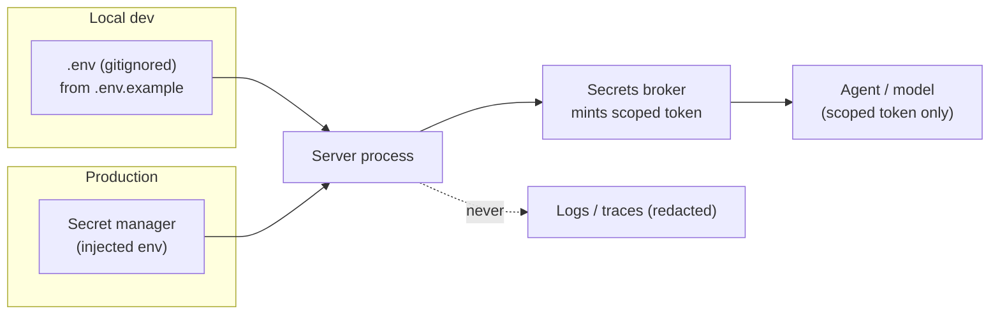

# Key Management

> **Breadcrumb:** [Home](../README.md) › [Docs Index](INDEX.md) › **Key Management**
> **Status:** `Active` · **Owner:** `governance-swarm` · **Last verified:** `2026-06-12`

## 1. Purpose

This document defines how AgentX2.ai handles **secrets and API keys**: where configuration lives, how
keys are isolated and rotated, how they are kept out of source, logs, and model context, and how the
[Secrets Broker](MCP_REGISTRY.md) brokers access. It is the credential companion to
[Security Architecture](06-governance/SECURITY_ARCHITECTURE.md) and [MCP Security](MCP_SECURITY.md).

> **This public repository contains NO secrets.** It ships only a documented, value-free
> `.env.example`. Real credentials are supplied at runtime via the environment or a production secret
> manager, never committed.

## 2. Context & scope

Configuration follows **[Twelve-Factor config](https://12factor.net/config)**: strict separation of
config from code, with all credentials read from the environment. The public website is static and
needs **no secrets at all**; secrets exist only in the **private operations and build planes**
([Public/Private Model](00-overview/PUBLIC_PRIVATE_MODEL.md)). Key lifecycle follows
[NIST SP 800-57](https://csrc.nist.gov/pubs/sp/800/57/pt1/r5/final).

## 3. Principles

- **No hardcoded secrets** — ever, in any plane; enforced by secret scanning in CI.
- **Environment-based config** — values injected at runtime, never baked into artifacts.
- **Least privilege** — each key is scoped to the minimum it needs.
- **Per-provider isolation** — one credential per provider; a leak is contained to that provider.
- **Broker, never expose** — models and agents get scoped tokens, never raw keys
  ([MCP Security](MCP_SECURITY.md)).
- **Rotate on a schedule and on suspicion** — routine rotation plus immediate rotation on any exposure.
- **Redact everywhere** — secrets are stripped from logs, traces, and error envelopes.

## 4. Configuration flow

Secrets move from a manager (or local `.env`) into the server process — and **stop there**. Nothing
downstream of the broker sees a raw key.

## 5. Supported provider keys

The environment variables documented in `.env.example`. **Type** distinguishes a true *Secret* from a
non-sensitive *Config* endpoint and a deliberately *Public* identifier. Rotation cadences are internal
policy defaults.

| Provider | Env var | Type | Purpose | Plane | Rotation |
|----------|---------|------|---------|-------|----------|
| OpenAI | `OPENAI_API_KEY` | Secret | Optional cloud LLM access | Private | 90d |
| Anthropic | `ANTHROPIC_API_KEY` | Secret | Optional cloud LLM access | Private | 90d |
| xAI (Grok) | `XAI_API_KEY` | Secret | Optional cloud LLM access | Private | 90d |
| Google | `GOOGLE_API_KEY` | Secret | Optional cloud LLM (Gemini) access | Private | 90d |
| Azure OpenAI | `AZURE_OPENAI_API_KEY` | Secret | Optional cloud LLM access | Private | 90d |
| Ollama (local) | `OLLAMA_HOST` | Config | Local model endpoint URL | Both | n/a (endpoint, not a secret) |
| GitHub | `GITHUB_TOKEN` | Secret | Repo + CI automation | Build/Private | per-job ephemeral; 90d for PATs |
| CRM | `CRM_API_KEY` | Secret | CRM MCP server upstream | Private | 90d |
| Email | `EMAIL_API_KEY` | Secret | Email MCP server upstream | Private | 90d |
| Analytics | `PUBLIC_ANALYTICS_ID` | Public | Privacy-respecting analytics site id | Public | n/a (public by design) |
| Vector DB | `VECTOR_DB_URL` | Config/Secret | Vector store endpoint (may embed credentials) | Private | rotate embedded creds 90d |
| Observability | `OTEL_EXPORTER_OTLP_ENDPOINT` | Config | Telemetry collector endpoint | Both | n/a (endpoint, not a secret) |

## 6. Rotation model

- **Routine rotation** on the cadence above; rotation is non-breaking via **dual-key overlap** (new key
  accepted before old key is revoked).
- **Emergency rotation** on any suspected exposure — revoke, reissue, and audit the blast radius
  immediately.
- **Ephemeral-first** where supported (e.g., per-job `GITHUB_TOKEN`, brokered scoped tokens) to minimize
  the lifetime of any long-lived secret ([NIST SP 800-57](https://csrc.nist.gov/pubs/sp/800/57/pt1/r5/final)).

## 7. Protection in depth

| Control | Mechanism |
|---------|-----------|
| Source | `.gitignore` blocks `.env`; **[secret scanning](https://docs.github.com/en/code-security/secret-scanning)** + push protection in CI blocks commits |
| Transit | TLS for all remote calls; tokens carried only over encrypted transports |
| At rest | Production secrets encrypted by the secret manager; never written to repo or build artifacts |
| Runtime | Per-provider process isolation; broker issues scoped, short-lived tokens |
| Logs/traces | Redaction filters strip secret-shaped values from logs, spans, and error envelopes |
| Access | Least privilege; key scope reviewed at issuance and on rotation |

## 8. Local development

Developers copy `.env.example` to `.env` (gitignored) and fill in their own credentials, or run
local-only (Ollama needs no key). The example file documents every variable with a placeholder and a
comment — **never a real value**. CI re-verifies that no secret has entered history.

## 9. Decisions

- **D-1 Twelve-Factor config.** All secrets come from the environment; none from code or artifacts.
- **D-2 Public repo is secret-free.** Only `.env.example` ships; CI enforces it.
- **D-3 Broker + scope.** Raw keys never reach models/agents; scoped tokens only.
- **D-4 Rotate routinely and on suspicion.** Dual-key overlap makes rotation non-breaking.

## 10. Risks & open questions

- **Endpoint-embedded credentials** (e.g., in `VECTOR_DB_URL`) blur the secret/config line; preferred
  pattern is a separate credential plus a clean URL — tracked for hardening.
- **[UNVERIFIED]** The specific production secret-manager product is an environment decision and is not
  asserted here; the abstraction (injected env + broker) is fixed, the vendor is not.
- **Insider misuse** of legitimate keys is mitigated by least privilege, scoped tokens, and audit, but
  remains a residual risk in the [Risk Register](06-governance/RISK_REGISTER.md).

## 11. Grounding & Sources

| # | Claim | Source | Accessed |
|---|-------|--------|----------|
| 1 | Config (incl. secrets) is read from the environment, separate from code | <https://12factor.net/config> | 2026-06-12 |
| 2 | Key lifecycle, rotation, and crypto-period guidance | <https://csrc.nist.gov/pubs/sp/800/57/pt1/r5/final> | 2026-06-12 |
| 3 | Sensitive-information disclosure is a named LLM risk | <https://owasp.org/www-project-top-10-for-large-language-model-applications/> | 2026-06-12 |
| 4 | Secret scanning + push protection keep secrets out of git | <https://docs.github.com/en/code-security/secret-scanning> | 2026-06-12 |

---

### Freshness

- **Created/Updated/Verified:** 2026-06-12 · **Review cadence:** 60d · **Next review:** 2026-08-11
- See [Freshness Policy](07-operations/FRESHNESS_POLICY.md).

### Navigation

- 🏠 [Home](../README.md) · ⬆️ [Docs Index](INDEX.md)
- ↔️ Related: [Security Architecture](06-governance/SECURITY_ARCHITECTURE.md) · [MCP Security](MCP_SECURITY.md) · [Public/Private Model](00-overview/PUBLIC_PRIVATE_MODEL.md)
