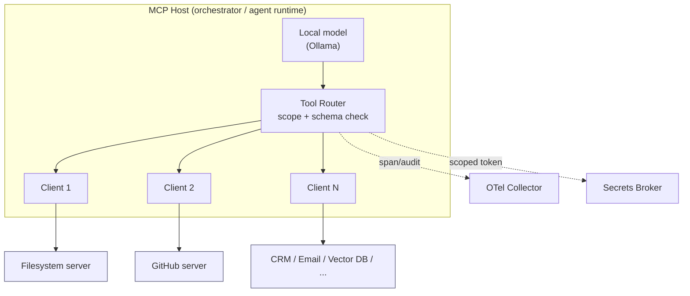
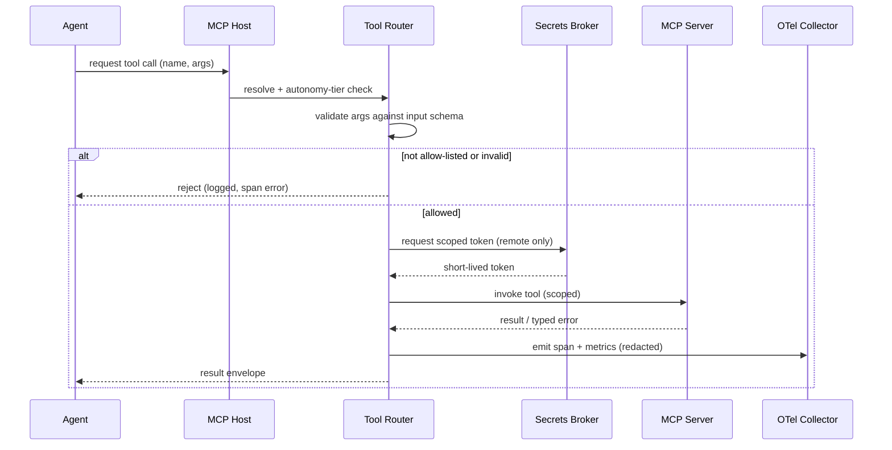

# MCP Architecture

> **Breadcrumb:** [Home](../README.md) › [Docs Index](INDEX.md) › **MCP Architecture**
> **Status:** `Active` · **Owner:** `architecture-swarm` · **Last verified:** `2026-06-12`

## 1. Purpose

This document defines how AgentX2.ai connects its agents and swarms to tools and data through the
**[Model Context Protocol (MCP)](https://modelcontextprotocol.io/)** — an open standard for exposing
tools, resources, and prompts to language-model applications over a uniform JSON-RPC interface. It is
the architectural companion to the [MCP Registry](MCP_REGISTRY.md) (the catalog of servers) and
[MCP Security](MCP_SECURITY.md) (the trust boundary). It refines the tool-boundary contract sketched
in [API Contracts](API_CONTRACTS.md) §5 and the governed surface in
[Integration Architecture](01-architecture/INTEGRATION_ARCHITECTURE.md).

## 2. Context & scope

The public website is static and has **no application API**; MCP lives entirely in the **private
operations plane** (the managed AI workforce) and the **build plane**. MCP is therefore the single,
governed way any agent reaches a side effect — read a file, open a pull request, query a vector store,
draft an email, or provision a client workspace.

In scope: the host/client/server topology, the planned server set, transport and authentication, the
tool-call lifecycle, validation, telemetry emission, failure handling, and human-approval gates. Out
of scope: per-server tool schemas (see [MCP Registry](MCP_REGISTRY.md)) and threat modeling detail
(see [MCP Security](MCP_SECURITY.md)).

## 3. What MCP is and why it matters

MCP standardizes the integration surface so that **one client implementation can talk to many tool
servers** without bespoke glue per integration. Each MCP **server** advertises a typed set of
capabilities — *tools* (callable actions), *resources* (readable context), and *prompts* (reusable
templates) — and the **host** application connects to them through one **client** per server
([modelcontextprotocol.io](https://modelcontextprotocol.io/)).

For a self-building, swarm-driven platform this yields four properties we depend on:

- **Uniformity** — every side effect flows through the same request/response shape and the same
  scope-check, so governance is enforced in one place rather than per-integration.
- **Least privilege** — a server exposes only the tools it declares, and an agent is granted only the
  servers its task requires ([Integration Architecture](01-architecture/INTEGRATION_ARCHITECTURE.md)).
- **Auditability** — every call is a discrete, typed event that emits an
  [OpenTelemetry GenAI span](https://opentelemetry.io/docs/specs/semconv/gen-ai/).
- **Swappability** — a server can be replaced (e.g., one CRM for another) without changing agent code.

## 4. Topology

MCP is a star: one **host** process owns N **clients**, each bound to exactly one **server**. Servers
are isolated from one another and from the model; the model never reaches a server directly — it asks
the host, which routes through scope and validation first.

## 5. Planned MCP servers

The platform plans the following servers. Each is private-plane unless noted; full per-server columns
(tools, rate limits, audit, circuit breakers, lifecycle) live in the [MCP Registry](MCP_REGISTRY.md).

| # | Server | Plane | Data class | Representative tools | Default autonomy |
|---|--------|-------|------------|----------------------|------------------|
| 1 | Filesystem | Build | Internal | `read_file`, `write_file`, `list_dir` | human-gated (writes) |
| 2 | GitHub | Build | Internal / Public | `get_pr`, `open_pr`, `create_issue` | human-gated (writes) |
| 3 | Browser automation | Private | Public / External | `navigate`, `extract`, `screenshot` | reversible |
| 4 | CRM | Private | Confidential (PII) | `get_contact`, `upsert_deal` | human-gated |
| 5 | Email | Private | Confidential (PII) | `draft_email`, `send_email` | human-gated (send) |
| 6 | Calendar | Private | Confidential | `get_availability`, `create_event` | human-gated (write) |
| 7 | Vector DB | Private | Internal | `upsert`, `query` | reversible |
| 8 | Knowledge graph | Private | Internal | `query`, `assert_relation` | reversible |
| 9 | Analytics | Private | Aggregated | `query_metric` | read-only |
| 10 | Finance data | Private | Confidential | `get_rates`, `read_record` | read-only / gated |
| 11 | Proposal generation | Private | Confidential | `render_proposal`, `export_pdf` | human-gated (send) |
| 12 | Client onboarding | Private | Confidential | `provision_workspace`, `assign_workforce` | human-gated |
| 13 | Agent registry | Private | Internal | `list_agents`, `register_agent` | reversible / gated |
| 14 | Prompt registry | Private | Internal | `get_prompt`, `version_prompt` | reversible |
| 15 | Policy engine | Private | Internal | `evaluate_policy` | read-only |
| 16 | Secrets broker | Private | Secret | `issue_scoped_token` | system + human-gated |
| 17 | Observability collector | Both | Internal | `emit_span`, `emit_metric` | read-only / system |

## 6. Transport & authentication model

MCP exchanges **[JSON-RPC 2.0](https://www.jsonrpc.org/specification)** messages over two transports:

- **stdio** for local, co-located servers (build plane, filesystem, observability). Trust derives from
  the parent process; no network exposure.
- **Streamable HTTP** for remote servers (CRM, Email, Calendar, Finance). Each call carries a
  **short-lived, scoped bearer token** minted by the [Secrets Broker](MCP_REGISTRY.md) — the raw
  upstream credential is never handed to the model or the agent.

Authentication layers, outermost to innermost:

| Layer | Mechanism | Notes |
|-------|-----------|-------|
| Host ↔ remote server | scoped bearer token | minted per session by the secrets broker, short TTL |
| Server ↔ upstream SaaS | [OAuth 2.0](https://datatracker.ietf.org/doc/html/rfc6749) / API key | held only inside the server; brokered, never exposed |
| Agent ↔ host | allow-list + autonomy tier | enforced by the tool router before dispatch |

No secret ever appears in repository source, model context, prompts, or telemetry
([Key Management](KEY_MANAGEMENT.md), [Security Architecture](06-governance/SECURITY_ARCHITECTURE.md)).

## 7. Tool-call lifecycle

Every tool call passes through resolve → scope-check → schema-validate → dispatch → observe → envelope.
A denied or unknown tool is rejected and logged before any side effect occurs.

The returned envelope matches the standard shape in [AGENTS.md](../AGENTS.md) §2 and
[API Contracts](API_CONTRACTS.md) §4, carrying `status`, `result`, `evidence` (including the
`trace_id`), and `cost`.

## 8. Failure modes & circuit breakers

Tool calls are treated as untrusted I/O. Each failure class has a defined detection and response, and
each server is fronted by a **circuit breaker** so a failing dependency cannot stall a swarm.

| Failure mode | Detection | Response | Breaker action |
|--------------|-----------|----------|----------------|
| Schema-invalid args | input validation | reject before dispatch | n/a (no call made) |
| Server timeout | per-call deadline | retry with backoff (bounded) | open after N consecutive timeouts |
| Upstream 429 / rate limit | status + headers | respect `Retry-After`, queue | throttle, then open if sustained |
| Server crash / unreachable | transport error | fail task as `needs_human` | open immediately |
| Untrusted / anomalous output | guardian screen | quarantine result, do not act | open on repeated abuse |
| Scope violation attempt | router scope check | reject + alert | open + flag for review |

Breaker states are **closed → open → half-open**: an open breaker fast-fails calls; after a cooldown it
admits a single probe (half-open) and closes only on success. Breaker transitions emit spans and feed
[Alerting](05-observability/OBSERVABILITY.md).

## 9. Human-approval requirements

MCP enforces the autonomy tiers defined in [Human-in-the-Loop](06-governance/HUMAN_IN_THE_LOOP.md).
Read-only tools run automatically; reversible writes run with logging; **irreversible or
externally-visible actions stop for human approval** before dispatch.

- **Always gated:** sending email, CRM writes, proposal delivery, client provisioning, secret issuance,
  any spend or contractual action.
- **Gated by default, configurable:** repository writes (PRs/merges), calendar writes, agent
  registration.
- **Never gated:** read-only queries (analytics, policy evaluation, vector/knowledge reads),
  observability emission.

Approval requests carry the proposed call, its scope, the predicted effect, and a timeout-default of
**deny**; nothing irreversible proceeds on silence.

## 10. Decisions

- **D-1 MCP-first.** All tool access uses MCP servers; bespoke adapters are the exception and must pass
  an integration fit review ([Integration Architecture](01-architecture/INTEGRATION_ARCHITECTURE.md)).
- **D-2 Broker, never expose.** Models and agents receive scoped tokens, never raw provider keys
  ([Key Management](KEY_MANAGEMENT.md)).
- **D-3 One router, one choke point.** Scope, schema validation, telemetry, and approval gates are
  centralized in the tool router so policy is enforced once.
- **D-4 Default-deny.** Unknown or unlisted tools are rejected; new servers enter via the registry with
  a lifecycle stage.

## 11. Risks & open questions

- **Excessive agency** — over-broad scopes invite tool abuse; mitigated by least-privilege registry
  entries and gating ([OWASP LLM Top 10](https://owasp.org/www-project-top-10-for-large-language-model-applications/)).
- **Indirect prompt injection** via tool *outputs* — mitigated by guardian screening of results before
  the model acts on them ([MCP Security](MCP_SECURITY.md)).
- **[UNVERIFIED]** Concrete upstream rate limits per SaaS vendor are not asserted here; the registry
  records internal policy defaults only, to be confirmed against each provider before go-live.
- **Remote-transport hardening** — the exact authorization handshake for Streamable HTTP servers will be
  ratified in an ADR before the first remote server is enabled.

## 12. Grounding & Sources

| # | Claim | Source | Accessed |
|---|-------|--------|----------|
| 1 | MCP servers expose tools/resources/prompts to model hosts | <https://modelcontextprotocol.io/> | 2026-06-12 |
| 2 | Calls are JSON-RPC 2.0 messages | <https://www.jsonrpc.org/specification> | 2026-06-12 |
| 3 | Tool calls emit GenAI telemetry spans | <https://opentelemetry.io/docs/specs/semconv/gen-ai/> | 2026-06-12 |
| 4 | Tool abuse / excessive agency are named LLM risk classes | <https://owasp.org/www-project-top-10-for-large-language-model-applications/> | 2026-06-12 |
| 5 | Upstream servers authenticate via OAuth 2.0 | <https://datatracker.ietf.org/doc/html/rfc6749> | 2026-06-12 |

---

### Freshness

- **Created/Updated/Verified:** 2026-06-12 · **Review cadence:** 60d · **Next review:** 2026-08-11
- See [Freshness Policy](07-operations/FRESHNESS_POLICY.md).

### Navigation

- 🏠 [Home](../README.md) · ⬆️ [Docs Index](INDEX.md)
- ↔️ Related: [MCP Registry](MCP_REGISTRY.md) · [MCP Security](MCP_SECURITY.md) · [Integration Architecture](01-architecture/INTEGRATION_ARCHITECTURE.md)
