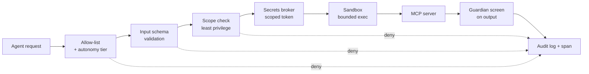

# MCP Security

> **Breadcrumb:** [Home](../README.md) › [Docs Index](INDEX.md) › **MCP Security**
> **Status:** `Active` · **Owner:** `governance-swarm` · **Last verified:** `2026-06-12`

## 1. Purpose

This document defines the **security posture of the MCP tool boundary** — the single place where an
otherwise text-only model can take a real action. It hardens the topology in
[MCP Architecture](MCP_ARCHITECTURE.md) and the catalog in [MCP Registry](MCP_REGISTRY.md) against the
[OWASP Top 10 for LLM Applications](https://owasp.org/www-project-top-10-for-large-language-model-applications/),
extending the platform [Security Architecture](06-governance/SECURITY_ARCHITECTURE.md).

## 2. Context & scope

The tool boundary is **assumed hostile in both directions**: agent *inputs* may be manipulated by
indirect prompt injection, and server *outputs* may be attacker-controlled content. Controls therefore
sit on the router (before dispatch) and on results (before the model acts on them). Scope covers
least-privilege scoping, allow-listing, input validation, injection and tool-abuse defense, secrets
brokering, audit, rate limiting, circuit breakers, sandboxing, and a STRIDE threat table.

## 3. Defense-in-depth controls

The boundary applies layered controls; no single control is trusted alone.

### 3.1 Least-privilege scopes

Each registry entry grants the **narrowest scope** that satisfies its purpose (e.g., CRM = read
contacts, write deals — not delete). Agents receive only the servers their task requires; scopes are
per-session and expire. This directly counters the *excessive agency* risk class
([OWASP LLM](https://owasp.org/www-project-top-10-for-large-language-model-applications/)).

### 3.2 Allow-list enforcement

The router is **default-deny**: unknown tools, non-`active` servers, and out-of-scope calls are rejected
before any side effect and logged as security events. There is no implicit fall-through.

### 3.3 Input validation

Every tool argument is validated against the server's declared input schema (type, range, format,
size). Validation failures reject the call without dispatch, preventing malformed or oversized payloads
from reaching upstreams.

### 3.4 Prompt-injection & tool-abuse defense

- **Indirect injection** — content fetched by tools (web pages, documents, emails) is treated as data,
  never instructions; results are guardian-screened before the model may act on them.
- **Tool abuse / chaining** — autonomy tiers gate write and external actions; a model cannot escalate
  from a read tool to a write tool without passing the router and (where required) a human gate
  ([Human-in-the-Loop](06-governance/HUMAN_IN_THE_LOOP.md)).
- **Canary + anomaly checks** — anomalous argument patterns (e.g., scope-probing) open the circuit
  breaker and raise an alert.

### 3.5 Secrets brokering

Models and agents **never receive raw provider keys**. The [Secrets Broker](MCP_REGISTRY.md) mints
short-lived, scoped tokens per session; the upstream credential lives only inside the server process and
is rotated on the lifecycle in [Key Management](KEY_MANAGEMENT.md) and
[NIST SP 800-57](https://csrc.nist.gov/pubs/sp/800/57/pt1/r5/final).

### 3.6 Audit logging

Every call — allowed or denied — emits a
[GenAI telemetry span](https://opentelemetry.io/docs/specs/semconv/gen-ai/) and an audit record with
the tool name, scope, decision, and `trace_id`. Sensitive arguments and outputs are redacted in
telemetry. Logs are tamper-evident and retained per policy.

### 3.7 Rate limiting & circuit breakers

Per-server policy rate limits throttle volume; circuit breakers (`closed → open → half-open`) fast-fail
a failing or abused dependency so it cannot stall or be hammered by a swarm
([MCP Architecture](MCP_ARCHITECTURE.md) §8).

### 3.8 Sandboxing

Servers run with **bounded execution** — constrained filesystem and network egress, CPU/memory and
wall-clock limits, and isolation from one another. A compromised or misbehaving server cannot reach
another server's scope or the host's secrets.

## 4. STRIDE threat table (tool boundary)

Threats are enumerated with [STRIDE](https://owasp.org/www-community/Threat_Modeling) and mapped to
controls above.

| STRIDE category | Tool-boundary example | Mitigation | Owner |
|-----------------|-----------------------|------------|-------|
| **S**poofing | Forged agent identity calls a privileged tool | Per-session scoped tokens; allow-list + autonomy tier | governance-swarm |
| **T**ampering | Manipulated tool arguments or in-flight payload | Input schema validation; integrity on transport | architecture-swarm |
| **R**epudiation | Action taken with no traceable owner | Full audit log + span with `trace_id`; tamper-evident logs | observability-swarm |
| **I**nformation disclosure | Raw API key leaked to model or telemetry | Secrets broker (scoped tokens); redaction in logs | governance-swarm |
| **D**enial of service | Swarm floods an upstream / failing server stalls work | Policy rate limits; circuit breakers; bounded retries | architecture-swarm |
| **E**levation of privilege | Read tool chained into a write/external action | Least-privilege scopes; default-deny router; human gates | governance-swarm |

## 5. Decisions

- **D-1 Boundary is hostile both ways.** Validate inputs *and* screen outputs; never let tool output act
  as instructions.
- **D-2 Broker, never expose.** Scoped tokens only; raw credentials stay inside server processes.
- **D-3 Default-deny + audit-all.** Every call is allow-listed and logged; denials are security events.
- **D-4 Fail safe.** On uncertainty, breakers open and irreversible actions stop for a human.

## 6. Risks & open questions

- **Output-side injection** remains the hardest class; guardian coverage and screening prompts are
  reviewed continuously ([Responsible AI](06-governance/RESPONSIBLE_AI.md)).
- **[UNVERIFIED]** The remote Streamable HTTP authorization handshake will be fixed by ADR before any
  remote server is enabled.
- **Sandbox strength** for third-party servers is environment-dependent and tracked in the
  [Risk Register](06-governance/RISK_REGISTER.md).

## 7. Grounding & Sources

| # | Claim | Source | Accessed |
|---|-------|--------|----------|
| 1 | Prompt injection, excessive agency, sensitive-info disclosure are named LLM risks | <https://owasp.org/www-project-top-10-for-large-language-model-applications/> | 2026-06-12 |
| 2 | MCP defines the tool/resource server boundary | <https://modelcontextprotocol.io/> | 2026-06-12 |
| 3 | STRIDE categories for the threat table | <https://owasp.org/www-community/Threat_Modeling> | 2026-06-12 |
| 4 | Audited tool calls via telemetry spans | <https://opentelemetry.io/docs/specs/semconv/gen-ai/> | 2026-06-12 |
| 5 | Key lifecycle / rotation guidance | <https://csrc.nist.gov/pubs/sp/800/57/pt1/r5/final> | 2026-06-12 |

---

### Freshness

- **Created/Updated/Verified:** 2026-06-12 · **Review cadence:** 60d · **Next review:** 2026-08-11
- See [Freshness Policy](07-operations/FRESHNESS_POLICY.md).

### Navigation

- 🏠 [Home](../README.md) · ⬆️ [Docs Index](INDEX.md)
- ↔️ Related: [MCP Architecture](MCP_ARCHITECTURE.md) · [Key Management](KEY_MANAGEMENT.md) · [Security Architecture](06-governance/SECURITY_ARCHITECTURE.md)
